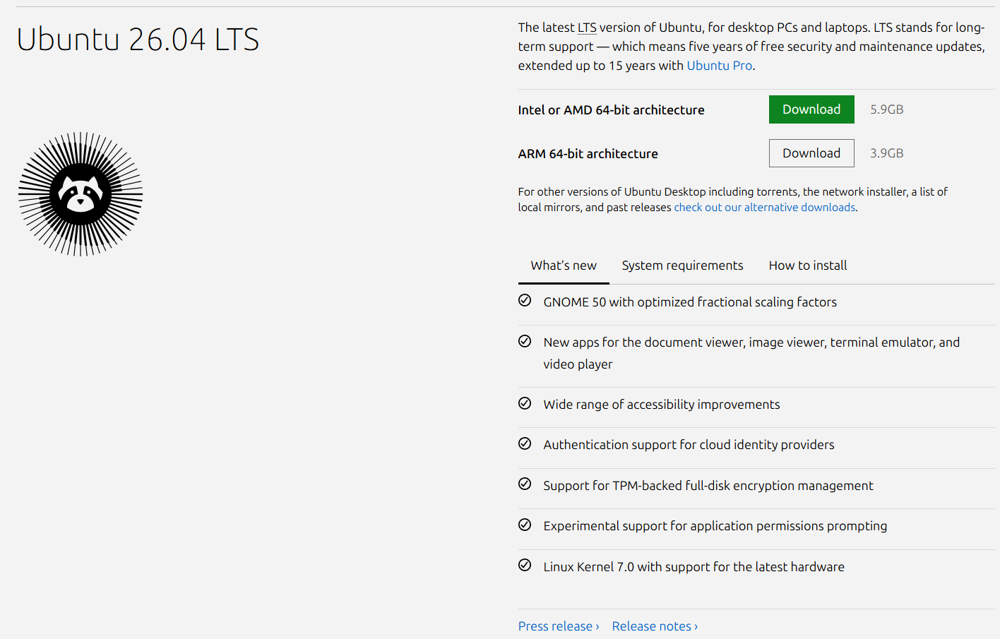

# Ubuntu 설치

이번 과정에서는 ROS2 Lyrical 개발 환경 구성을 위해 Ubuntu 26.04를 설치합니다.

Ubuntu 설치는 생각보다 어렵지 않으며, 순서대로 따라 하면 쉽게 설치할 수 있습니다.

#### Ubuntu 설치 순서

Ubuntu 설치는 아래 순서대로 진행합니다.

- 빈 USB 준비
- Ubuntu 26.04 이미지 다운로드
- 부팅 USB 제작 툴 Rufus 다운로드
- Ubuntu 설치 USB  만들기
- Ubuntu 26.04 설치
- 한글 입력 환경 설정

---

**빈 USB 준비**

최소 8GB 이상의 빈 USB를 준비합니다.

USB 안에 중요한 데이터가 있다면 미리 백업해 두는 것이 좋습니다.

Ubuntu 설치 USB를 만드는 과정에서 기존 데이터는 모두 삭제 됩니다.

---

**Ubuntu 26.04 이미지 다운로드**

Ubuntu 공식 홈페이지에서 설치 이미지를 다운로드합니다.

[https://ubuntu.com/download/desktop](https://ubuntu.com/download/desktop)



사용중인 PC 환경에 맞는 버전을 선택합니다.

일반적인 PC 환경이라면 대부분 아래 버전을 사용하면 됩니다.

- Intel or AMD 64-bit architecture

대부분의 데스크톱과 노트북은 이 버전에 해당합니다.

---

#### 부팅 USB 제작 툴 Rufus 다운로드

Windows 환경에서는 Rufus를 사용해 설치 USB를 만들 수 있습니다.

[https://rufus.ie/ko/](https://rufus.ie/ko/)


사용 중인 Windows 환경에 맞는 버전을 다운로드 합니다.

64비트 Windows 환경이라면 별도의 설치 과정이 필요 없는 Portable 버전을 사용하는 것을 추천합니다.

---

#### Ubuntu 설치 USB 만들기


Rufus를 실행한 후 우측의 **[선택]** 버튼을 눌러 다운로드한 Ubuntu 이미지를 선택합니다.

Ubuntu 설치 USB를 만드는 방식은 크게 두 가지가 있습니다.

- ISO 쓰기 모드
- DD 쓰기 모드

일반적으로는 ISO 쓰기 모드를 사용하면 됩니다.

다만 일부 PC환경에서는 설치 과정에서 오류가 발생하거나 정상적으로 부팅되지 않는 경우가 있습니다.

이 경우에는 DD 쓰기 모드로 다시 만들어 보는 것을 추천합니다.

필자의 경우 UEFI/Legacy 혼합 환경에서는 ISO 모드로 정상 설치되지 않았으며, DD 모드를 사용하여 문제를 해결할 수 있었습니다.

---

#### Ubuntu 설치


USB로 부팅하면 처음으로 이와 같은 화면이 표시됩니다.

언어를 **한국어**로 선택한 후 **[다음]** 버튼을 클릭합니다.

---


접근성 관련 설명 화면입니다.

필요한 기능이 있는 경우에만 설정하고, 일반적으로는 기본값으로 진행하면 됩니다.

---


키보드 레이아웃은 기본값으로 진행합니다.

Ubuntu 의 한글 환경은 과거에 비해 많이 개선되었지만, 여전히 Windows나 macOS와는 차이가 있습니다.

따라서 한글 입력 설정은 설치가 완료된 이후 별도로 진행하겠습니다.

---


환경에 맞게 인터넷 연결을 설정합니다.

- 유선 연결
- Wi-Fi 연결
- 지금 연결하지 않기

필자는 유선 환경을 사용했지만, Wi-Fi 환경에서도 문제없이 설치할 수 있습니다.

인터넷 연결 없이 설치를 먼저 진행한 후 나중에 연결해도 무방합니다.

---


Ubuntu 26.04의 코드네임인 **Resolute Raccoon**의 대표 이미지가 표시됩니다.

이 화면에서 Ubuntu 설치를 시작할 수 있습니다.

**[다음]**을 클릭합니다.

---


설치 방식을 선택합니다.

일반적인 사용자라면 **대화명 설치**를 선택하는 것을 추천합니다.

---


Ubuntu 기본 프로그램과 오피스 툴 설치 여부를 선택합니다.

- 기본 설치
- 더 많은 소프트웨어

일반적으로는 **기본 설치**를 추천합니다.

필요한 프로그램은 설치가 완료된 후 언제든지 설치할 수 있습니다.

---


일반적으로 아래 두 항목을 체크하는 것을 추천합니다.

- 그래픽과 Wi-Fi 하드웨어를 위한 서드파티 소프트웨어 설치
- 추가 미디어 포맷 지원 설치

첫 번째 항목은 NVIDIA 드라이버나 기타 하드웨어 드라이버 설치에 도움이 됩니다.

두 번재 항목은 영상 재생이나 멀티미디어 작업 시 유용합니다.

특정 버전의 그래픽 드라이버를 직섭 설치할 예정이라면 첫 번째 항목은 선택하지 않아도 됩니다.

설정을 완료한 후 **[다음]** 버튼을 클릭합니다.

---


설치 방식을 선택합니다.

- 디스크 지우고 Ubuntu 설치
- 수동 설치

Ubuntu 만 단독으로 사용할 예정이라면 **디스크 지우고 Ubuntu 설치**를 선택하면 됩니다.

Windows와 함께 듀얼 부팅을 구성하거나 기존 환경을 유지해야 한다면 **수동 설치**를 선택합니다.

---


수동 설치를 선택하면 파티션 설정 화면이 나타납니다.

여기서 **남은 공간** 상태로는 설치를 진행할 수 없습니다.

반드시 **[+]** 버튼을 눌러 새로운 파티션을 생성해야 합니다.

---


전체 남은 공간을 사용하도록 설정하고 마운트 위치를 **Root(/)** 로 지정합니다.

Root 디렉터리는 Linux 시스템의 최상위 디렉터리이며 대부분의 시스템 파일과 프로그램은 이 위치를 기준으로 동작합니다.

---


설정이 완료되면 새로운 파티션이 생성됩니다.

여기까지 완료되면 **[다음]** 버튼을 클릭합니다.

---


이름, 컴퓨터 이름, 사용자 이름, 비밀번호를 입력합니다.

여기서 중요한 팁이 있습니다.

Linux 에서는 터미널을 자주 사용하기 때문에 사용자 이름과 컴퓨터 이름을 가능한 짧게 사용하는 것을 추천합니다.

예를 들어 아래와 같이 설정했다고 가정해 보겠습니다.

- 사용자 이름 : username (twiniex)
- 컴퓨터 이름 : vm

이 경우 터미널에는 아래와 같이 표시됩니다.

```bash
username@vm:~$ (twiniex@vm:~$)
```

필자의 경우 사용자 이름은 회사명인 `twiniex` 로 통일하고, 장치 종류에 따라 컴퓨터 이름만 다르게 사용합니다.

예를 들면 다음과 같습니다.

- Desktop → `username@dt:~$`
- Laptop → `username@lt:~$`
- RaspberryPi → `username@rp:~$`
- Virtual Machine → `username@vm:~$`

이 방식은 SSH나 원격 접속 환경에서 특히 유용하며, 여러 장비를 운영할 때 관리하기도 편리합니다.

---


현재 거주 지역을 선택한 후 **[다음]** 버튼을 클릭합니다.

---


지금까지 선택한 설정을 확인한 후 **[설치]** 버튼을 클릭합니다.

---


Ubuntu 설치가 진행됩니다.

Ubuntu 26.04의 대표 이미지인 너구리가 표시되며 설치가 시작됩니다.

설치가 완료될 때까지 잠시 기다립니다.

---


설치가 완료되면 **[지금 다시 시작]** 버튼을 클릭합니다.

---


설치 과정에서 입력한 사용자 이름과 비밀번호를 사용하여 로그인합니다.

---


이제 Ubuntu 사용 준비가 완료되었습니다.

---

#### 한글 입력 설정

Ubunty에서는 설치 후 한글 입력 환경을 별도로 설정하는 것을 추천합니다.

---


좌측 하단의 **앱 보기** 버튼을 클릭합니다.

이 버튼은 Windows의 시작 메뉴와 비슷한 역할을 합니다.

---


**설정(Settings)** 메뉴를 실행합니다.

---


좌측 메뉴에서 키보드 항목으로 이동합니다.

입력 소스 목록이 표시됩니다.

여기서 다음과 같이 설정하는 것을 추천합니다.

- 한국어 (Hangul) → 사용
- 한국어 (101/104키 호환) → 제거

불필요한 입력 소스는 제거하는 것이 좋습니다.

다른 입력 소스가 등록되어 있다면 제거하고, `한국어 (Hangul)` 가 없다면 추가합니다.

---


`한국어 (Hangul)` 우측의 메뉴 버튼을 선택한 후 **기본 설정**을 클릭합니다.

---


한영 전환 키 설정 화면입니다.

기본으로 등록되어 있는 아래 항목들은 제거합니다.

- Hangul
- Shift + Space

---


이후 한영 전환에 사용할 키를 직접 추가합니다.

Windows 환경에서는 일반적으로 스페이스바 오른쪽의 **한/영 키** 또는 **오른쪽 Alt 키(Alt_R)** 를 사용합니다.

필자는 Windows와 동일한 사용 경험을 유지하기 위해 `Alt_R`을 사용하고 있습니다.

설정 후에는 반드시 **[적용]** 버튼을 누른 뒤 **[확인]** 버튼을 클릭해야 합니다.

이제 Ubuntu에서 한글 입력까지 모두 완료 되었습니다.
