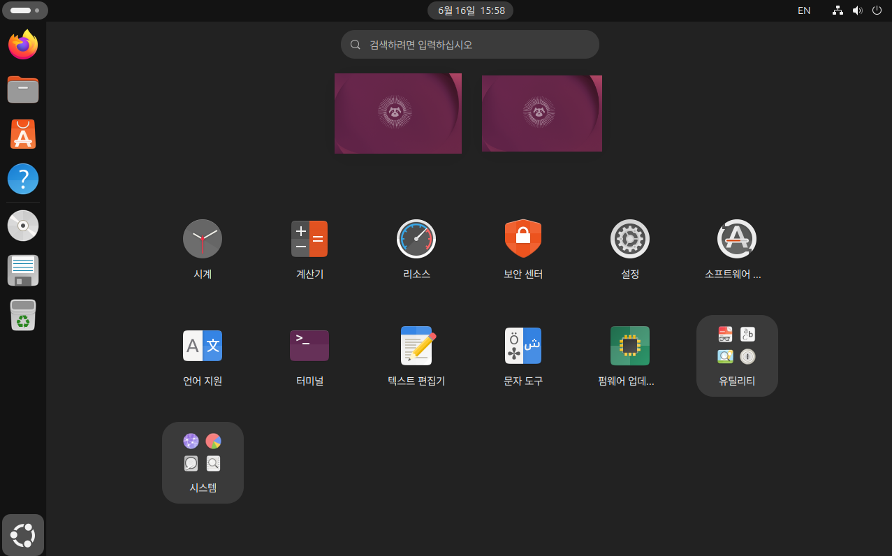

# Ubuntu Package : Terminator

이제 Ubuntu 설치가 완료되었으므로, 앞으로 사용하게 될 개발 도구들을 설치해보겠습니다.

Windows에서는 일반적으로 인터넷에서 설치 파일(.exe)을 다운로드하여 프로그램을 설치합니다.

반면 Ubuntu를 포함한 Linux 환경에서는 대부분의 프로그램을 패키지(Package) 형태로 관리합니다.

패키지는 Windows의 프로그램이나 스마트폰의 애플리케이션과 비슷한 개념이라고 생각하면 됩니다.

Ubuntu는 Debian 계열 Linux이기 때문에 APT(Advanced Package Tool) 라는 패키지 관리 시스템을 사용합니다.

APT는 Ubuntu에서 운영하는 저장소(Repository)에 등록된 패키지를 설치하고 관리하는 역할을 합니다.

이러한 방식은 Windows와 비교했을 때 몇 가지 장점이 있습니다.

- 설치 방법이 일관적입니다.
- 프로그램 간 의존성을 자동으로 관리합니다.
- 업데이트와 제거가 쉽습니다.
- 시스템 안정성을 유지하기 쉽습니다.

반면 처음 Ubuntu를 접하는 사용자라면 프로그램을 웹 브라우저에서 직접 다운로드하지 않고 터미널을 통해 설치하는 방식이 다소 낯설게 느껴질 수 있습니다.

하지만 익숙해지고 나면 오히려 Windows보다 편리하게 느껴지는 경우가 많습니다.

이번 과정에서는 앞으로 자주 사용하게 될 아래 두 가지 프로그램을 설치합니다.

- Terminator
    - 여러 개의 터미널을 하나의 창에서 관리할 수 있는 터미널 프로그램
- Visual Studio Code
    - Python과 ROS2 개발에 적합한 무료 코드 에디터

---

#### Terminator 설치

먼저 Ubuntu 기본 터미널을 실행합니다.



좌측 하단의 앱 도기(App Launcher) 버튼을 클릭합니다.

Ubuntu 기본 터미널이 보인다면 바로 실행하면 됩니다.

만약 보이지 않는다면 검색창에 다음과 같이 입력합니다.

```bash
Terminal
```

또는

```bash
터미널
```

---


Ubuntu에서 기본적으로 제공되는 터미널 화면입니다.

앞으로 우리는 이 터미널을 사용하여 ROS2 명령어를 실행하고 다양한 패키지를 설치하게 됩니다.

하지만 ROS2는 특성상 여러 개의 터미널 창을 동시에 사용하는 경우가 매우 많습니다.

예를 들어:

- ROS2 Node 실행
- Topic 모니터링
- Gazebo 실행
- RViz2 실행
- MoveIt 실행

등을 각각 별도의 터미널에서 실행하는 경우가 많습니다.

따라서 여러 개의 터미널을 효율적으로 관리할 수 있는 도구가 필요합니다.

이번에 설치할 **Terminator**는 하나의 창 안에서 여러 개의 터미널을 동시에 사용할 수 있는 프로그램입니다.

---

**패키지 설치 명령어**

패키지를 설치하기 전에 먼저 몇 가지 기본 명령어를 살펴보겠습니다.

sudo

```
superuser do
```

관리자 권한으로 명령을 실행할 때 사용합니다.

---

apt

```
Advanced Package Tool
```

Debian 계열 Linux에서 사용하는 패키지 관리 시스템입니다.

---

install

패키지를 설치하는 명령입니다.

---

즉 아래 명령은 다음 의미를 가집니다.

```bash
sudo apt install 패키지명
```

```
관리자 권한으로
APT 저장소에서
패키지를 설치한다.
```

---

**패키지 목록 갱신**

새로운 패키지를 설치하기 전에는 아래 명령을 먼저 실행하는 것을 추천합니다.

```bash
sudo apt update
```

이 명령은 실제 패키지를 설치하거나 업데이트하는 명령이 아닙니다.

Ubuntu 저장소에 등록된 최신 패키지 목록을 다운로드하여 갱신하는 역할을 합니다.

---

설치된 패키지를 최신 버전으로 업데이트 하려면 다음 명령을 사용합니다.

```bash
sudo apt upgrade
```

이 명령은 현재 시스템에 설치된 패키지 중 새로운 버전이 존재하는 패키지를 업데이트 합니다.

---


```bash
sudo apt update
# 저장소에서 최신 패키지 목록을 내려받아 갱신

sudo apt upgrade
# 현재 설치된 패키지 중 업그레이드 가능한 패키지를 새 버전으로 갱신
```

---

**Terminator 설치**

이제 Terminator를 설치해보겠습니다.


```bash
sudo apt install terminator
```

```bash
관리자 권한으로
Ubuntu Repository에 등록된
Terminator 패키지를 설치합니다.
```

---


설치가 완료되면 앱 목록에서 **Terminator**를 확인할 수 있습니다.

---


실행해보면 기존 터미널과 크게 다르지 않은 화면이 나타납니다.

하지만 Terminator의 가장 큰 장점은 터미널 분할 기능입니다.

마우스 우클릭을 해보면 다음 기능을 사용할 수 있습니다.

- 상하 분할
- 좌우 분할

---


하나의 Terminator 창 안에서 여러 개의 터미널을 동시에 사용할 수 있습니다.

ROS2 개발 환경에서는 이러한 기능을 매우 자주 사용하게 됩니다.

필자의 경우 일반적으로 다음과 같이 사용합니다.

```bash
좌상단 : ROS2 Node 실행
우상단 : Topic 모니터링
좌하단 : Gazebo 실행
우하단 : RViz2 실행
```

---

Ubuntu 화면 좌측에는 현재 실행 중인 프로그램 목록이 표시됩니다.

아이콘을 위쪽 즐겨찾기 영역으로 드래그하면 Dock에 고정할 수 있습니다.

Terminator는 앞으로 매우 자주 사용하게 될 프로그램이므로 즐겨찾기에 등록해 두는 것을 추천합니다.


