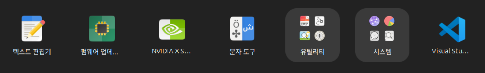

# Ubuntu Package : VS Code

앞서 Terminator는 Ubuntu에서 기본적으로 제공하는 Repository를 통해 설치 했습니다.

반면 Visual Studio Code는 Microsoft에서 직접 관리하는 Repository를 통해 제공됩니다.

따라서 VS Code를 설치하기 위해서는 먼저 Microsoft Repository를 시스템에 등록해야 합니다.

처음에는 다소 복잡하게 느껴질 수 있지만, 한번 등록해 두면 이후에는 일반적인 Ubuntu 패키자와 동일한 방식으로 설치 및 업데이트를 진행할 수 있습니다.

다행히 이러한 과정은 자주 수행하는 작업이 아니며, 공식 문서나 검색 엔진, 또는 ChatGPT와 같은 LLM 도구를 활용하면 대부분 쉽게 해결할 수 있습니다.

---

#### Microsoft Repository 등록

GitHub Link: [https://github.com/applesnack23/ros2-lerobot-code/tree/main/chapter1](https://github.com/applesnack23/ros2-lerobot-code/tree/main/chapter1)/[vscode_install.sh](https://github.com/applesnack23/ros2-lerobot-code/blob/main/chapter1/vscode_install.sh)

```bash
# Microsoft GPG Key 등록
sudo apt update
sudo apt install wget gpg

wget -qO- https://packages.microsoft.com/keys/microsoft.asc \
| gpg --dearmor \
> packages.microsoft.gpg

sudo install -D -o root -g root -m 644 \
packages.microsoft.gpg \
/etc/apt/keyrings/packages.microsoft.gpg

# VS Code Repository 등록
echo "deb [arch=amd64 signed-by=/etc/apt/keyrings/packages.microsoft.gpg] https://packages.microsoft.com/repos/code stable main" \
| sudo tee /etc/apt/sources.list.d/vscode.list

# 패키지 목록 갱신
sudo apt update

# VS Code 설치
sudo apt install code
```

---



설치가 완료되면 터미널에서 아래 명령으로 VS Code를 실행할 수 있습니다.

```bash
code
```

물론 Ubuntu 좌측 하단의 **앱 보기**에서 **Visual Studio code**를 선택하여 실행할 수도 있습니다.

---

앞으로 VS Code와 Terminator는 매우 자주 사용하게 될 프로그램입니다.

Ubuntu 좌측 Dock에 고정해 두면 훨씬 편리하게 사용할 수 있습니다.

필자 역시 두 프로그램을 항상 Dock에 등록하여 사용하고 있습니다.


---

모든 개발자들은 각자 선호하는 개발 환경과 설정 방법을 가지고 있습니다.

이 책에서는 입문자를 기준으로 가장 일반적이고 무난한 설정을 기준으로 설명합니다.

이미 사용 중인 개발 환경이나 선호하는 설정이 있다면 본인의 방식대로 진행해도 좋습니다.

---

#### VS Code 실행


VS Code를 처음 실행하면 Welcome 화면이 표시됩니다.

VS Code의 가장 큰 특징 중 하나는 Extension이라고 불리는 확장 기능 시스템입니다.

기본 기능만으로도 충분히 강력하지만, 필요한 기능을 추가로 설치하여 원하는 개발 환경을 구성할 수 있습니다.

---

#### Extension 설치


좌측 메뉴의 Extension 아이콘을 선택하여 Extension Marketplace를 실행합니다.

우리는 Python 개발 환경을 구축하기 위해 먼저 Python Extension을 설치합니다.

검색창에 다음을 입력합니다.

```bash
Python
```

Microsoft에서 제공하는 Python Extension을 설치합니다.

---

Python Extension을 설치하면 대부분의 개발 환경이 자동으로 함께 구성됩니다.

만약 자동으로 설치가 되지 않는 다면 아래 Extension을 추가로 설치하는 것을 추천합니다.

- Python Debugger
    - Python 디버깅 기능 제공
- Pylance
    - 코드 분석 및 자동 완성 기능 제공

---

또한 이후 URDF와 Xacro 파일을 편리하게 편집하기 위해 다음 Extension도 함께 설치하는 것을 추천합니다.

- URDF
    - 개발자 : smilerobotics

---

#### Python Build & Run


좌측 상단의 Explorer 아이콘을 선택합니다.

VS Code는 프로젝트를 폴더 단위로 관리합니다.

따라서 코드를 작성하기 전에 먼저 작업 폴더를 열어야 합니다.

**Open Folder**를 선택하여 프로젝트 폴더를 지정합니다.

---


예제에서는 다음과 같은 폴더 구조를 사용하였습니다.

```bash
Project
└── HelloWorld
```

물론 폴더 이름은 자유롭게 지정해도 됩니다.

---


처음 폴더를 열면 해당 폴더를 신뢰할 것인지 묻는 창이 표시됩니다.

일반적으로는 **항상 신뢰함(Trust)** 을 선택하면 됩니다.

---


Explorer 영역에서 마우스 우클릭 후 새로운 Python 파일을 생성합니다.

예제에서는 다음 파일을 생성하였습니다.

```bash
HelloWorld.py
```

그리고 아래와 같이 가장 기본적인 Python 코드를 작성합니다.

```python
print("Hello, World!")
```

---

코드 작성이 완료 되었다면 상단 우측의 **Run Python File** 버튼을 클릭합니다.

프로그램이 실행되면 하단 터미널 창에 다음 결과가 출력됩니다.

```python
Hello, World!
```

---

#### Terminal에서 Python 실행

이번에는 터미널에서 직접 Python 프로그램을 실행해보겠습니다.


먼저 `cd(Change Directory)` 명령어를 사용하여 프로젝트 폴더로 이동합니다.

```bash
# 실행
username@lt:~$ cd Project/
username@lt:~/Project$ cd HelloWorld/
username@lt:~/Project/HelloWorld$ python3 HelloWorld.py

# 결과
Hello, World!
```

위 명령은 다음 과정을 수행합니다.

1. Project 폴더로 이동
2. HelloWorld 폴더로 이동
3. Python 프로그램 실행

정상적으로 실행되었ㄷ면 다음 결과가 출력됩니다.

```python
Hello, World!
```

---

여기서 한 가지 유용한 팁이 있습니다.

Linux 터미널에서는 모든 경로를 직접 입력할 필요가 없습니다.

예를 들어:

```python
Pr + TAB
```

을 입력하면:

```python
Project/
```

로 자동 완성됩니다.

마찬가지로:

```python
He + TAB
```

은:

```python
HelloWorld/
```

로 자동 완성됩니다.

터미널을 자주 사용하는 개발자들은 대부분 이 기능을 적극적으로 활용합니다.
