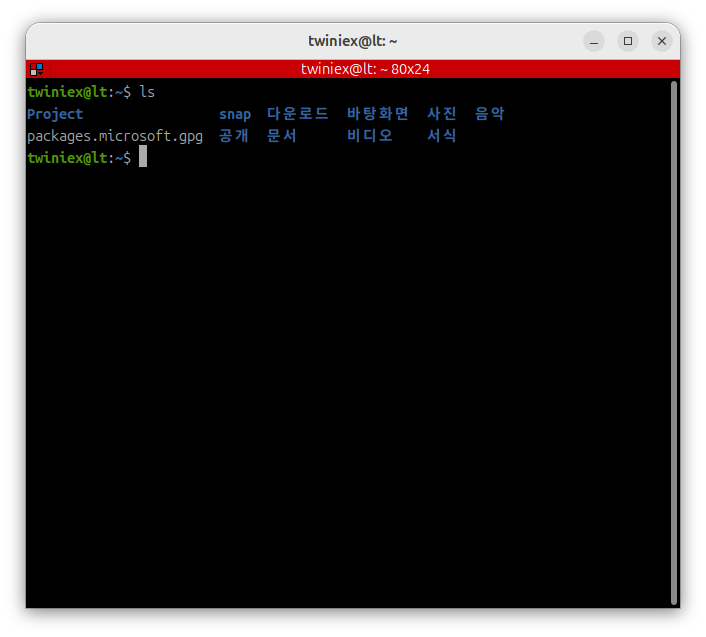

# Ubuntu 기본 명령어

Linux 환경인 Ubuntu에서는 Windows나 macOS보다 터미널을 사용하는 빈도가 훨씬 높습니다.

특히 우리가 학습하게 될 ROS2는 대부분의 개발 및 디버깅 작업을 터미널 환경에서 수행하기 때문에, Ubuntu의 Terminal 환경에 익숙해지는 것이 매우 중요합니다.

처음에는 명령어를 입력하는 방식이 다소 낯설게 느껴질 수 있지만, 몇 가지 기본 명령어만 익혀도 대부분의 작업을 수행할 수 있습니다.

이번 장에서는 앞으로 가장 자주 사용하게 될 기본 명령어들을 살펴보겠습니다.

---

#### ls



현재 디렉터리의 파일과 디렉터리 목록을 확인합니다.

```bash
ls
```

자주 사용하는 옵션은 다음과 같습니다.

```bash
ls -l
# 상세 정보 출력

ls -a
# 숨김 파일 포함 출력
```

---

#### cd


디렉터리를 이동할 때 사용합니다.

```bash
cd Project
```

상위 디렉터리로 이동할 경우에는 다음과 같이 사용합니다.

```bash
cd ..
```

Home 디렉터리로 이동하는 경우에는 다음과 같이 사용합니다.

```bash
cd ~
```

---

#### mkdir


새로운 디렉터리를 생성합니다.

```bash
mkdir test_folder
```

---

#### rmdir


비어 있는 디렉터리를 삭제합니다.

```bash
rmdir Project
```

디렉터리 안에 파일이 존재하면 삭제되지 않습니다.

---

#### rm


파일을 삭제할 때 사용합니다.

```bash
rm file.txt
```

디렉터리를 삭제하려면 `-r` 옵션을 사용합니다.

```bash
rm -r test_folder
```

rm 명령은 휴지통을 거치지 않고 즉시 삭제되므로 주의해야 합니다.

---

#### cp


파일 또는 디렉터리를 복사합니다.

```bash
cp ./HelloWorld/HelloWorld.py ./
```

디렉터리를 복사하는 경우에는 `-r` 옵션을 사용합니다.

---

#### mv


파일 또는 디렉터리를 이동하거나 이름을 변경할 때 사용합니다.

```bash
mv ./HelloWorld.py ./HelloW.py
```

---

#### clear


터미널 화면을 정리합니다.

```bash
clear
```

많은 명령어를 실행한 뒤 화면을 정리할 때 자주 사용합니다.

---
