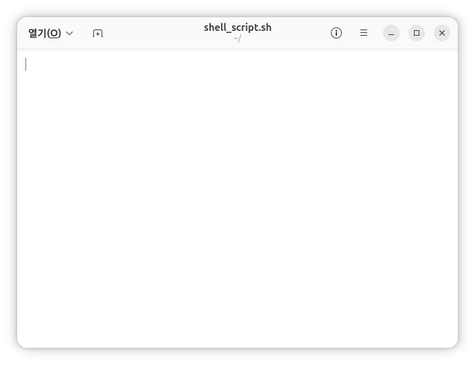

# Ubuntu bash/Bashrc

#### Bash (=Bourne Again Shell)

Bash는 Linux에서 가장 많이 사용되는 Shell입니다.

Shell을 쉽게 말하면 **사용자와 운영체제(Kernel) 사이에서 명령을 전달해주는 통역기**라고 생각할 수 있습니다.

앞서 우리는 Ubuntu의 기본 명령어들을 살펴보았습니다.

예를 들어:

```bash
ls
```

명령으로 파일 목록을 확인하고,

```bash
cd
```

명령으로 디렉터리를 이동할 수 있었습니다.

이러한 명령어들은 직접 Linux Kernel로 전달되는 것이 아니라, 먼저 Bash가 명령을 해석한 후 실행 가능한 프로그램을 찾아 실행합니다.

이후 Linux Kernel이 파일 시스템이나 하드웨어에 접근하여 작업을 수행하고 결과를 다시 사용자에게 전달합니다.

구조를 간단히 표현하면 다음과 같습니다.

```bash
사용자
↓
Bash (명령 해석)
↓
Linux Kernel
↓
Hardware
```

예를 들어:

```bash
username@lt:~$ ls
```

를 입력하면 Bash는 `ls` 프로그램을 실행하고, Linux Kernel은 파일 시스템에 접근하여 결과를 가져온 뒤 화면에 출력합니다.

---

#### Bash 가 하는 일

**명령 실행**

Bash는 사용자가 입력한 명령어를 실행합니다.

예를 들어::

```bash
python3 main.py
```

를 입력하면 Bash는 `python3` 실행 파일을 찾아 프로그램을 실행합니다.

이때 Bash가 명령어를 찾는 위치는 `PATH` 환경 변수에 저장되어 있습니다.

```bash
echo $PATH
```

---

**변수 관리**

```bash
name="USERNAME"
echo $name
```

```bash
USERNAME
```

---

**환경 변수 관리**

Linux에서는 시스템 설정 정보를 환경 변수 형태로 관리합니다.

대표적인 환경 변수는 다음과 같습니다.

```bash
echo $HOME
echo $USER
echo $PATH
```

| 환경 변수 | 설명 |
| --- | --- |
| HOME | 현재 사용자의 Home Directory |
| USER | 현재 사용자 이름 |
| PATH | 명령어 검색 경로 |

---

#### **Shell Script**

```bash
echo $HOME
echo $USER
echo $PATH
```

위 명령어들은 각각 하나의 Shell 명령어입니다.

Shell Script는 이러한 여러 개의 Shell 명령어를 하나의 파일에 저장하고 한 번에 실행할 수 있게 해주는 기능입니다.

---

**gnome-text-editor**

먼저 `gnome-text-editor` 를 사용하여 `shell_script.sh` 파일을 만들어 보겠습니다.

```bash
gnome-text-editor shell_script.sh
```



Windows의 메모장과 비슷한 텍스트 편집기가 실행됩니다.

만약 gnome-text-editor 가 설치되어 있지 않다면 다음 명령으로 설치할 수 있습니다.

```bash
sudo apt install gnome-text-editor
```

텍스트 편집기에 아래 내용을 입력합니다.

```bash
echo $HOME
echo $USER
echo $PATH
```


내용을 입력한 후 저장합니다.

우측 상단 메뉴를 이용하여 저장할 수도 있고, `Ctrl + S` 단축키를 사용할 수도 있습니다.

저장이 완료되면 `gnome-text-editor` 를 종료합니다.

---

터미널에서 파일이 정상적으로 생성되었는지 확인해 보겠습니다.

```bash
ls
```


`shell_script.sh` 파일이 생성된 것을 확인할 수 있습니다.

이제 Shell Script를 실행해 보겠습니다.

```bash
bash shell_script.sh
```

`bash`는 Shell Script 파일을 실행하는 명령어입니다.

실행이 완료되면 다음과 같이 각 명령어의 결과가 출력됩니다.

```bash
/home/USERNAME
USERNAME
/usr/local/bin:/usr/bin:/bin:...
```

즉, Shell Script는 여러 개의 Shell 명령어를 하나의 파일로 묶어서 순서대로 실행하는 기능이라고 이해하면 됩니다.

---

**자동완성 (TAB)**

Bash의 가장 편리한 기능 중 하나입니다.

```bash
cd Doc<TAB>
```

↓

```bash
cd Documents
```

명령어와 파일 이름을 자동으로 완성할 수 있습니다.

---

#### .bashrc

`.bashrc`는 Bash가 시작될 때 자동으로 실행하는 설정 파일입니다.

ROS2에서는 다양한 환경 변수를 사용합니다.

예를 들어:

```bash
source /opt/ros/lyrical/setup.bash
```

명령을 실행해야 ROS2 명령어를 사용할 수 있습니다.
(아직은 ROS2를 설치하지 않아 실행할 수 없는 명령입니다.)

하지만 터미널을 열 때마다 이 명령을 매번 입력하는 것은 매우 번거롭습니다.

다라서 `.bashrc`에 등록하여 자동으로 실행하도록 설정합니다.

---

`.bashrc`파일의 위치는 다음과 같습니다.

```bash
/home/username/.bashrc
```

Linux에서는 파일 이름 앞에 `.`이 붙으면 숨김 파일로 취급합니다.

`.bashrc`는 숨겨져 있기 때문에 일반적인 `ls` 로는 확인을 할 수 없습니다.

숨김 파일을 확인하려면 다음 명령을 사용합니다.

```bash
ls -a
```

---

`.bashrc`를 수정한 뒤 변경 사항을 적용하려면 터미널을 다시 실행하거나 아래 명령을 사용합니다.

```bash
source ~/.bashrc
```

`source` 명령은 현재 사용 중인 터미널에서 파일 내용을 실행하는 `Shell Script` 명령어입니다.

`bash script.sh`와 달리 새로운 Bash 환경을 생성하지 않기 때문에 환경 변수나 alias 설정이 현재 터미널에 그대로 적용됩니다.

#### alias 설정

alias는 자주 사용하는 긴 명령어를 짧게 줄여 사용할 수 있는 기능입니다.

예를 들어 bashrc 를 수정하기 위해 gnome-text-editor 를 실행합니다.

```bash
gnome-text-editor .bashrc
```

.bashrc 파일의 가장 아래에 다음 내용을 추가합니다.

```bash
alias ll='ls -al'
```

`=` 양쪽에는 공백을 넣지 않아야 합니다.

내용을 저장한 후 텍스트 편집기를 종료합니다.

변경 내용을 현재 터미널에 적용하려면 다음 명령을 실행합니다.

```bash
source ~/.bashrc
```

이후부터는 다음과 같이 입력할 수 있습니다.

```bash
ll
```

위 명령은 다음 명령과 동일하게 동작합니다.

```bash
ls -al
```

즉, `ll`이라는 짧은 명령어로 숨김 파일을 포함한 상세 파일 목록을 확인할 수 있습니다.

alias 기능을 확인한 이후 `ll` 에 대한 alias 를 지우고 싶다면 .bashrc 파일을 다시 수정하면 됩니다.

다만, .bashrc 에는 중요한 내용이 많기 때문에 수정 시 주의해야 합니다.

---

#### 환경 변수 설정

환경 변수 역시 `.bashrc` 에 등록하여 사용할 수 있습니다.

```bash
export MY_VAR="hello"
```

```bash
echo $MY_VAR
```

```jsx
hello
```

---

#### PATH 설정

새로운 실행 파일 경로를 추가할 때는 PATH 환경 변수를 수정합니다.

```bash
export PATH=$PATH:/home/username/bin
```

이후에는 `/home/username/bin` 안에 있는 프로그램을 어디서든 실행할 수 있습니다.
