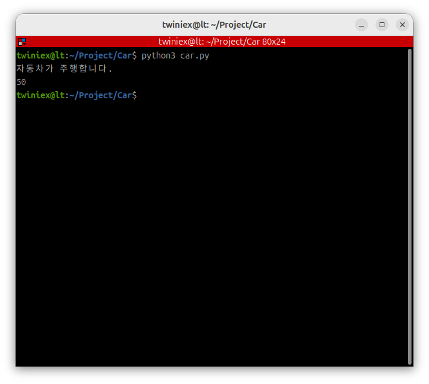

# Python 기본 문법

#### Python

이 교재에서는 파이썬 문법에 대해서는 다루지 않습니다.

이 교재에서는 Python 문법 자체를 자세하게 다루지는 않습니다.

프로그래밍 경험이 전혀 없다면 Python에 대한 추가 학습이 필요할 수도 있습니다. 하지만 이 교재에서는 프로젝트를 진행하면서 필요한 문법과 코드를 함께 설명하기 때문에, Python이나 프로그래밍 경험이 없더라도 내용을 따라오는 데에는 큰 문제가 없습니다.

문법적인 내용은 필요한 시점마다 설명할 예정이며, 여기서는 ROS2를 이해하기 위해 꼭 필요한 개념들만 간단히 살펴보겠습니다.

---

#### 객체지향 프로그래밍

Python은 객체지향 프로그래밍(Object Oriented Programming)을 지원하는 다중 패러다임 언어입니다.

간단한 프로그램은 함수 중심으로 작성할 수도 있지만, 규모가 커질수록 클래스와 객체를 이용하여 프로그램을 구조화하는 방식이 많이 사용됩니다.

ROS2 역시 Node, Publisher, Subscriber, Message 등 대부분의 요소가 객체 형태로 구성되어 있습니다.

따라서 객체와 클래스를 이해하는 것은 ROS2를 이해하는 데 매우 중요합니다.

---

#### 클래스와 객체

객체지향 프로그래밍에서는 실제 프로그램을 직접 만드는 것이 아니라, 먼저 설계도를 만들고 그 설계도를 이용하여 실제 동작하는 객체를 생성합니다.

대표적으로 많이 사용하는 비유가 붕어빵과 붕어빵 틀입니다.

- 붕어빵 틀 → 클래스 (Class)
- 실제 만들어진 붕어빵 → 객체 (Object, Instance)

클래스는 설계도이며, 객체는 실제로 동작하는 프로그램입니다.

예를 들어 자동차를 만든다고 가정해 보겠습니다.

우리는 실제 자동차를 바로 만드는 것이 아니라 먼저 자동차의 설계도를 정의합니다.

```python
class Car:
	pass
```

이 설계도를 이용하여 실제 자동차 객체를 생성할 수 있습니다.

여기서 pass 는 클래스에 대한 내용 정의를 하지 않았다는 의미입니다.

```python
sonata = Car()
grandeur = Car()
morning = Car()
```

이렇게 생성된 `sonata`, `grandeur`, `moirning` 은 모두 Car 클래스로부터 만들어진 객체이며, 인스턴스(Instance)라고도 부릅니다.

---

#### 변수와 함수

클래스는 크게 두 가지 요소로 구성됩니다.

- 변수 (Variable)
- 함수 (Function)

변수는 객체가 가지고 있는 상태나 값을 저장합니다.

함수는 객체가 수행할 수 있는 기능이나 동작을 정의합니다.

예를 들어 자동차는 다음과 같은 기능을 가질 수 있습니다.

```python
class Car:
	def drive(self):
		pass

	def stop(self):
		pass
```

마찬가지로 로봇이라면 다음과 같은 기능을 가질 수 있습니다.

```python
class Robot:
	def pick(self);
		pass
		
	def place(self):
		pass
```

아직 실제 동작은 구현하지 않았지만, 이러한 구조를 통해 객체가 어떤 기능을 수행할 수 있는지를 정의할 수 있습니다.

---

#### 변수 예제

이번에는 자동차 클래스에 실제 변수와 함수를 추가해 보겠습니다.

```python
class Car:
    def __init__(self):
        self.wheel = 4
        self.handle = "round"
        self.speed = 0

    def drive(self):
        self.speed = 50
        print("자동차가 주행합니다.")

    def stop(self):
        self.speed = 0
        print("자동차가 정지합니다.")
```

객체가 생성되면 `__init__()` 함수가 자동으로 호출되며, 객체의 초기 상태를 설정합니다.

```python
self.wheel
self.handle
self.speed
```

와 같은 값들이 객체의 변수입니다.

반대로:

```python
drive()
stop()
```

과 같은 기능들은 객체의 함수입니다.

예를 들어 drive() 함수가 호출되면 자동차의 속도를 50으로 변경합니다.

```bash
mkdir Project/Car
```

실습을 하기 위해 터미널에서 Project 폴더로 이동 합니다.

```bash
gnome-text-editor car.py
```

텍스트 에디터를 사용해 car.py 를 만들어 아래와 같이 Python 코드를 작성합니다.

```python
class Car:
    def __init__(self):
        self.wheel = 4
        self.handle = "round"
        self.speed = 0

    def drive(self):
        self.speed = 50
        print("자동차가 주행합니다.")

    def stop(self):
        self.speed = 0
        print("자동차가 정지합니다.")

my_car = Car()

my_car.drive()

print(my_car.speed)
```

저장을 한 후에 Python 코드를 실행합니다.

```bash
python3 car.py
```



---

#### 모듈(Module)

Python에서는 클래스를 파일 단위로 관리합니다.

예를 들어 아래와 같은 파일이 있다고 가정하겠습니다.

```python
# car.py

class Car:
	pass
	
class Engine:
	pass
	
class Tire:
	pass
```

이때 `car.py`와 같은 Python 파일 하나를 **모듈(Module)** 이라고 부릅니다.

하나의 모듈 안에는 여러 개의 클래스가 존재할 수 있습니다.

---

#### 패키지(Package)

모듈이 파일 단위의 관리 방식이라면, 패키지는 폴더 단위의 관리 방식입니다.

예를 들어:

```python
garage/
 ├── car.py
 ├── engine.py
 └── tire.py
```

여기서 `garage` 폴더가 패키지이며,

- car.py
- engine.py
- tire.py

는 각각의 모듈입니다.

---

#### 패키지와 모듈 사용하기

패키지와 모듈은 `import` 를 이용하여 사용할 수 있습니다.

예를 들어:

```python
from garage.car import Car

my_car = Car()

my_car.drive()
print(my_car.speed)

my_car.stop()
```

위 코드는 `garage` 패키지의 `car` 모듈 안에 있는 `Car` 클래스를 사용하겠다는 의미입니다.

---

반대로 패키지 전체를 가져오면 다음과 같이 사용합니다.

```python
import garage

my_car = garage.car.Car()
```

이번에는 `garage` 패키지 전체를 가져왔기 때문에 Car 클래스를 사용할 때 전체 경로를 명시해야 합니다.

---

모듈만 가져오는 경우는 다음과 같습니다.

```python
from garage import car

my_car = car.Car()
```

이번에는 `car` 모듈 전체를 가져왔기 때문에 `Car` 클래스를 사용할 때 `car.Car()` 형태로 접근해야 합니다.
