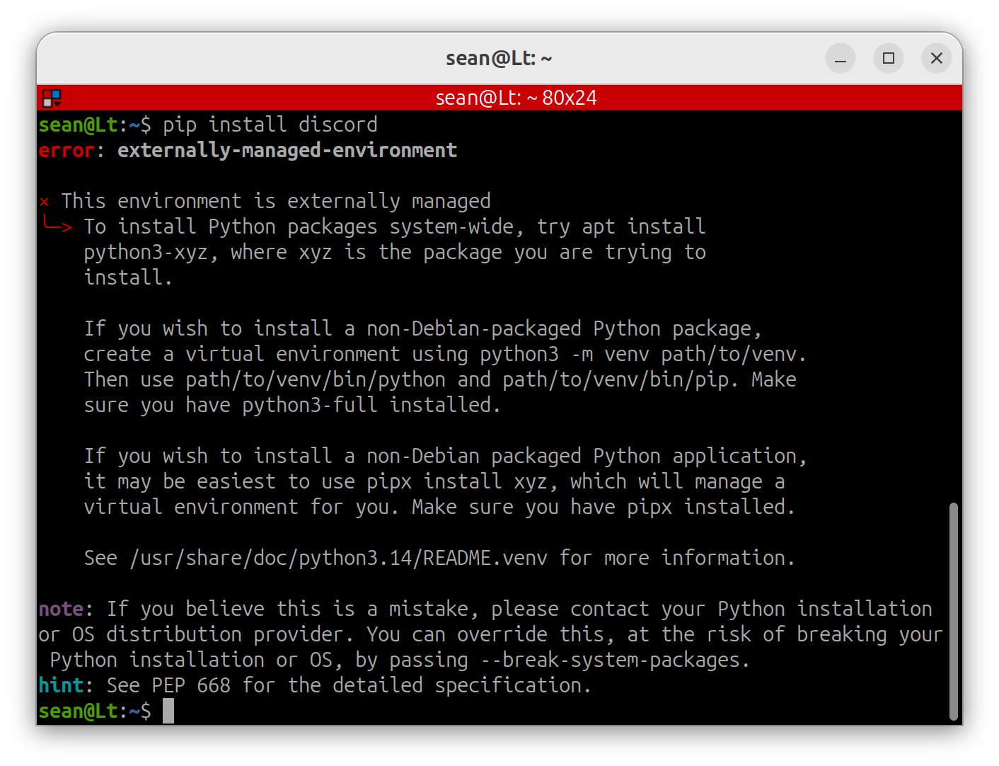

# pip

### pip

`pip`는 Python 패키지를 설치하고 관리하는 도구입니다.

Python으로 작성된 외부 라이브러리를 다운로드하고 설치할 때 사용합니다.

예를 들어:

- numpy
- matplotlib
- opencv-python
- torch

와 같은 패키지들을 설치할 수 있습니다.

쉽게 비유하면,

- iPhone에는 Apple App Store
- Android에는 Google Play Store
- Ubuntu에는 APT
- Python에는 pip

가 있다고 생각하면 됩니다.

즉, `pip`는 Python 생태계에서 사용되는 패키지 저장소이자 패키지 관리 도구입니다.

Ubuntu 26.04에서는 `pip`가 기본적으로 설치되어 있지 않기 때문에 먼저 설치해야 합니다.

```bash
sudo apt install python3-pip
```

설치 후 자주 사용하는 명령어는 다음과 같습니다.

```bash
# 패키지 설치
pip install 패키지이름

# 패키지 삭제
pip uninstall 패키지이름

# 설치된 패키지 목록 확인
pip list

# 특정 버전 설치
pip install 패키지이름==버전
```

---

### pip 와 apt 충돌

하지만 Ubuntu 26.04 환경에서 `pip install`을 실행하면 아래와 같은 오류가 발생할 수 있습니다.

```
error: externally-managed-environment

× This environment is externally managed
╰─> To install Python packages system-wide, use apt install
    python3-xyz
```



이 오류는 Ubuntu가 시스템 Python 환경을 보호하기 위해 `pip` 를 이용한 직접 설치를 제한하기 때문입니다.

Ubuntu는 `apt`를 통해 Python 패키지들을 관리합니다.

만약 `pip`가 시스템 Python에 직접 패키지를 설치하게 되면 `apt`가 관리하는 패키지와 충돌이 발생할 수 있습니다.

예를 들어:

```
apt 설치 버전
numpy 1.25

pip 설치 버전
numpy 2.0
```

과 같은 상황이 발생하면 시스템 프로그램이나 ROS2 패키지가 예상하지 못한 동작을 할 수 있습니다.

이러한 문제를 방지하기 위해 Ubuntu는 시스템 Python 환경을 보호하고 있습니다.

강제로 설치하는 방법이 있지만 추천되지 않으므로 이 교재에서는 설명하지 않습니다.

---

#### 권장 방법: venv

Python에서는 이러한 문제를 해결하기 위해 `venv`라는 가상 환경 기능을 제공합니다.

`venv`를 사용하면 시스템 Python과 완전히 분리된 독립적인 Python 환경을 만들 수 있습니다.

따라서 대부분의 Python 프로젝트에서는 시스템 Python 대신 `venv`환경을 사용하는 것을 권장합니다.
