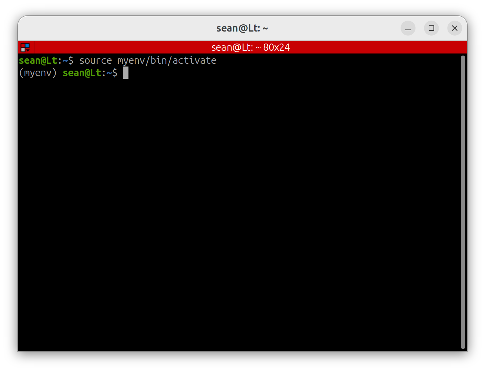

# venv

#### venv

`venv`는 Python 가상환경(Virtual Environment)을 생성하는 도구입니다.

가상환경은 시스템 Python과 완전히 분리된 독립적인 Python 환경이라고 생각하면 됩니다.

가상환경 안에서는 필요한 Python 패키지를 자유롭게 설치하고 관리할 수 있으며, 시스템 Python 환경에는 영향을 주지 않습니다.

프로젝트마다 별도의 가상환경을 사용하면 패키지 버전 충돌 없이 각각의 개발 환경을 독립적으로 관리할 수 있습니다.

예를 들어:

```
프로젝트 A
└── numpy 1.26

프로젝트 B
└── numpy 2.0
```

처럼 서로 다른 버전의 패키지를 동시에 사용하는 것도 가능합니다.

---

Ubuntu 26.04에서는 venv가 기본적으로 설치되어 있지 않기 때문에 먼저 설치해야 합니다.

```bash
sudo apt install python3.14-venv
```

---

**가상환경 생성**

다음 명령으로 새로운 가상환경을 생성할 수 있습니다.

```bash
python3 -m venv 환경이름
```

예를 들어 `myenv`라는 이름의 가상환경을 생성하면 현재 폴더 안에 `myenv` 폴더가 생성되며, 그 안에 독립적인 Python 환경이 구성됩니다.

---

**가상환경 활성화**

생성한 가상환경은 다음 명령으로 활성화할 수 있습니다.

```bash
source 환경이름/bin/activate
```

예를 들면:

```bash
source myenv/bin/activate
```

활성화가 완료되면 터미널 프롬프트 앞에 가상환경 이름이 표시됩니다.

예를 들어:

```bash
(myenv) username@lt:~$
```

와 같이 표시됩니다.

이 상태에서 `pip install`을 실행하면 시스템 Python이 아니라 현재 가상환경 안에 패키지가 설치됩니다.



**가상환경 비활성화**

가상환경 사용이 끝났다면 다음 명령으로 비활성화할 수 있습니다.

```bash
deactivate
```

비활성화되면 터미널 프롬프트 앞에 표시되던 `(myenv)`가 사라지며 다시 시스템 Python 환경으로 돌아오게 됩니다.


Python 프로젝트에서는 대부분 `venv`를 사용하는 것을 권장합니다.

특히 ROS2와 AI 관련 라이브러리를 함께 사용하는 경우 패키지 버전 충돌이 자주 발생하기 때문에 가상환경을 사용하는 습관을 들이는 것이 좋습니다.
