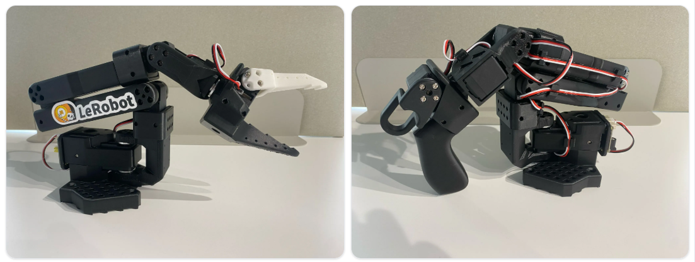

# 소개

앞에서 우리는 Robot을 제어하기 위한 기초 과정으로 Linux와 Python을 학습했습니다.

이제부터는 실제 Robot인 SO-ARM101을 이용하여 Servo Motor와 Joint의 구조를 살펴보고, Python을 이용해 Robot을 직접 제어해 보겠습니다.

---

#### TheRobotStudio

TheRobotStudio는 누구나 제작하고 활용할 수 있는 오픈소스 Robot Hardware를 개발하는 그룹입니다.

대표적인 프로젝트는 다음과 같습니다.

- SO-ARM100
- SO-ARM101
- LeKiwi
- Teleoperation Robot

SO-ARM101은 기존 SO-ARM100을 개선한 오픈소스 Robot Arm입니다. 배선 구조와 조립 편의성이 개선되었으며, Hugging Face의 LeRobot과 함께 사용할 수 있도록 개발되었습니다.

TheRobotStudio의 주요 방향은 다음과 같습니다.

> 저비용, 오픈소스, 누구나 제작할 수 있는 Robot Hardware
> 

고가의 산업용 Robot보다 성능은 제한적이지만, Robot 제어와 AI Robot 기술을 학습하기에 적합하다는 장점이 있습니다.

---

#### Hugging Face와 LeRobot

Hugging Face는 AI Model, Dataset, Library를 공유하고 활용할 수 있도록 다양한 도구를 제공하는 AI Platform입니다.

Hugging Face는 Robot 분야로 영역을 확장하면서 LeRobot을 개발했습니다.

LeRobot은 Robot을 제어하고 데이터를 수집하며, 수집한 데이터로 AI를 학습하고 학습된 동작을 다시 Robot에서 실행하기 위한 오픈소스 Framework입니다.

> LeRobot은 Robot 제어, 데이터 수집, 모방학습과 실행을 지원하는 Framework입니다.
> 

SO-ARM101은 LeRobot과 함께 사용하여 다음과 같은 기능으로 확장할 수 있습니다.

- Leader-Follower 제어
- Teleoperation
- Robot 데이터 수집
- 모방학습
- 학습된 AI Model 실행

이 교재에서는 우선 SO-ARM101의 기본 제어와 Pick & Place를 학습하고, 이후 ROS2와 Gazebo를 이용한 Robot 제어로 확장합니다.

---

#### SO-ARM101

**Leader Arm**

오른쪽 Robot은 SO-ARM101 Leader Arm입니다.

Leader Arm은 사용자가 손으로 움직이면서 각 Joint의 위치를 입력하기 위한 Robot입니다. 사용자가 쉽게 움직일 수 있도록 Follower Arm보다 낮은 기어비의 Motor가 사용됩니다.

Leader Arm의 Joint Position을 읽어 Follower Arm에 전달하면 Follower Arm이 Leader Arm의 움직임을 따라가도록 만들 수 있습니다.

**Follower Arm**

왼쪽 Robot은 SO-ARM101 Follower Arm입니다.

Follower Arm은 프로그램 또는 Leader Arm으로부터 전달받은 명령에 따라 실제로 움직이는 Robot입니다.

물체를 잡을 수 있는 Gripper가 장착되어 있으므로 간단한 Pick & Place 동작을 구현할 수 있습니다.

이 교재에서는 Follower Arm을 이용하여 다음 내용을 학습합니다.

- Servo Motor 제어
- Teaching과 Playback
- Pick & Place
- ROS2 기반 Robot 제어
- Gazebo Simulation
- Digital Twin
