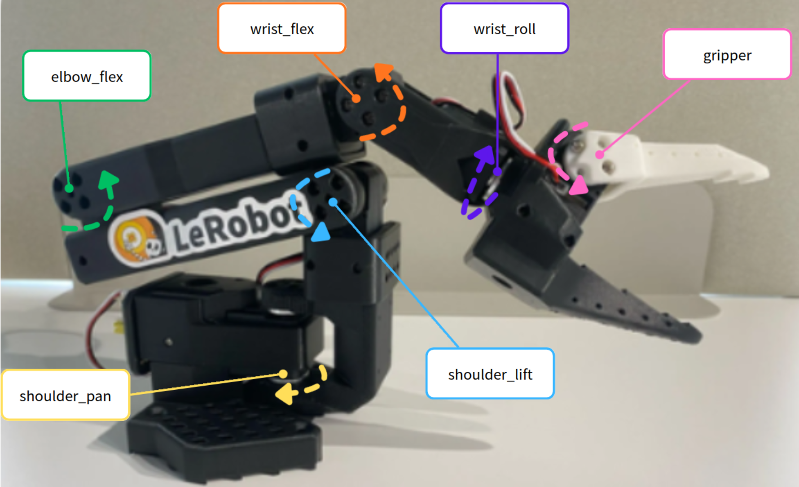

# 모터 구성



SO-ARM101은 Arm을 움직이는 5개의 Joint와 Gripper를 움직이는 1개의 Joint로 구성됩니다.

Leader Arm과 Follower Arm에는 각각 6개의 Servo Motor가 사용됩니다. 두 Arm을 모두 구성하면 총 12개의 Servo Motor가 사용됩니다.

SO-ARM101의 조립과 설정에 관한 최신 내용은 Hugging Face의 공식 LeRobot 문서에서 확인할 수 있습니다.

```bash
https://huggingface.co/docs/lerobot/en/so101
```

---

#### **Follower Arm 모터 구성**

Follower Arm은 물체를 들어 올리고 목표 위치로 이동해야 하므로 모든 Joint에 기어비가 `1/345`인 STS3215 Servo Motor를 사용합니다.

| Follower Arm Joint | Motor ID | 기어비 |
| --- | --- | --- |
| Shoulder Pan | 1 | 1/345 |
| Shoulder Lift | 2 | 1/345 |
| Elbow Flex | 3 | 1/345 |
| Wrist Flex | 4 | 1/345 |
| Wrist Roll | 5 | 1/345 |
| Gripper | 6 | 1/345 |

---

#### **Leader Arm 모터 구성**

Leader Arm은 사용자가 손으로 직접 움직여야 하므로 Joint의 역할에 따라 서로 다른 기어비의 Servo Motor를 사용합니다.

| Leader Arm Joint | Motor ID | 기어비 |
| --- | --- | --- |
| Shoulder Pan | 1 | 1/191 |
| Shoulder Lift | 2 | 1/345 |
| Elbow Flex | 3 | 1/191 |
| Wrist Flex | 4 | 1/147 |
| Wrist Roll | 5 | 1/147 |
| Gripper | 6 | 1/147 |

---

기어비가 높으면 일반적으로 출력 Torque가 커지는 대신 사용자가 손으로 움직이기 어려워집니다.

Follower Arm은 직접 물체를 움직여야 하므로 높은 기어비의 Motor를 사용합니다. 반면 Leader Arm은 사용자가 직접 움직여야 하므로 일부 Joint에 비교적 낮은 기어비의 Motor를 사용합니다.

Leader Arm의 움직임을 Follower Arm이 따라가도록 하여 사용자의 동작을 수집하고 학습하는 방식을 모방학습(Imitation Learning)이라고 합니다.
