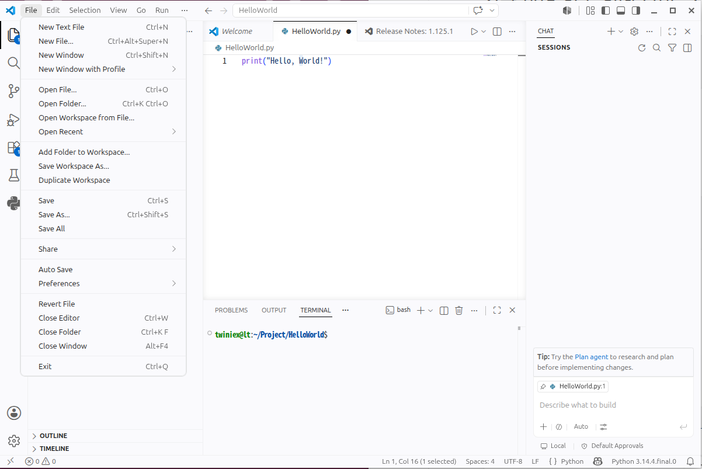

# 파이썬 코드 실행 준비

#### venv 진입

```bash
username@lt:~$ source project/rosws/lerobot/venv/bin/activate
```

가상환경으로 진입을 했습니다.

앞으로 교재에서 가상환경에 진입하는 경우가 많은데 매번 입력하기 귀찮습니다.

앞서 배웠던 `alias` 기능을 사용해 `.bashrc` 에 `venv` 를 적용해두면 훨씬 수훨합니다.

```bash
gnome-text-editor .bashrc
```

텍스트 에디터를 통해 .bashrc 에 아래 내용을 추가합니다.

```bash
alias venv='source project/rosws/lerobot/venv/bin/activate'
```

이후에는 `venv` 만 입력해도 가상환경에 진입할 수 있습니다.

---

#### 파이썬 코드 실행 준비

SO-ARM101을 제어하기 위한 작업 폴더를 생성합니다.

```bash
(venv) username@lt:~$ cd project/rosws
(venv) username@lt:~/project/rosws$ mkdir control
(venv) username@lt:~/project/rosws$ cd control
(venv) username@lt:~/project/rosws/control$ 
```



VS CODE 에서 **File → Open Folder** 를 선택합니다.


앞에서 생성한 project/rosws/control 폴더를 선택합니다.


Explorer 영역에서 마우스 오른쪽 버튼을 누르고 **New File**을 선택하여 다음 파일을 생성합니다.


```bash
motor_test.py
```

이번 실습에서는 앞에서 생성한 LeRobot 가상환경을 사용해야 합니다.

따라서 VS Code의 Python Interpreter를 가상환경의 Python으로 변경합니다.

```bash
단축키: Ctrl + Shift + P
입력: Python: Select Interpreter
선택: Enter Interpreter Path
선택: Find… Browse your file system to find a python interpreter.
```


다음 Python Interpreter를 선택합니다.

```bash
~/project/rosws/lerobot/venv/bin/python
```
