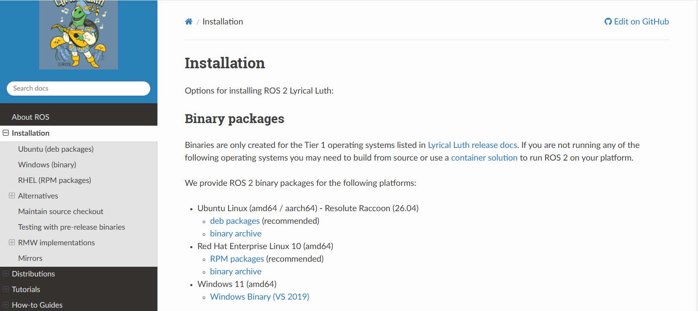

# ROS2 Lyrical Luth 설치

이번 장에서는 Ubuntu 26.04와 호환되는 ROS2 Lyrical Luth를 설치합니다.

#### ROS2 공식 설치 페이지

웹 브라우저에서 `ROS 2 Lyrical install`을 검색하여 ROS 2 공식 설치 안내 페이지로 이동합니다.



ros2 공식 설치안내 페이지 화면 

ROS 2는 다음 두 가지 방식으로 설치할 수 있습니다.

- Binary packages: 미리 빌드된 패키지를 설치하는 방식
- Building from source: 소스 코드를 내려받아 직접 빌드하는 방식

이 교재에서는 설치가 간편하고 안정적인 Binary packages 방식을 사용합니다. 공식 설치 페이지에서 `Binary packages` 아래의 `deb packages`를 선택하고 설치를 진행합니다.

안내 페이지에서는 크게 바이너리 설치(binary packages) 와 소스코드에서 직접 빌드(building from source)하는 두가지 방법이 나와있습니다.

본 도서에서는 설치의 편의성과 안정성을 고려하여 바이너리 패키지 설치 방식을 사용합니다. 
위 화면에서 Binary packages 아래에 deb backages를 선택하고 화면에 나오는 절차에 맞게 설치를 진행하겠습니다

---

#### Local 설정

Locale은 운영체제에서 사용하는 언어와 문자 인코딩 설정입니다. ROS 2는 UTF-8 환경을 사용하므로 설치 전에 Locale을 UTF-8로 설정합니다


ros2 lyrical 설치 중 set locale 부분 

```bash
locale  # check for UTF-8

sudo apt update && sudo apt install locales
sudo locale-gen en_US en_US.UTF-8
sudo update-locale LC_ALL=en_US.UTF-8 LANG=en_US.UTF-8
export LANG=en_US.UTF-8

locale  # verify settings
```

Ubuntu를 한국어로 설치했다면 `ko_KR.UTF-8`로 설정되어 있을 수 있으며, 일반적으로 ROS 2를 실행하는 데 큰 문제는 없습니다.

다만 이 교재에서는 ROS 2 공식 문서와 동일한 환경을 구성하기 위해 `en_US.UTF-8`을 적용합니다.

---

#### Universe 저장소 활성화

ROS 2와 관련된 개발 도구를 설치할 수 있도록 Ubuntu의 `universe` 저장소를 활성화합니다.


```bash
sudo apt install software-properties-common
sudo add-apt-repository universe
```

Ubuntu의 패키지 저장소는 라이선스와 지원 범위에 따라 다음과 같이 구분됩니다.

| 구역 | 설명 |
| --- | --- |
| **main** | Canonical이 직접 유지·보수하는 오픈소스 소프트웨어 |
| **restricted** | 동작에 필요하지만 완전한 오픈소스가 아닌 드라이버 및 소프트웨어 |
| **universe** | 커뮤니티에서 유지·보수하는 오픈소스 소프트웨어 |
| **multiverse** | 저작권이나 라이선스에 제약이 있는 소프트웨어 |

ROS2는 별도의 저장소에서 제공되지만, ROS2의 개발과 빌드에 필요한 일부 의존성 패키지는 `universe`에 포함되어 있습니다.

Ubuntu Desktop에서는 일반적으로 이미 활성화되어 있지만, Server나 Minimal 환경에서는 비활성화되어 있을 수 있으므로 설치 전에 활성화하는 것이 안전합니다.

다음 명령으로 활성화 여부를 확인할 수 있습니다.

```bash
apt-cache policy | grep universe
```


출력 결과에 universe 가 포함된 줄이 나타나면 정상적으로 활성화된 상태입니다.

---

#### ROS2 apt 저장소 등록

ROS2 패키지는 Ubuntu 기본 저장소가 아닌 ROS 프로젝트에서 운영하는 별도의 패키지 저장소를 통해 제공됩니다.

먼저 `curl`을 설치합니다.


```bash
sudo apt update
sudo apt install curl -y
```

다음 명령으로 최신 `ros2-apt-source` 패키지의 버전을 확인합니다.

```bash
export ROS_APT_SOURCE_VERSION=$(curl -s \
https://api.github.com/repos/ros-infrastructure/ros-apt-source/releases/latest \
| grep -F "tag_name" \
| awk -F'"' '{print $4}')
```

확인한 버전에 맞는 패키지를 내려받습니다.

```bash
curl -L -o /tmp/ros2-apt-source.deb \
"https://github.com/ros-infrastructure/ros-apt-source/releases/download/${ROS_APT_SOURCE_VERSION}/ros2-apt-source_${ROS_APT_SOURCE_VERSION}.$(. /etc/os-release && echo ${UBUNTU_CODENAME:-${VERSION_CODENAME}})_all.deb"
```

마지막으로 내려받은 패키지를 설치합니다.

```bash
sudo dpkg -i /tmp/ros2-apt-source.deb
```

`ros2-apt-source` 패키지는 ROS2 저장소 주소와 패키지 서명 검증에 필요한 GPG 공개키를 시스템에 등록합니다.

과거에는 저장소 주소와 GPG키를 사용자가 직접 등록했지만, 현재는 `ros2-apt-source` 패키지를 사용하여 한 번에 설정할 수 있습니다.

---

#### 개발 도구 설치

ROS2 패키지 개발에 필요한 도구를 설치합니다.


```bash
sudo apt update && sudo apt install ros-dev-tools
```

`ros-dev-tools` 에는 ROS2 개발 과정에서 사용하는 다음과 같은 도구가 포함되어 있습니다.

- `colcon`: ROS2 Workspace ㅣㄹ드
- `rosdep`: Package 의존성 설치
- `vcstool`: 여러 Git 저장소 관리

이후 사용자 정의 Package를 작성하고 Workspace를 빌드할 예정이므로 함께 설치합니다.

---

#### ROS2 Lyrical Luth 설치

패키지 목록과 현재 설치된 패키지를 먼저 갱신합니다.

```bash
sudo apt update
sudo apt upgrade -y
```

ROS2 Lyrical Desktop 버전을 설치합니다.


ros2 lyrical 버전을 설치하는 명령어

```
sudo apt install ros-lyrical-desktop
```

ROS 2는 크게 `ROS-Base`와 `Desktop` 구성으로 설치할 수 있습니다.

| 구분 | 설명 |
| --- | --- |
| ROS-Base | ROS 2 핵심 기능만 포함하는 최소 구성 |
| Desktop | ROS-Base와 RViz2, rqt, Turtlesim 등의 도구를 포함하는 구성 |

ROS-Base는 모니터가 없는 로봇 제어용 컴퓨터나 임베디드 환경에 적합합니다.

Desktop은 RViz2와 같은 시각화 도구와 교육용 예제를 포함하므로 개발용 PC나 노트북에 적합합니다.

이 교재에서는 Turtlesim과 RViz2를 사용하므로 Desktop 버전을 설치합니다. Desktop 버전에는 ROS-Base가 포함되어 있으므로 별도로 설치할 필요는 없습니다.

---

#### ROS2 환경 불러오기

ROS2 명령어를 사용하려면 새로운 Terminal을 열 때마다 다음 설정 파일을 불러와야 합니다.

```bash
source /opt/ros/lyrical/setup.bash
```

매번 명령을 입력하지 않으려면 다음 명령으로 `.bashrc`에 등록할 수 있습니다.

```bash
echo "source /opt/ros/lyrical/setup.bash" >> ~/.bashrc
```

설정을 현재 Terminal에 바로 적용합니다.

```bash
source ~/.bashrc
```

---

#### ROS2 설치 확인

ROS2가 정상적으로 설치되었는지 확인하기 위해 Talker와 Listener 예제를 실행합니다.

먼저 Terminal을 두 개 실행합니다.

Terminal #1에서 다음 명령을 실행합니다.

```bash
source /opt/ros/lyrical/setup.bash
ros2 run demo_nodes_cpp listener
```

Terminal #2에서 다음 명령을 실행합니다.

```bash
source /opt/ros/lyrical/setup.bash
ros2 run demo_nodes_cpp talker
```


Talker는 메시지를 반복해서 보내고, Listener는 해당 메시지를 받아 화면에 출력합니다.

두 Terminal에 메시지가 정상적으로 출력된다면 ROS2 Lyrical Luth 설치가 완료된 것입니다.

현재는 설치 상태를 확인하기 위해 예제 Node를 실행한 것입니다. Node와 ROS2 명령어의 자세한 사용 방법은 다음 장에서 알아보겠습니다.