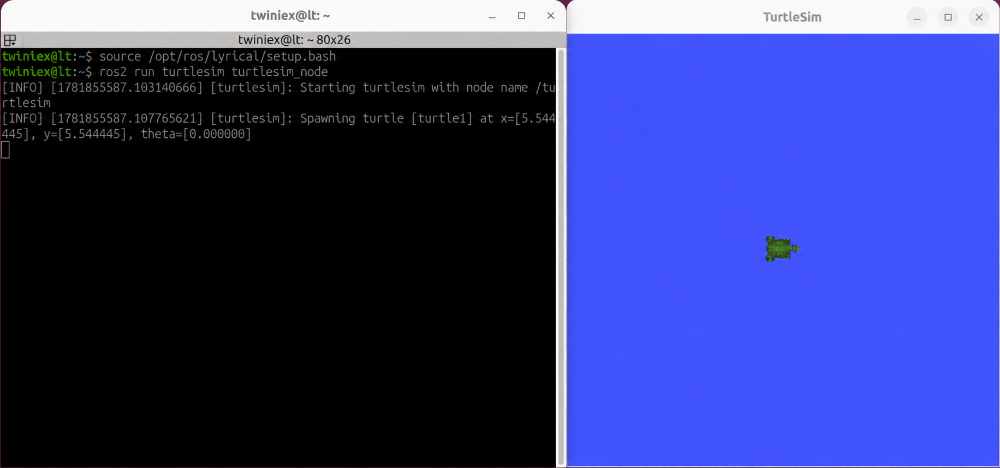

# Turtlesim 설치와 실행

이번 장에서는 ROS 2의 기본 개념과 명령어를 알아보기 위해 ROS 2에서 제공하는 교육용 시뮬레이터인 Turtlesim을 사용합니다.

ROS 2는 Node, Topic, Publisher, Subscriber와 같은 개념을 기반으로 동작합니다. 이러한 개념은 대부분 터미널 명령어와 데이터 형태로 표현되기 때문에 처음에는 이해하기 어려울 수 있습니다.

Turtlesim을 사용하면 실제 로봇 없이도 화면 속 거북이가 움직이는 모습을 보며 ROS 2의 동작을 시각적으로 확인할 수 있습니다.

#### Turtlesim 설치

ROS 2 Lyrical을 Desktop 버전으로 설치했다면 Turtlesim도 기본적으로 함께 설치됩니다.

Turtlesim이 설치되어 있지 않다면 다음 명령을 실행합니다.

```
sudo apt updatesudo apt install ros-lyrical-turtlesim
```

---

#### ROS 2 환경 불러오기

ROS 2 명령어를 사용하려면 먼저 현재 Terminal에 ROS 2 환경설정을 적용해야 합니다.

```
source /opt/ros/lyrical/setup.bash
```

이 명령은 `/opt/ros/lyrical/setup.bash`에 저장된 ROS 2 환경설정을 현재 Terminal에 적용합니다.

앞에서 `.bashrc` 또는 Alias를 이용해 환경설정을 자동으로 불러오도록 구성했다면 이 명령은 생략할 수 있습니다.

---

#### Turtlesim 실행

다음 명령으로 Turtlesim을 실행합니다.

```
ros2 run turtlesim turtlesim_node
```

명령어의 구성은 다음과 같습니다.

```
ros2 run 패키지이름 실행파일이름
```

따라서 위 명령은 `turtlesim` Package에 포함된 `turtlesim_node` Node를 실행한다는 의미입니다.

명령을 실행하면 파란색 창의 중앙에 거북이 한 마리가 나타납니다.



현재는 Turtlesim이 정상적으로 설치되고 실행되었는지만 확인합니다. 다음 장부터 Turtlesim을 활용하여 ROS2의 Node와 관련 명령어를 알아보겠습니다.