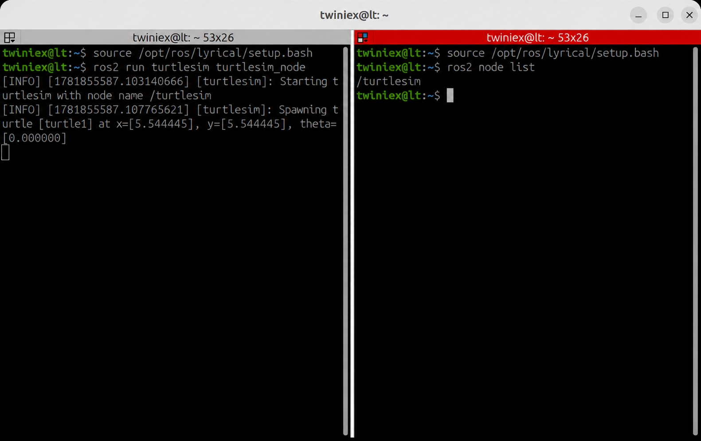

# ROS2 Node

Node는 ROS2 시스템에서 특정 기능을 수행하는 하나의 실행 단위입니다.

예를 들어 카메라 영상을 처리하는 Node, 모터를 제어하는 Node, 센서 데이터를 전달하는 Node를 각각 만들 수 있습니다. 각 Node는 필요한 정보를 다른 Node와 주고받으며 하나의 로봇 시스템을 구성합니다.

#### Node 실행

ROS2의 실행 파일은 다음 명령으로 실행합니다.

```bash
ros2 run <Pkg Name> <Node Name>
```

명령어는 다음과 같이 구성됩니다.

- ros2 run: ROS2 실행 명령
- Package Name: 실행 파일이 포함된 Package 이름
- Executable Name: Package 내부에서 실행할 파일 이름

앞에서 사용한 Turtlesim도 같은 방법으로 실행합니다.

```bash
source /opt/ros/lyrical/setup.bash
ros2 run turtlesim turtlesim_node
```

앞에서 .bashrc 또는 alias를 이용해 ROS2 환경설정을 적용했다면 source 명령은 생략할 수 있습니다.

명령을 실행하면 파란색 창의 중앙에 거북이 한 마리가 나타납니다.

---

#### 실행 중인 Node 확인

Turtlesim을 실행한 상태에서 새로운 Terminal을 열고 다음 명령을 실행합니다.

```bash
ros2 node list
```



실행 결과에서 다음 Node를 확인할 수 있습니다.

```bash
/turtlesim
```

`turtlesim_node`는 `ros2 run` 명령에서 사용한 실행 파일 이름이고, /turtlesim은 해당 프로그램이 실행되면서 생성한 Node의 이름입니다.

---

#### Node 정보 확인

Node의 자세한 정보는 다음 명령으로 확인할 수 있습니다.

```bash
ros2 node info /<Node Name>
```

현재 실행 중인 /turtlesim Node의 정보를 확인해 보겠습니다.

```bash
ros2 node info /turtlesim
```


실행 결과에서는 해당 Node가 사용하는 다음 정보를 확인할 수 있습니다.

- Subscribers
- Publishers
- Service Servers
- Service Clients
- Action Servers
- Action Clients

Node는 Topic, Service, Action을 이용하여 다른 Node와 데이터를 주고받습니다.

현재는 `/turtlesim`이라는 Node가 실행되고 있으며 `ros2 node list`와 `ros2 node info` 명령으로 Node의 목록과 정보를 확인할 수 있다는 정도만 알아두면 됩니다. Topic, Service, Action은 다음 장에서 자세히 알아보겠습니다.