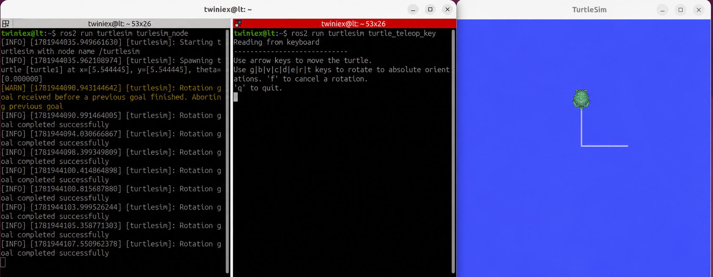

# ROS2 Topic

앞 장에서 Node가 서로 정보를 주고받으며 하나의 ROS2 시스템을 구성한다고 설명했습니다.

Node 사이에서 가장 많이 사용하는 통신 방식이 Topic입니다.

#### Topic이란?

Topic은 발행(Publish)과 구독(Subscribe) 구조로 동작합니다.

Publisher가 특정 Topic에 데이터를 발행하면 해당 Topic을 구독하는 Subscriber가 데이터를 전달받습니다.

Topic 통신의 특징은 다음과 같습니다.

- 비동기 방식으로 동작하며 응답을 기다리지 않습니다.
- 하나의 Topic에 여러 Publisher와 Subscriber가 연결될 수 있습니다.
- 센서값, 위치 정보, 속도 명령처럼 지속적으로 전달되는 데이터에 적합합니다.

이번에는 Turtlesim을 이용하여 Topic의 동작을 확인해 보겠습니다.

---

#### Turtlesim과 Teleop 실행

첫 번째 Terminal에서 Turtlesim을 실행합니다.

```bash
ros2 run turtlesim turtlesim_node
```

두 번째 Terminal에서 키보드로 거북이를 조작하는 Node를 실행합니다.

```bash
ros2 run turtlesim turtle_teleop_key
```

`turtle_teleop_key`를 실행한 Terminal을 선택하고 방향키를 누르면 거북이가 선을 그리며 움직입니다.



이 과정에서 turtle_teleop_key Node는 키보드 입력을 속도 명령으로 변환하여 Topic에 발행합니다.

turtlesim_node는 해당 Topic을 구독하고 있다가 속도 명령을 전달받으면 거북이를 움직입니다.

```bash
turtle_teleop_key
        │
        │ Publish
        ▼
/turtle1/cmd_vel
        │
        │ Subscribe
        ▼
turtlesim_node
```

---

#### Topic 목록 확인

새로운 Terminal을 열고 현재 활성화된 Topic 목록을 확인합니다.

```bash
ros2 topic list
```


다음과 같은 Topic을 확인할 수 있습니다.

```bash
/turtle1/cmd_vel
/turtle1/pose
/turtle1/color_sensor
```

각 Topic의 역할은 다음과 같습니다.

| Topic | 설명 |
| --- | --- |
| `/turtle1/cmd_vel` | 거북이의 이동 속도 명령 |
| `/turtle1/pose` | 거북이의 현재 위치와 자세 |
| `/turtle1/color_sensor` | 거북이가 위치한 배경의 색상 정보 |

---

#### Topic 정보 확인

`ros2 topic info` 명령을 사용하면 Topic의 정보를 확인할 수 있습니다.

```bash
ros2 topic info /turtle1/pose
```


실행 결과에 다음 정보가 표시됩니다.

- Topic이 사용하는 메시지 타입
- Publisher 수
- Subscriber 수

메시지 타입(Message Type)은 Topic을 통해 전달되는 데이터의 구조와 형식을 정의합니다.

`/turtle1/pose` Topic은 다음 메시지 타입을 사용합니다.

```bash
turtlesim_msgs/msg/Pose
```

---

#### 메시지 구조 확인

ros2 interface show 명령으로 메시지의 데이터 구조를 확인할 수 있습니다.

```bash
ros2 interface show turtlesim_msgs/msg/Pose
```


Pose 메시지는 다음과 같은 데이터로 구성됩니다.

| 데이터 | 설명 |
| --- | --- |
| `x` | 거북이의 X축 위치 |
| `y` | 거북이의 Y축 위치 |
| `theta` | 거북이가 바라보는 회전 각도 |
| `linear_velocity` | 현재 직선 속도 |
| `angular_velocity` | 현재 회전 속도 |

`x`, `y`, `theta`는 거북이의 현재 위치와 자세를 나타내고, `linear_velocity`와 `angular_velocity`는 현재 움직임을 나타냅니다.

---

#### Topic 데이터 구독

Terminal에서 `/turtle1/pose` Topic을 직접 구독해 보겠습니다.

```bash
ros2 topic echo /turtle1/pose
```


`ros2 interface show`에서 확인한 구조에 따라 데이터가 계속 출력됩니다.

`turtle_teleop_key`가 실행된 Terminal에서 방향키를 눌러 거북이를 움직이면 위치, 회전 각도 및 속도값이 변하는 것을 확인할 수 있습니다.

`ros2 topic echo` 명령도 해당 Topic을 구독하는 하나의 Subscriber 역할을 합니다.

---

#### 속도 명령 Topic 확인

이번에는 Terminal에서 Topic에 직접 값을 발행하여 거북이를 움직여 보겠습니다.

거북이의 이동을 제어하는 Topic은 다음과 같습니다.

```
/turtle1/cmd_vel
```

`cmd_vel`은 Command Velocity의 줄임말로 로봇이나 시뮬레이터에 속도 명령을 전달할 때 일반적으로 사용하는 이름입니다.

다음 명령으로 Topic의 정보를 확인합니다.

```
ros2 topic info /turtle1/cmd_vel
```


`/turtle1/cmd_vel`은 다음 메시지 타입을 사용합니다.

```
geometry_msgs/msg/Twist
```

메시지 구조를 확인합니다.

```
ros2 interface show geometry_msgs/msg/Twist
```


`Twist` 메시지는 직선 속도인 `linear`와 회전 속도인 `angular`로 구성됩니다.

```
linear
├─ x
├─ y
└─ z

angular
├─ x
├─ y
└─ z
```

ROS 2의 메시지는 3차원 로봇에서도 사용할 수 있도록 X, Y, Z축 값을 모두 제공합니다.

하지만 Turtlesim은 평면에서 움직이는 2D 시뮬레이터이므로 다음 두 값만 사용합니다.

- `linear.x`: 거북이가 앞뒤로 이동하는 속도
- `angular.z`: 거북이가 평면에서 회전하는 속도

나머지 값은 기본값인 `0.0`으로 사용합니다.

---

#### Topic에 메시지 발행

Topic에 메시지를 발행하는 기본 명령은 다음과 같습니다.

```
ros2 topic pub <옵션> <Topic Name> <Message Type> "<Data>"
```

한 번만 발행하려면 `--once` 옵션을 사용합니다.

```
ros2 topic pub --once \
/turtle1/cmd_vel \
geometry_msgs/msg/Twist "{linear: {x: 2.0}, angular: {z: 2.0}}"
```

한 줄로 입력해도 됩니다.

```bash
ros2 topic pub --once /turtle1/cmd_vel geometry_msgs/msg/Twist "{linear: {x: 2.0}, angular: {z: 2.0}}"
```


위 명령은 다음과 같은 속도 명령을 발행합니다.

- `linear.x: 2.0` → 전진 속도
- `angular.z: 2.0` → 회전 속도


전진과 회전 명령을 동시에 전달했기 때문에 거북이가 곡선을 그리며 움직입니다.

메시지 데이터를 입력할 때 `x:`와 같이 콜론 앞에는 공백을 넣지 않아야 합니다.

---

## Topic을 주기적으로 발행

- `--once`는 메시지를 한 번만 발행합니다.

Turtlesim은 일정 시간 동안 새로운 속도 명령이 들어오지 않으면 거북이를 자동으로 정지시킵니다. 따라서 거북이를 계속 움직이려면 속도 명령을 반복해서 발행해야 합니다.

다음 명령은 1 Hz, 즉 1초에 한 번씩 메시지를 발행합니다.

```
ros2 topic pub --rate 1 \
/turtle1/cmd_vel \
geometry_msgs/msg/Twist "{linear: {x: 2.0}, angular: {z: 2.0}}"
```

명령을 실행하면 거북이가 원을 그리며 계속 움직입니다.

발행을 중지하려면 해당 Terminal에서 `Ctrl + C`를 누릅니다.

Terminal에서 실행한 `ros2 topic pub` 명령은 `turtle_teleop_key` Node가 수행하던 Publisher의 역할을 대신한 것입니다.

같은 Topic에 같은 메시지 타입으로 데이터를 발행하면 다른 Node나 Terminal에서도 동일한 명령을 전달할 수 있습니다.

---

## ros2 topic 주요 명령어

| 명령어 | 설명 |
| --- | --- |
| `ros2 topic list` | 현재 활성화된 Topic 목록 출력 |
| `ros2 topic list -t` | Topic과 메시지 타입을 함께 출력 |
| `ros2 topic info <Topic>` | Topic 정보 확인 |
| `ros2 topic info <Topic> -v` | Publisher와 Subscriber의 상세 정보 확인 |
| `ros2 topic echo <Topic>` | Topic 데이터 실시간 출력 |
| `ros2 topic hz <Topic>` | Topic의 발행 주기 확인 |
| `ros2 topic bw <Topic>` | Topic의 통신 대역폭 확인 |
| `ros2 topic pub <Topic> <Type> "<Data>"` | Topic에 메시지 발행 |
| `ros2 topic find <Type>` | 특정 메시지 타입을 사용하는 Topic 검색 |

Topic은 응답을 기다리지 않고 데이터를 전달하는 발행·구독 방식의 통신입니다.

다음 장에서는 필요한 순간에 요청을 보내고 그 결과를 전달받는 Service에 대해 알아보겠습니다.
