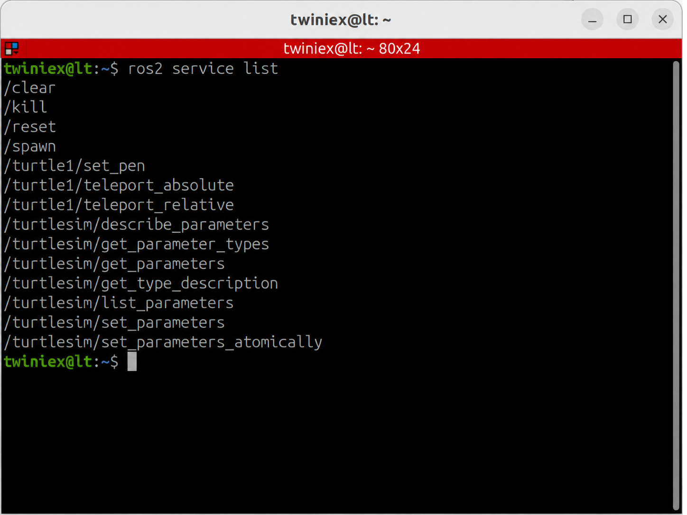

# ROS2 Service

Topic이 지속적으로 흐르는 데이터를 전달하는 방식이라면 Service는 필요한 순간에 요청(Request)을 보내고 그 결과를 응답(Response)으로 받는 통신 방식입니다.

Service를 요청하는 Node를 Service Client라고 하고, 요청을 받아 처리한 후 응답을 보내는 Node를 Service Server라고 합니다.

```bash
Service Client
      │
      │ Request
      ▼
Service Server
      │
      │ Response
      ▼
Service Client
```

Service의 특징은 다음과 같습니다.

- 하나의 요청에 하나의 응답이 전달됩니다.
- Client는 Server에 필요한 작업을 요청합니다.
- 화면 지우기, 설정 변경, 상태 확인처럼 한번 실행하고 끝나는 작업에 적합합니다.
- 요청 결과를 확인할 수 있습니다.

일반적으로 Service Client는 응답이 올 때까지 기다리는 방식으로 사용하지만, 프로그램에서는 비동기 방식으로 요청을 보내고 다른 작업을 수행하도록 구성할 수도 있습니다.

---

#### Service 목록 확인

먼저 Turtlesim을 실행합니다.

```bash
ros2 run turtlesim turtlesim_node
```

새로운 Terminal을 열고 현재 활성화된 Service 목록을 확인합니다.

```bash
ros2 service list
```



다음과 같은 Service를 확인할 수 있습니다.

```bash
/clear
/reset
/spawn
/kill
/turtle1/set_pen
/turtle1/teleport_absolute
```

각 Service의 역할은 다음과 같습니다.

| Service | 설명 |
| --- | --- |
| `/clear` | 거북이가 그린 선을 지웁니다. |
| `/reset` | Turtlesim을 초기 상태로 되돌립니다. |
| `/spawn` | 새로운 거북이를 생성합니다. |
| `/kill` | 지정한 거북이를 삭제합니다. |
| `/turtle1/set_pen` | 거북이가 그리는 선의 색상과 굵기를 설정합니다. |
| `/turtle1/teleport_absolute` | 거북이를 지정한 위치로 즉시 이동합니다. |

---

#### Service 정보 학인

`/turtle1/teleport_absolute Service`의 정보를 확인해 보겠습니다.

```bash
ros2 service info /turtle1/teleport_absolute
```


실행 결과에서는 다음 정보를 확인할 수 있습니다.

- Service Type
- Service Client 수
- Service Server 수

Service Type은 Service를 통해 주고받는 데이터의 구조와 형식을 정의합니다.

Topic은 전달할 메시지 구조 하나를 정의하지만, Service는 요청과 응답이라는 두 가지 데이터 구조를 하나의 타입에 함께 정의합니다.

---

#### Service 데이터 구조 확인

`/turtle1/teleport_absolute`에서 사용하는 Service Type을 확인합니다.

```bash
ros2 service type /turtle1/teleport_absolute
```

다음과 같은 결과가 출력됩니다.

```bash
turtlesim_msgs/srv/TeleportAbsolute
```

Service Type의 데이터 구조는 `ros2 interface show` 명령으로 확인할 수 있습니다.

```bash
ros2 interface show turtlesim_msgs/srv/TeleportAbsoulte
```


결과는 다음과 같은 구조로 표시됩니다.

```bash
float32 x
float32 y
float32 theta
---
```

Service Interface에서 `---`를 기준으로 위쪽은 Request, 아래쪽은 Response 데이터 입니다.

`TeleportAbsolute`는 다음 세 가지 값을 요청 데이터로 사용합니다.

| 데이터 | 설명 |
| --- | --- |
| `x` | 이동할 X축 위치 |
| `y` | 이동할 Y축 위치 |
| `theta` | 이동 후 거북이가 바라볼 각도 |

`---`아래에는 아무런 데이터도 없습니다. 거북이를 지정된 위치로 옮기는 작업만 수행하므로 별도의 Response 데이터가 정의되어 있지 않기 때문입니다.

Response 데이터가 비어 있더라도 요청의 처리 완료 여부는 확인할 수 있습니다.

---

#### Request와 Response가 있는 Service

모든 Service와 Response가 비어 있는 것은 아닙니다.

새로운 거북이를 생성하는 `/spawn` Service 타입을 확인해 보겠습니다.

```bash
ros2 service type /spawn
```

다음과 같은 Service Type이 출력됩니다.

```bash
turtlesim_msgs/srv/Spawn
```

데이터 구조를 확인합니다.

```bash
ros2 interface show turtlesim_msgs/srv/Spawn
```


`Spawn` Service는 다음과 같은 구조를 가집니다.

```bash
float32 x
float32 y
float32 theta
string name
---
string name
```

`---`위쪽에는 새로 생성할 거북이의 위치, 각도와 이름을 입력합니다.

`---`아래쪽에는 실제로 생성된 거북이의 이름이 Response로 전달됩니다.

---

#### Service 요청

Terminal에서 Service를 요청하는 기본 명령은 다음과 같습니다.

```bash
ros2 service call <Service Name> <Service Type> "<Request Data>"
```

명령어는 다음과 같이 구성됩니다.

- `ros2 service call`: Service 요청 명령
- `Service Name`: 요청할 Service 이름
- `Service Type`: 해당 Service가 사용하는 타입
- `Request Data`: Service에 전달할 요청 데이터

Terminal에서 ros2 service call을 실행하면 Terminal 명령이 Service Client 역할을 합니다.

Request 데이터는 ros2 interface show 명령에서 확인한 `---`위쪽의 구조에 맞게 입력해야 합니다.

---

#### 거북이 위치 이동

`/turtle1/teleport_absolute` Service를 호출하여 거북이를 이동해 보겠습니다.

```bash
ros2 service call \
/turtle1/teleport_absolute \
turtlesim_msgs/srv/TeleportAbsolute \
"{x: 2.0, y: 2.0, theta: 0.0}"
```

한 줄로 입력해도 됩니다.

```bash
ros2 service call /turtle1/teleport_absolute turtlesim_msgs/srv/TeleportAbsolute "{x: 2.0, y: 2.0, theta: 0.0}"
```


명령을 실행하면 거북이가 X축 `2.0`, Y축 `2.0` 위치로 즉시 이동합니다. Theta를 0.0으로 지정했기 때문에 오른쪽을 바라보게 됩니다.

---

#### ros2 service 주요 명령어

| 명령어 | 설명 |
| --- | --- |
| `ros2 service list` | 현재 활성화된 Service 목록 출력 |
| `ros2 service list -t` | Service 이름과 타입을 함께 출력 |
| `ros2 service type <Service>` | 특정 Service의 타입 확인 |
| `ros2 service info <Service>` | Service의 Client와 Server 정보 확인 |
| `ros2 interface show <Service Type>` | Request와 Response 데이터 구조 확인 |
| `ros2 service call <Service> <Type> "<Data>"` | Service 요청 |

Service는 Client가 Server에 작업을 요청하고 그 결과를 응답받는 통신 방식입니다.

화면 지우기나 설정 변경처럼 짧은 시간 안에 완료되는 작업에는 적합하지만, 이동이나 회전처럼 완료까지 시간이 걸리고 진행 상태를 확인해야 하는 작업에는 적합하지 않습니다.

이러한 작업에는 다음 장에서 알아볼 Action을 사용합니다.