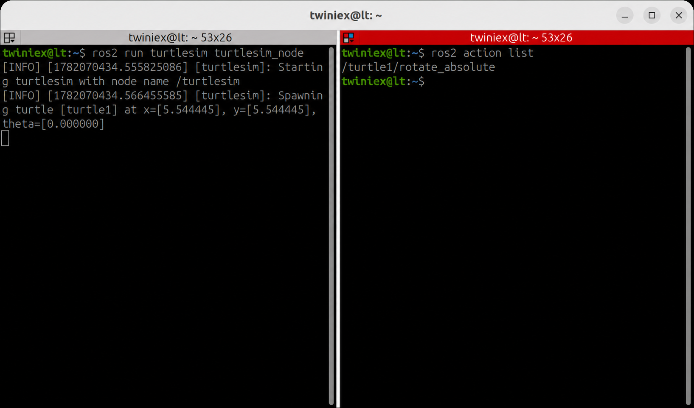

# ROS2 Action

Action은 시간이 오래 걸리는 작업을 처리하기 위한 통신 방식입니다. Action Client가 목표(Goal)를 전달하면 Action Server가 작업을 수행하고, 진행 상태와 최종 결과를 전달합니다.

Action의 주요 특징은 다음과 같습니다.

- 작업 목표(Goal)를 전달합니다.
- 작업 중 진행 상태(Feedback)를 받을 수 있습니다.
- 작업이 끝나면 최종 결과(Result)를 받습니다.
- 작업이 진행되는 동안 취소(Cancel)를 요청할 수 있습니다.

Service가 `요청 → 응답`으로 끝나는 구조라면, Action은 다음과 같이 동작합니다.

```bash
목표 전달 → 피드백 반복 → 최종 결과
```

---

#### Action 목록 확인

먼저 turtlesim_node를 실행한 후, 다른 터미널에서 현재 사용할 수 있는 Action 목록을 확인합니다.

```bash
ros2 action list
```



Turtlesim에서는 거북이를 지정한 각도로 회전시키는 `/turtle1/rotate_absolute` Action을 제공합니다.

---

#### Action 정보 확인

다음 명령으로 Action에 연결된 Client와 Server 정보를 확인합니다.

```bash
ros2 action info /turtle1/rotate_absolute
```


기본 출력에는 Action Client와 Action Server의 수가 표시됩니다. Action 타입까지 함께 확인하려면 `-t` 옵션을 사용합니다.

```bash
ros2 action info /turtle1/rotate_absolute -t
```


전체 Action 목록과 타입을 함께 확인할 수도 있습니다.

```bash
ros2 action list -t
```

특정 Action의 타입만 확인하려면 다음 명령을 사용합니다.

```bash
ros2 action type /turtle1/rotate_absolute
```

`/turtle1/rotate_absolute`의 타입은 다음과 같습니다.

```bash
turtlesim_msgs/action/RotateAbsolute
```

---

#### Action 데이터 구조 확인

확인한 Action 타입의 데이터 구조를 살펴보겠습니다.

```bash
ros2 interface show turtlesim_msgs/action/RotateAbsolute
```


`RotateAbsolute` Action은 다음 세 부분으로 구성됩니다.

- Goal: 목표 회전 각도인 theta
- Result: 실제로 회전한 각도인 delta
- Feedback: 목표까지 남은 각도인 remaining

각 부분은 `---`를 기준으로 구분되며 위에서부터 `Goal`, `Result`, `Feedback` 순서입니다. 각도 단위는 라디안(rad)을 사용합니다.

---

#### Action 실행

Action에 목표를 전달하는 기본 명령 형식은 다음과 같습니다.

```bash
ros2 action send_goal <action_name> <action_type> "{<goal_args>}"
```

거북이를 약 180도에 해당하는 `3.14 rad` 방향으로 회전시키려면 다음과 같이 입력합니다.

```bash
ros2 action send_goal \
  /turtle1/rotate_absolute \
  turtlesim_msgs/action/RotateAbsolute \
  "{theta: 3.14}"
```


명령을 실행하면 거북이가 목표 각도까지 회전합니다. 작업이 완료되면 실제로 회전한 각도인 `delta`가 Result로 출력됩니다.

---

#### Feedback 확인

Action의 진행 상태를 확인하려면 `--feedback` 옵션을 추가합니다.

```bash
ros2 action send_goal --feedback \
  /turtle1/rotate_absolute \
  turtlesim_msgs/action/RotateAbsolute \
  "{theta: 3.0}"
```


거북이가 목표 각도로 회전하는 동안 `remaining` 값이 계속 출력됩니다. 이 값은 목표 각도까지 얼마나 남았는지를 나타냅니다.

Feedback은 짧은 시간에도 여러 번 발생할 수 있으므로 기본 명령에서는 출력되지 않습니다. 진행 상태가 필요할 때만 `--feedback` 옵션을 사용하면 됩니다.

---

## 주요 Action 명령어

| 명령어 | 설명 |
| --- | --- |
| `ros2 action list` | 현재 활성화된 Action 목록 확인 |
| `ros2 action list -t` | Action 목록과 타입 확인 |
| `ros2 action info <action>` | Action Client와 Server 정보 확인 |
| `ros2 action info <action> -t` | Action 연결 정보와 타입 확인 |
| `ros2 action type <action>` | Action 타입 확인 |
| `ros2 interface show <action_type>` | Goal, Result, Feedback 구조 확인 |
| `ros2 action send_goal <action> <action_type> "{<args>}"` | Action 목표 전달 |
| `ros2 action send_goal --feedback <action> <action_type> "{<args>}"` | Feedback을 출력하며 목표 전달 |

---

## Topic, Service, Action 비교

| 구분 | 통신 방식 | 적합한 상황 |
| --- | --- | --- |
| Topic | 발행·구독 방식으로 데이터를 지속해서 전달 | 센서 데이터, 위치 정보, 속도 명령 |
| Service | 요청을 보내고 한 번의 응답을 수신 | 화면 초기화, 설정 변경 |
| Action | 목표를 전달하고 Feedback과 Result를 수신 | 로봇 이동, 회전 등 시간이 걸리는 작업 |

세 가지 방식은 모두 Node 사이의 통신에 사용됩니다. 지속적인 데이터에는 Topic, 한 번의 요청과 응답에는 Service, 진행 상태 확인이 필요한 장시간 작업에는 Action이 적합합니다.
