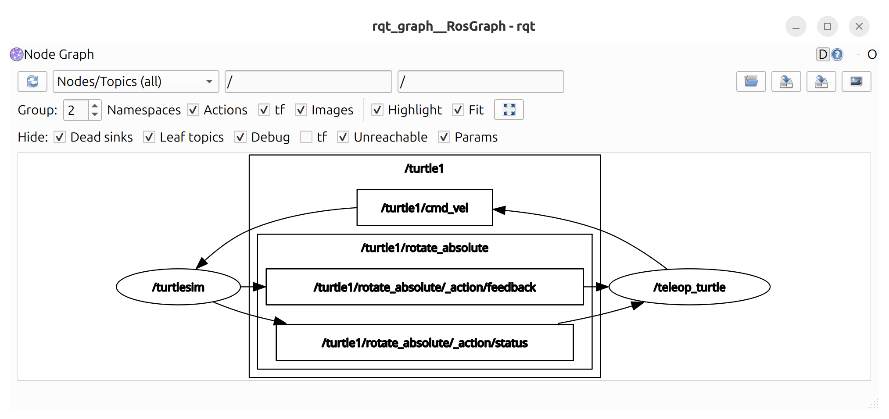
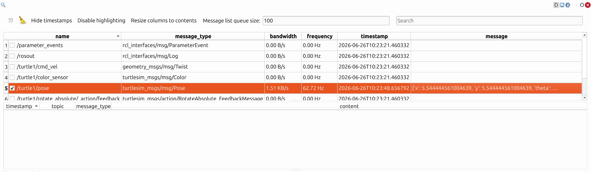

# rqt

`rqt`는 Qt 기반으로 ROS2의 다양한 정보를 화면에 표시하고 제어할 수 있는 GUI 도구입니다.

`rqt`는 하나의 고정된 프로그램이 아니라 여러 기능을 플러그인(Plugin) 형태로 불러와 사용하는 구조입니다. `rqt_graph`, `Topic Monitor`, `Service Caller` 등이 대표적인 플러그인입니다.

Terminator에서 하나의 창을 여러 터미널로 나누어 사용하는 것처럼, rqt에서도 여러 플러그인을 하나의 창에 배치할 수 있습니다.

---

#### rqt 설치

다음 명령으로 rqt와 주요 플러그인을 설치합니다.

```bash
sudo apt install ros-lyrical-rqt ros-lyrical-rqt-common-plugins
```

설치가 완료되면 다음 명령으로 rqt를 실행할 수 있습니다.

```bash
rqt
```

---

#### rqt_graph 실행

지금까지는 다음과 같은 명령으로 ROS2의 구성 요소를 텍스트로 확인했습니다.

```bash
ros2 node list
ros2 topic list
ros2 service list
ros2 action list
```

노드와 통신 요소가 많아지면 명령어 출력만으로 전체 구조를 파악하기 어렵습니다. `rqt_graph`를 사용하면 Node와 Topic의 연결 관계를 그래프로 확인할 수 있습니다.

각 터미널에서 다음 명령을 실행합니다.

```bash
# 1번 터미널: Turtlesim 실행
ros2 run turtlesim turtlesim_node
```

```bash
# 2번 터미널: 키보드 조종 노드 실행
ros2 run turtlesim turtle_teleop_key
```

```bash
# 3번 터미널: rqt_graph 실행
ros2 run rqt_graph rqt_graph
```



화면 왼쪽 위의 새로고침 버튼을 누르면 `/turtlesim`과 `/teleop_turtle` 노드의 연결 관계가 표시됩니다.

`/teleop_turtle` 노드는 키보드 입력을 받아 `/turtle1/cmd_vel` Topic에 속도 명령을 발행 합니다. `/turtlesim` 노드는 이 Topic을 구독하고 거북이를 움직입니다.

```bash
/teleop_turtle
    → /turtle1/cmd_vel
        → /turtlesim
```

화살표의 방향을 살펴보면 어떤 노드가 Publisher이고 어떤 노드가 Subscriber인지 확인할 수 있습니다.

---

#### Service와 Action의 표시

`rqt_graph`는 Node와 Topic의 발행·구독 관계를 중심으로 보여주는 도구입니다. 따라서 Service는 그래프에 표시되지 않습니다.

Action은 내부적으로 다음과 같은 Topic과 Service를 조합하여 동작합니다.

- Goal 전달
- 작업 취소
- Result 요청
- Feedback 전달
- 상태 전달

이 가운데 Feedback과 상태는 Topic을 사용하고, Goal·Cancel·Result 관련 통신에는 Service가 사용됩니다.

따라서 설정과 실행 상태에 따라 Action의 Topic 부분이 그래프에 나타날 수 있지만 Service 부분은 표시되지 않습니다. Action 관련 항목을 확인하려면 그래프의 숨김 항목 표시 옵션도 확인해야 합니다.

| 통신 방식 | rqt_graph 표시 | 설명 |
| --- | --- | --- |
| Topic | 표시됨 | Publisher와 Subscriber의 연결을 표현 |
| Service | 표시되지 않음 | rqt_graph의 시각화 대상이 아님 |
| Action | 일부 표시될 수 있음 | 내부에서 사용하는 Topic만 표시 가능 |

> Service가 표시되지 않는 이유는 연결이 즉시 사라지기 때문이 아니라, `rqt_graph`가 Topic 연결을 중심으로 시각화하기 때문입니다.
> 

---

#### 주요 rqt 플러그인

rqt를 실행한 후 상단의 `Plugins` 메뉴에서 다양한 플러그인을 불러올 수 있습니다.

**Topic Monitor**

실행 경로:

```bash
Plugins → Topics → Topic Monitor
```

현재 발행되는 Topic 데이터를 실시간으로 확인합니다. 터미널의 다음 명령과 비슷한 역할을 합니다.

```bash
ros2 topic echo <topic_name>
```

여러 Topic을 한 화면에서 선택하여 비교할 수 있습니다. `/turtle1/pose`를 선택하고 거북이를 움직이면 위치 값이 변하는 것을 확인할 수 있습니다.



---

**Message Publisher**

실행 경로:

```bash
Plugins → Topics → Message Publisher
```

터미널의 `ros2 topic pub` 명령을 GUI로 실행하는 플러그인입니다.

`/turtle1/cmd_vel` Topic과 `geometry_msgs/msg/Twist` 타입을 선택한 후 `linear.x` 또는 `angular.z` 값을 설정하면 거북이를 움직일 수 있습니다.


---

**Service Caller**

실행 경로:

```bash
Plugins → Services → Service Caller
```

터미널의 `ros2 service call` 명령을 GUI로 실행하는 플러그인입니다.

호출할 Service를 선택하면 Request 입력 항목이 표시됩니다. 값을 입력하고 Call 버튼을 누르면 Service가 호출됩니다.


예를 들어 `/spawn` Service에 좌표와 이름을 입력하면 새로운 거북이를 생성할 수 있습니다.


---

**Parameter Reconfigure**

실행 경로:

```bash
Plugins → Configuration → Dynamic Reconfigure
```

노드가 제공하는 Parameter를 GUI에서 확인하고 변경할 수 있습니다.

Turtlesim에서는 다음 Parameter를 사용해 화면 배경색을 설정합니다.

- background_r
- background_g
- background_b

터미널에서는 다음과 같이 값을 변경할 수 있습니다.

```bash
ros2 param set /turtlesim background_r 150
```


---

**Console**

실행 경로:

```bash
Plugins → Logging → Console
```

여러 노드에서 발생하는 로그를 한 화면에서 확인합니다. Debug, Info, Warn, Error 등의 로그 수준에 따라 메시지를 필터링 할 수 있습니다.

여러 노드를 동시에 실행할 때 어느 노드에서 문제가 발생했는지 확인하는 데 유용합니다.


---

**Plot**

실행 경로:

```bash
Plugins → Visualization → Plot
```

Topic 메시지에 포함된 숫자 데이터를 실시간 그래프로 표시합니다.

예를 들어 다음 값을 추가하면 거북이의 좌표 변화를 확인할 수 있습니다.

```bash
/turtle1/pose/x
/turtle1/pose/y
```


---

**정리**

rqt는 ROS2의 Node, Topic, Service, Parameter와 로그 정보를 GUI에서 확인하고 제어할 수 있도록 여러 플러그인을 제공하는 도구입니다.

| 플러그인 | 주요 기능 |
| --- | --- |
| rqt_graph | Node와 Topic 연결 관계 확인 |
| Topic Monitor | Topic 데이터 실시간 확인 |
| Message Publisher | Topic 메시지 발행 |
| Service Caller | Service 요청 |
| Parameter Reconfigure | Parameter 확인 및 변경 |
| Console | 노드 로그 확인 |
| Plot | 숫자 데이터 그래프 표시 |

처음에는 rqt를 통해 통신 구조와 데이터 변화를 시작적으로 확인하고, 같은 동작을 터미널 명령으로 다시 실행해보면 ROS2의 통신 구조를 이해하는 데 도움이 됩니다