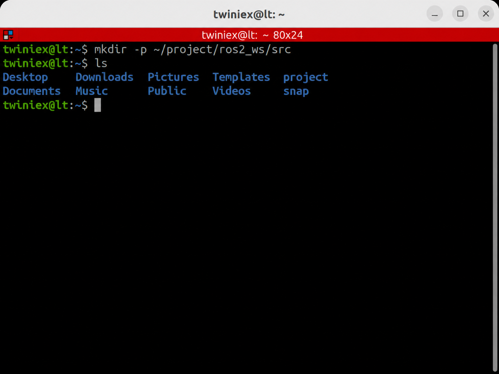

# ROS2 Workspace와 package 구조

앞 장에서는 ROS2의 기본 개념을 살펴보고, Turtlesim에 포함된 Node와 터미널 명령을 이용해 통신하는 방법을 배웠습니다.

이번 장에서는 직접 ROS2 Package를 만들고, `turtlesim_node`와 같은 Node를 작성해 보겠습니다. 그에 앞서 ROS2 코드를 작성하고 관리하는 기본 단위인 Workspace와 Package의 개념부터 알아보겠습니다.

---

#### Workspace란?

Workspace는 여러 ROS2 Package를 모아두고 빌드하는 작업 공간입니다. 쉽게 말해 직접 작성하는 ROS2 코드를 관리하는 최상위 폴더입니다.

Workspace 이름에는 특별한 규칙이 없지만 일반적으로 이름 뒤에 `_ws`를 붙입니다. 이 교재에서는 홈 디렉터리에 ros2_ws라는 Workspace를 만들겠습니다.

```bash
mkdir -p ~/project/ros2_ws/src
ls ~/project/ros2_ws
```



---

#### Workspace 디렉터리 구조

처음에는 `src` 디렉터리만 존재하지만 빌드를 실행하면 다음과 같은 구조가 만들어집니다.

```bash
ros2_ws/
├── src/        # 직접 작성하는 Package와 소스 코드
├── build/      # 빌드 과정에서 생성되는 임시 파일
├── install/    # 실행 파일과 환경 설정 파일
└── log/        # 빌드 과정의 로그
```

일반적으로 개발자가 직접 작성하고 수정하는 곳은 `src`입니다. build, install, log는 빌드 도구가 자동으로 생성하고 관리합니다.

ROS2 명령을 사용하기 전에는 다음 파일을 현재 터미널에 적용했습니다.

```bash
source /opt/ros/lyrical/setup.bash
```

이 명령은 `/opt/ros/lyrical`에 설치된 ROS2 환경을 현재 터미널에 등록합니다.

직접 만든 Workspace도 빌드가 끝난 후 다음 파일을 적용해야 Package와 실행 파일을 터미널에서 찾을 수 있습니다.

```bash
source ~/project/ros2_ws/install/setup.bash
```

---

#### 설치된 Package와 직접 만든 Package

앞 장에서 사용한 Turtlesim도 ROS2 Package입니다. 다만 Turtlesim은 직접 만든 Package가 아니라 `apt`를 통해 시스템에 설치한 Package입니다.

```bash
sudo apt install ros-lyrical-turtlesim
```

설치된 파일은 `/opt/ros/lyrical` 아래에 배치됩니다.

```bash
/opt/ros/lyrical/
├── share/turtlesim/    # Package 정보와 설정 파일
├── lib/turtlesim/      # turtlesim_node 등의 실행 파일
└── ...
```

따라서 Turtlesim을 사용하기 위해 별도의 Workspace를 만들거나 colcon build를 실행할 필요는 없습니다.

반면 직접 만드는 Package는 `~/project/ros2_ws/src`에 소스 코드 형태로 작성합니다. 이후 `colcon build`를 실행하면 Package가 `~/project/ros2_ws/install`에 설치되고, 해당 환경을 source한 후 실행할 수 있습니다.

| 구분 | apt로 설치한 Package | 직접 만든 Package |
| --- | --- | --- |
| 대표적인 예 | `turtlesim` | `first_package` |
| 설치 위치 | `/opt/ros/lyrical` | `~/ros2_ws/install` |
| 소스 작성 위치 | Workspace에 없음 | `~/ros2_ws/src` |
| 직접 빌드 | 필요 없음 | `colcon build` 필요 |
| source 대상 | `/opt/ros/lyrical/setup.bash` | `~/ros2_ws/install/setup.bash` |

---

#### Package란?

Package는 ROS2에서 하나의 독립된 기능을 관리하는 단위입니다.

Turtlesim Package에는 다음과 같은 여러 실행 프로그램이 포함되어 있습니다.

- `turtlesim_node`: 거북이 시뮬레이터 실행
- `turtle_teleop_key`: 키보드로 거북이 조종

이처럼 하나의 Package에는 관련된 Node, 설정 파일, 메시지 정의, 실행 파일 등을 함께 구성할 수 있습니다.

ROS2 Package는 사용하는 언어에 따라 주로 다음 두 가지 방식으로 만듭니다.

| 구분 | Python Package | C++ Package |
| --- | --- | --- |
| 빌드 형식 | `ament_python` | `ament_cmake` |
| 주요 설정 파일 | `setup.py`, `setup.cfg` | `CMakeLists.txt` |
| 공통 설정 파일 | `package.xml` | `package.xml` |
| 특징 | 작성과 수정이 비교적 간단함 | 컴파일 과정이 필요함 |

이 교재에서는 Python을 이용해 ROS2 Node를 작성합니다.

---

#### Package 생성

Package는 Workspace의 `src` 디렉터리 안에 생성합니다.

기본 명령 형식은 다음과 같습니다.

```bash
ros2 pkg create --build-type ament_python <package_name>
```

`--build-type ament_python`은 Python Package로 생성하겠다는 의미입니다.

이 교재에서는 `first_package`라는 이름으로 만들겠습니다.

```bash
cd ~/project/ros2_ws/src
ros2 pkg create --build-type ament_python first_package
```


Package를 생성한 후 Workspace 전체를 VS Code로 엽니다.

```bash
code ~/project/ros2_ws
```


VS Code의 탐색기에서 src 아래에 생성된 Package 구조를 한눈에 확인할 수 있습니다.

```bash
first_package/
├── first_package/
│   ├── __init__.py       # Python Package임을 나타내는 파일
│   └── py.typed          # 타입 힌트 지원을 위한 마커 파일
├── resource/
│   └── first_package     # ROS 2 Package 등록용 마커 파일
├── test/                 # 테스트 코드
├── package.xml           # Package 정보와 의존성
├── setup.cfg             # 실행 파일 설치 경로 설정
└── setup.py              # Python Package와 실행 파일 설정
```

---

#### package.xml

`package.xml`은 Package의 이름, 버전, 설명, 관리자, 라이선스, 의존성 등을 기록하는 파일입니다.

ROS2는 이 파일을 이용해 Package의 정보를 확인합니다.

```xml
<?xml version="1.0"?>
<?xml-model href="http://download.ros.org/schema/package_format3.xsd"
  schematypens="http://www.w3.org/2001/XMLSchema"?>

<package format="3">
  <name>first_package</name>
  <version>0.0.0</version>
  <description>TODO: Package description</description>

  <maintainer email="sean@todo.todo">sean</maintainer>
  <license>TODO: License declaration</license>

  <test_depend>ament_copyright</test_depend>
  <test_depend>ament_flake8</test_depend>
  <test_depend>ament_mypy</test_depend>
  <test_depend>ament_pep257</test_depend>
  <test_depend>ament_xmllint</test_depend>
  <test_depend>python3-pytest</test_depend>

  <export>
    <build_type>ament_python</build_type>
  </export>
</package>
```

학습용 Package는 `TODO` 항목을 그대로 두어도 실행에는 문제가 없습니다. 실제로 배포할 Package라면 다음과 같이 작성합니다.

```xml
<description>거북이를 제어하는 ROS 2 예제 Package</description>
<maintainer email="your@email.com">홍길동</maintainer>
<license>Apache-2.0</license>
```

각 항목의 의미는 다음과 같습니다.

- `description`: Package의 기능 설명
- `maintainer`: Package 관리자와 연락처
- `license`: 소스 코드의 사용 조건
- `test_depend`: 테스트를 실행할 때 필요한 의존성
- `depend`: Package 실행과 빌드에 필요한 의존성

ROS2 Python Node를 작성할 때 사용하는 rclpy 등의 의존성은 필요에 따라 직접 추가해야 합니다.

```xml
<depend>rclpy</depend>
<depend>turtlesim</depend>
<depend>geometry_msgs</depend>
```

사용하지 않는 Package까지 모두 추가할 필요는 없습니다. 각 Node에서 실제로 사용하는 Package만 등록합니다.

---

#### setup.py

`setup.py`는 Python Package의 설치 정보와 실행 파일을 설정하는 파일입니다.

```python
from setuptools import find_packages, setup

package_name = 'first_package'

setup(
    name=package_name,
    version='0.0.0',
    packages=find_packages(exclude=['test']),
    data_files=[
        (
            'share/ament_index/resource_index/packages',
            ['resource/' + package_name]
        ),
        (
            'share/' + package_name,
            ['package.xml']
        ),
    ],
    package_data={'': ['py.typed']},
    install_requires=['setuptools'],
    zip_safe=True,
    maintainer='sean',
    maintainer_email='sean@todo.todo',
    description='TODO: Package description',
    license='TODO: License declaration',
    extras_require={
        'test': [
            'pytest',
        ],
    },
    entry_points={
        'console_scripts': [
        ],
    },
)
```

가장 중요한 부분은 `entry_points` 입니다. 여기에 Python 파일의 main() 함수를 등록하면 `ros2 run` 명령으로 실행할 수 있습니다.

```python
entry_points={
    'console_scripts': [
        '실행이름 = Package이름.파일이름:main',
    ],
},
```

예를 들어 `first_package/publisher_node.py`에 있는 `main()` 함수를 `my_publisher`라는 이름으로 등록하려면 다음과 같이 작성합니다.

```python
entry_points={
    'console_scripts': [
        'my_publisher = first_package.publisher_node:main',
    ],
},
```

빌드 후 다음 명령으로 실행할 수 있습니다.

```bash
ros run first_package my_publisher
```

여기서 첫번째 이름은 Package 이름이고, 두 번째 이름은 `console_scripts`에 등록한 이름입니다.

Node 파일을 추가하거나 `entry_points`를 변경한 경우에는 다시 빌드해야 합니다.

---

#### setup.cfg

`setup.cfg`는 `ros2 run` 이 실행 파일을 찾을 수 있도록 python 실행 파일의 설치 경로를 지정합니다.

```
[develop]
script_dir=$base/lib/first_package

[install]
install_scripts=$base/lib/first_package
```

Package를 생성하면 자동으로 만들어지므로 일반적인 실습에서는 수정할 필요가 없습니다.

---

#### Workspace 빌드

빌드는 소스 코드를 실행 가능한 형태로 준비하는 과정입니다.

C++ Package에서는 소스 코드를 바이너리 파일로 컴파일 합니다. Python은 인터프리터가 코드를 실행하므로 별도의 컴파일 과정은 없지만, ROS2가 Package와 실행 파일을 찾을 수 있도록 소스 코드와 설정을 `install` 디렉터리에 배치해야 합니다.

Workspace 최상위 디렉터리에서 다음 명령을 실행합니다.

```bash
cd ~/project/ros2_ws
colcon build
ls
```

`colcon`은 ROS2 Workspace를 빌드하는 도구입니다.

빌드가 완료되면 다음 디렉터리가 생성됩니다.

```
ros2_ws/
├── src/
├── build/
├── install/
└── log/
```


빌드한 Package를 현재 터미널에서 사용하려면 먼저 환경을 적용합니다.

```bash
source ~/project/ros2_ws/install/setup.bash
```

이제 `ros2 run` 명령으로 Workspace안의 실행 파일을 찾을 수 있습니다.

---

#### 특정 Package만 빌드

다음 명령은 `src`에 있는 모든 Package를 빌드합니다.

```bash
colcon build
```

Package가 많아지면 전체 빌드 시간이 길어질 수 있습니다. 이때 `--packages-select` 옵션을 사용하면 지정한 Package만 빌드할 수 있습니다.

```bash
cd ~/project/ros2_ws
colcon build --packages-select first_package
```

---

#### --symlink-install 사용

Python Package를 개발할 때는 다음과 같이 `--symlink-install` 옵션을 사용할 수 있습니다.

```bash
cd ~/project/ros2_ws
colcon build --symlink-install
```

이 옵션을 사용하면 `install` 디렉터리에 소스 파일을 복사하는 대신 연결을 생성합니다. 따라서 Python 코드만 수정한 경우에는 다시 빌드하지 않아도 변경 내용이 바로 반영되는 경우가 많습니다.

다만 다음 항목을 변경한 경우에는 다시 빌드해야 합니다.

- `setup.py`의 `entry_points`
- `package.xml`의 의존성
- 새로운 Python 파일이나 실행 항목
- Launch, 설정 파일 등의 설치 규칙

---

#### Workspace 환경 적용

ROS2 환경과 직접 만든 Workspace를 함께 사용하려면 다음 순서로 적용합니다.

```bash
source /opt/ros/lyrical/setup.bash
source ~/project/ros2_ws/install.setup.bash
```

첫번째 명령은 기본 ROS2 환경을 불러오고, 두 번째 명령은 직접 만든 Workspace를 그 위에 추가합니다.

매번 입력하기 번거롭다면 `.bashrc`에 등록할 수 있습니다. 다만 Workspace가 아직 빌드되지 않았다면 `install/setup.bash`가 없으므로 오류가 발생할 수 있습니다.

필요할 때만 실행할 수 있도록 다음과 같이 별칭을 등록할 수도 있습니다.

```bash
alias pkg_enable='source /opt/ros/lyrical/setup.bash && source ~/ros2_ws/install/setup.bash && echo "ROS 2 Workspace enabled"'
```

설정을 적용합니다.

```bash
source ~/.bashrc
```

이후 다음 명령으로 Workspace를 활성화할 수 있습니다.

```bash
pkg_enable
```

지금까지 ROS2 Workspace와 Package의 기본 구조를 살펴보았습니다. 다음 장에서는 `first_package`에 Python Node를 작성하고 `ros2 run`으로 직접 실행해 보겠습니다.