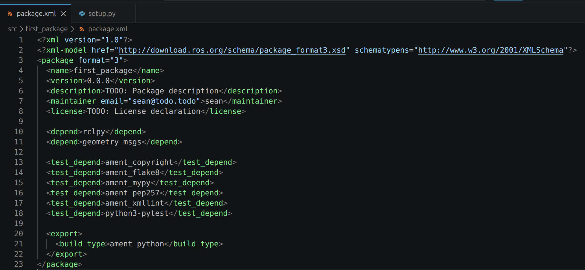

# 직선형태의 거북이 이동 publishing 노드 생성

앞 절에서는 first_package 패키지를 만들고 기본 구조를 살펴봤습니다.

이번에는 이 패키지 안에 첫 번째 Node를 작성해보겠습니다. 첫 번째 Node는 Turtlesim의 거북이를 직선으로 이동시키는 Publisher Node 입니다.

앞에서 터미널 명령으로 `/turtle1/cmd_vel` Topic에 속도 값을 발행했던 작업을 이번에는 Python 코드로 구현합니다.

---

#### 의존성 추가

Node를 작성하기 전에 `package.xml`에 필요한 의존성(Dependency)을 추가해야 합니다.

의존성이란 현재 패키지가 빌드되고 실행되는 데 필요한 외부 패키지를 의미합니다. 이번 Node에서는 다음 두 패키지를 사용합니다.

- `rclpy`: Python으로 ROS2 Node를 작성하기 위한 라이브러리
- `geometry_msgs`: `Twist` 와 같은 기하학 메시지 타입을 제공하는 패키지

`package.xml`에 의존성을 정확하게 등록하면 `rosdep`와 같은 도구가 패키지에 필요한 항목을 확인하고 설치하는 데 사용할 수 있습니다. 또한 다른 환경에서 패키지를 사용할 때 필요한 패키지를 쉽게 파악할 수 있습니다.

**rclpy**

`rclpy`는 Python에서 ROS2 기능을 사용하기 위한 클라이언트 라이브러리입니다.

Node를 생성하는 `Node` 클래스, ROS2 통신을 초기화하는 `rclpy.init()`, Publisher와 Timer를 생상하는 메서드등이 포함되어 있습니다.

**geometry_msgs**

`geometry_msgs`는 위치, 속도, 방향과 같은 기하학적 데이터를 표현하는 메시지 타입을 제공합니다.

이번에 사용할 `/turtle1/cmd_vel` Topic의 메시지 타입은 `geometry_msgs/msg/Twist`이므로 `geometry_msgs`가 필요합니다.

VS Code에서 `package.xml`을 열고 `<test_depend>` 항목 위에 다음 내용을 추가합니다.

```xml
<depend>rclpy</depend>
<depend>geometry_msgs</depend>
```

수정한 `package.xml`의 전체 내용은 다음과 같습니다.

```xml
<?xml version="1.0"?>
<?xml-model href="http://download.ros.org/schema/package_format3.xsd"
             schematypens="http://www.w3.org/2001/XMLSchema"?>

<package format="3">
  <name>first_package</name>
  <version>0.0.0</version>
  <description>TODO: Package description</description>
  <maintainer email="twiniex@todo.todo">twiniex</maintainer>
  <license>TODO: License declaration</license>

  <depend>rclpy</depend>
  <depend>geometry_msgs</depend>

  <test_depend>ament_copyright</test_depend>
  <test_depend>ament_flake8</test_depend>
  <test_depend>ament_mypy</test_depend>
  <test_depend>ament_pep257</test_depend>
  <test_depend>ament_xmllint</test_depend>
  <test_depend>python3-pytest</test_depend>

  <export>
    <build_type>ament_python</build_type>
  </export>
</package>
```



---

#### Node 파일 작성

다음 폴더 안에 `move_pub.py` 파일을 새로 만듭니다.

```xml
~/project/ros2_ws/src/first_package/first_package
```

`move_pub.py`에 다음 코드를 작성합니다.

#### 전체 소스 코드

> GitHub Link: [https://github.com/applesnack23/ros2-lerobot-code/blob/main/chapter3/move_pub.py](https://github.com/applesnack23/ros2-lerobot-code/blob/main/chapter3/move_pub.py)
> 

```python
import rclpy
from rclpy.node import Node
from geometry_msgs.msg import Twist

class MyPublisher(Node):

    def __init__(self):
        super().__init__('move_publisher')
        self.publisher = self.create_publisher(
            Twist,
            '/turtle1/cmd_vel',
            10
        )
        self.timer = self.create_timer(
            0.5,
            self.timer_callback
        )
        self.get_logger().info('Move Publisher Node Started')

    def timer_callback(self):
        msg = Twist()
        msg.linear.x = 2.0
        msg.angular.z = 0.0
        self.publisher.publish(msg)

def main(args=None):
    rclpy.init(args=args)
    node = MyPublisher()
    rclpy.spin(node)
    node.destroy_node()
    rclpy.shutdown()

if __name__ == '__main__':
    main()
```

코드를 기능별로 살펴보겠습니다.

---

#### 모듈 Import

```python
import rclpy
from rclpy.node import Node
from geometry_msgs.msg import Twist
```

`rcply`는 Python에서 ROS2 기능을 사용하기 위한 라이브러리 입니다.

`Node`는 모든 ROS2 Node의 기반이 되는 클래스 입니다. 이 클래스를 상속하여 새로운 Node를 만들 수 있습니다.

`Twist`는 직선 속도와 회전 속도를 표현하는 메시지 타입입니다.

---

#### 클래스와 Node 포기와

```python
class MyPublisher(Node):
	def __init__(self):
		super().__init__('move_publisher')
```

`MyPublisher` 클래스는 `Node` 클래스를 상속받아 만듭니다.

```python
super().__init__('move_publisher')
```

이 코드는 부모 클래스인 `Node`를 초기화하고 ROS2 시스템에서 사용할 Node 이름을 `move_publisher`로 지정합니다.

실행 중인 Node를 확인하려면 `/move_publisher`라는 이름으로 표시됩니다.

---

#### Publisher 생성

```python
self.publisher = self.create_publisher(
	Twist,
	'/turtle1/cmd_vel',
	10
)
```

`create_publisher()`는 메시지를 발행할 Publisher를 생성합니다.

| 인자 | 설명 |
| --- | --- |
| `Twist` | 발행할 메시지 타입 |
| `/turtle1/cmd_vel` | 메시지를 발행할 Topic 이름 |
| `10` | QoS Queue Depth |

세번째 인자인 `10`은 QoS의 Queue Depth입니다. 처리 속도에 차이가 발생했을 때 최근 메시지를 최대 10개까지 유지하도록 설정합니다.

Queue Depth를 초과하면 오래된 메시지가 제거되고 새로운 메시지가 저장됩니다. 속도 명령은 오래된 값보다 최신 값이 중요하므로 Queue를 지나치게 크게 설정할 필요는 없습니다.

---

#### Timer 생성

```python
self.timer = self.create_timer(
	0.5,
	self.timer_callback
)
```

`create_timer()`는 일정한 주기로 Callback 함수를 실행하는 Timer를 생성합니다.

첫 번째 인자인 `0.5`는 실행 주기를 초 단위로 나타냅니다. 두 번째 인자는 Timer가 호출할 함수입니다.

따라서 `timer_callback()` 함수가 0.5초마다 실행됩니다.

---

#### Callback 함수

```python
def timer_callback(self):
	msg = Twist()
	msg.linear.x = 2.0
	msg.angular.z = 0.0
	self.publisher.publish(msg)
```

`timer_callback()`은 Timer에 의해 반복적으로 실행되는 함수입니다.

먼저 `Twist` 메시지 객체를 생성하고 속도 값을 설정합니다.

- `linear.x = 2.0`: 전진 속도
- `angular.z = 0.0`: 회전 속도

회전 속도가 `0.0`이므로 거북이는 회전하지 않고 직선으로 이동합니다.

마지막으로 `publish()`를 호출하여 `/turtle1/cmd_vel` Topic에 메시지를 발행합니다.

---

#### main 함수

```python
def main(args=None):
	rclpy.init(args=args)
	node = MyPublisher()
	rclpy.spin(node)
	node.destroy_node()
	rclpy.shutdown()
```

`main()` 함수는 다음 순서로 실행됩니다.

1. `rclpy.init()`으로 ROS2 통신을 초기화합니다.
2. `MyPublisher` 객체를 생성합니다.
3. `rclpy.spin()`으로 Node를 계속 실행합니다.
4. Node가 종료되면 `destroy_node()`로 사용하던 리소스를 정리합니다.
5. `rclpy.shutdown()`으로 ROS2 통신을 종료합니다.

`rclpy.spin()`은 `Ctrl+C`로 프로그램을 종료할 때까지 Timer와 Callback을 계속 처리합니다.

---

#### setup.py에 Node 등록

Node 파일을 작성했더라도 바로 `ros2 run` 명령으로 실행할 수는 없습니다.

ROS2가 실행 파일을 찾을 수 있도록 `setup.py`의 `entry_points`에 Node를 등록해야 합니다.

```python
entry_points={
    'console_scripts': [
        'move_straight = first_package.move_pub:main',
    ],
},
```

등록 형식은 다음과 같습니다.

```
실행 이름 = 패키지 이름.파일 이름: main 함수
```

여기서 `move_straight`와 `move_publisher`는 서로 다른 이름입니다.

| 이름 | 정의 위치 | 용도 |
| --- | --- | --- |
| `move_straight` | `setup.py`의 `entry_points` | `ros2 run`에서 사용하는 실행 이름 |
| `move_publisher` | `super().__init__()` | ROS 2 시스템 내부의 Node 이름 |

프로그램을 실행할 때는 `move_straight`를 사용합니다.

```
ros2 run first_package move_straight
```

실행 중인 Node 목록에서는 `/move_publisher`로 표시됩니다.

```
ros2 node list
```

---

#### Build

작성한 파일과 `setup.py`의 변경 사항을 적용하려면 패키지를 다시 빌드해야 합니다.

워크스페이스의 최상위 폴더에서 다음 명령을 실행합니다.

```bash
cd ~/project/ros2_ws
colcon build --packages-select first_package
```

현재 워크스페이스에 패키지가 하나뿐이라면 다음 명령을 사용해도 됩니다.

```bash
colcon build
```

빌드가 완료되면 워크스페이스의 환경 설정을 현재 터미널에 적용합니다.

```bash
source ~/project/ros2_ws/install/setup.bash
```

앞 절에서 `pkg_enable` 명령을 등록했다면 다음과 같이 실행할 수 있습니다.

```bash
pkg_enable
```

---

#### 실행

첫 번째 터미널에서 Turtlesim Node를 실행합니다.

```bash
ros2 run turtlesim turtlesim_node
```

두 번째 터미널에서는 워크스페이스 환경을 적용한 후 Publisher Node를 실행합니다.

```bash
source ~/project/ros2_ws/install/setup.bash
ros2 run first_package move_straight
```


프로그램이 정상적으로 실행되면 Turtlesim의 거북이가 직선으로 이동합니다.

거북이가 화면 끝에 도착하면 멈춘 것처럼 보이지만 Publisher Node는 계속 실행되고 있습니다. Node는 0.5초마다 같은 속도 명령을 발행하며, Turtlesim이 출력하는 충돌 관련 Log도 확인할 수 있습니다.

이번 실습은 터미널에서 `ros2 topic pub` 명령으로 수행했던 동작을 Python으로 작성한 Publisher Node로 구현한 것입니다.

터미널 명령은 단순한 테스트에 적합하지만, Python Node는 조건문이나 다른 Node와의 통신을 추가하여 더 복잡한 기능으로 확장할 수 있습니다.

---

#### 마무리하며

이번 절에서는 다음과 같은 Publisher Node의 기본 구조를 살펴봤습니다.

1. 필요한 패키지를 Import 합니다.
2. `Node`클래스를 상속받아 새로운 Node를 만듭니다.
3. Publisher와 Timer를 생성합니다.
4. Callback함수에서 메시지를 발행합니다.
5. `setup.py`에 Entry Point를 등록합니다.
6. 패키지를 빌드하고 실행합니다.

다음 절에서는 같은 Publisher 구조를 사용하면서 Callback의 동작을 변경하여 거북이가 사각형, 삼각형, 원과 같은 여러 형태로 움직이도록 만들어 보겠습니다.