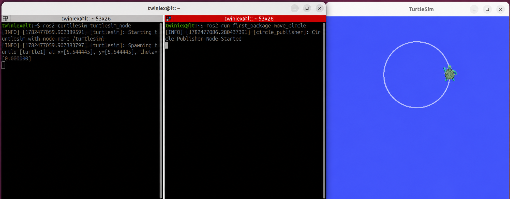

# 여러 형태의 거북이 이동 publishing 노드 생성

앞 절에서는 거북이를 직선으로 이동시키는 Publisher Node를 만들었습니다.

이번 절에서는 같은 Publisher 구조를 사용하여 거북이가 원과 사각형을 그리도록 확장해보겠습니다. Node 생성, Entry Point 등록, Build, 실행 과정을 반복하면서 ROS2 패키지 제작 흐름을 익히는 것이 이번 절의 목표입니다.

두 Node는 `Ctrl+C`로 종료하기 전까지 같은 동작을 반복합니다.

#### 원 그리기

거북이를 원형으로 이동시키는 원리는 간단합니다.

`linear.x`와 `angular.z`에 동시에 값을 입력하면 거북이는 전진하면서 회전합니다. 두 값이 일정하게 유지되면 일정한 반지름의 원을 그리게 됩니다.

다음 경로에 `circle_pub.py` 파일을 만듭니다.

```bash
~/project/ros2_ws/src/first_package/first_package/circle_pub.py
```

다음 코드를 작성합니다.

#### 전체 소스 코드

> GitHub Link: [https://github.com/applesnack23/ros2-lerobot-code/blob/main/chapter3/circle_pub.py](https://github.com/applesnack23/ros2-lerobot-code/blob/main/chapter3/circle_pub.py)
> 

```python
import rclpy
from rclpy.node import Node
from geometry_msgs.msg import Twist

class CirclePublisher(Node):

    def __init__(self):
        super().__init__('circle_publisher')

        self.publisher = self.create_publisher(
            Twist,
            '/turtle1/cmd_vel',
            10
        )

        self.timer = self.create_timer(
            0.1,
            self.timer_callback
        )

        self.get_logger().info('Circle Publisher Node Started')

    def timer_callback(self):
        msg = Twist()
        msg.linear.x = 2.0
        msg.angular.z = 1.0
        self.publisher.publish(msg)

def main(args=None):
    rclpy.init(args=args)
    node = CirclePublisher()
    rclpy.spin(node)
    node.destroy_node()
    rclpy.shutdown()

if __name__ == '__main__':
    main()
```

앞 절에서 작성한 직선 이동 Node와 비교하면 Callback 함수의 `angular.z` 값만 달라졌습니다.

```python
msg.linear.x = 2.0
msg.angular.z = 1.0
```

`linear.x`는 전진 속도이고 `angular.z`는 회전 속도입니다. 두 값이 모두 `0`이 아니므로 거붓이는 전진하면서 회전합니다.

원의 반지름은 두 속도의 비율에 따라 달라집니다.

$$
반지름 = \frac{직선 속도}{각속도}
$$

현재 값에서는 다음과 같이 계산됩니다.

$$
반지름 = \frac{2.0}{1.0} = 2.0
$$

---

#### 원 그리기 Node 등록

`setup.py`의 `console_scripts`에 `move_circle`을 추가합니다.

```python
entry_points={
    'console_scripts': [
        'move_straight = first_package.move_pub:main',
        'move_circle = first_package.circle_pub:main',
    ],
},
```

---

#### Build 및 실행

워크스페이스 최상위 폴더에서 패키지를 빌드합니다.

```bash
cd ~/project/ros2_ws
colcon build --packages-select first_package
```

빌드가 완료되면 각각의 터미널에서 다음 명령을 실행합니다.

```bash
# 1번 터미널
ros2 run turtlesim turtlesim_node
```

```bash
# 2번 터미널
ros2 run first_package move_circle
```



거북이가 원을 반복해서 그리는 것을 확인할 수 있습니다. 노드를 종료하려면 실행중인 터미널에서 `Ctrl+C`를 누릅니다.

현재 실행 중인 노드는 다음 명령으로 확인할 수 있습니다.

```bash
ros2 node list
```

실행 결과에는 다음 두 노드가 표시됩니다.

```bash
/circle_publisher
/turtlesim
```


---

#### rqt_graph로 연결 확인

다음 명령으로 `rqt_graph`를 실행합니다.

```bash
ros2 run rqt_graph rqt_graph
```

화면 왼쪽 위의 새로고침 버튼을 누르면 다음 연결을 확인할 수 있습니다.

```bash
/circle_publisher
→ /turtle1/cmd_vel
→ /turtlesim
```

`circle_publisher`가 속도 명령을 발행하고, `turtlesim` 이 해당 Topic을 구독하여 거북이를 움직입니다.


---

#### 사각형 그리기

사각형을 그리려면 직진과 회전을 반복해야 합니다.

- `MOVING`: 일정 시간 동안 직진
- `TURNING`: 제자리에서 90도 회전
- 회전 완료 후 다시 `MOVING`으로 전환

현재 동작 상태와 경과 시간을 인스턴스 변수로 관리하겠습니다.

다음 경로에 `square_pub.py` 파일을 만듭니다.

```bash
~/project/ros2_ws/src/first_package/first_package/square_pub.py
```

다음 코드를 작성합니다.

#### 전체 소스 코드

> GitHub Link: [https://github.com/applesnack23/ros2-lerobot-code/blob/main/chapter3/square_pub.py](https://github.com/applesnack23/ros2-lerobot-code/blob/main/chapter3/square_pub.py)
> 

```python
import math

import rclpy
from rclpy.node import Node
from geometry_msgs.msg import Twist

class SquarePublisher(Node):

    def __init__(self):
        super().__init__('square_publisher')

        self.publisher = self.create_publisher(
            Twist,
            '/turtle1/cmd_vel',
            10
        )

        self.timer = self.create_timer(
            0.1,
            self.timer_callback
        )

        self.state = 'MOVING'
        self.elapsed = 0.0
        self.turned_angle = 0.0

        self.move_duration = 2.0
        self.angular_speed = math.pi / 2
        self.dt = 0.1

        self.get_logger().info('Square Publisher Node Started')

    def timer_callback(self):
        msg = Twist()

        if self.state == 'MOVING':
            msg.linear.x = 2.0
            msg.angular.z = 0.0

            self.elapsed += self.dt

            if self.elapsed >= self.move_duration:
                self.state = 'TURNING'
                self.elapsed = 0.0
                self.turned_angle = 0.0

        elif self.state == 'TURNING':
            msg.linear.x = 0.0
            msg.angular.z = self.angular_speed

            self.turned_angle += self.angular_speed * self.dt

            if self.turned_angle >= math.pi / 2 - 0.01:
                self.state = 'MOVING'
                self.elapsed = 0.0
                self.turned_angle = 0.0

        self.publisher.publish(msg)

def main(args=None):
    rclpy.init(args=args)

    node = SquarePublisher()
    rclpy.spin(node)

    node.destroy_node()
    rclpy.shutdown()

if __name__ == '__main__':
    main()
```

---

#### 상태 변수

다음 변수들은 거북이의 현재 동작을 관리합니다.

```python
self.state = 'MOVING'
self.elapsed = 0.0
self.turned_angle = 0.0

self.move_duration = 2.0
self.angular_speed = math.pi / 2
self.dt = 0.1
```

- `state`: 현재 직진 또는 회전 상태
- `elapsed`: 직진한 시간
- `turned_angle`: 누적 회전 각도
- `move_duration`: 한 변을 이동하는 시간
- `angular_speed`: 회전 속도
- `dt`: 타이머 호출 주기

---

#### 직진과 회전 전환

`MOVING` 상태에서는 2초 동안 직진합니다.

```python
if self.state == 'MOVING':
	msg.linear.x = 2.0
	msg.angular.z = 0.0
```

2초가 지나면 `TURNING` 상태로 변경합니다.

```python
if self.elapsed >= self.move_duration:
	self.state = 'TURNING'
```

`TURNING` 상태에서는 직선 속도를 0으로 설정하고 회전 명령을 발행합니다.

```python
elif self.state == 'TURNING':
	msg.linear.x = 0.0
	msg.angular.z = self.angular_speed
```

누적 회전 각도가 약 90도인 `π/2` 라디안에 도달하면 다시 `MOVING` 상태로 돌아갑니다.

```python
if self.turned_angle >= math.pi / 2 - 0.01:
	self.state = 'MOVING'
```

`0.01`은 타이머 주기와 부동소수점 계산으로 발생할 수 있는 작은 오차를 고려한 허용 범위입니다.

---

#### 사각형 노드 등록

`setup.py`의 `console_scripts`에 `move_square`를 추가합니다.

```python
entry_points={
    'console_scripts': [
        'move_straight = first_package.move_pub:main',
        'move_circle = first_package.circle_pub:main',
        'move_square = first_package.square_pub:main',
    ],
},
```

---

#### 빌드 및 실행

패키지를 다시 빌드합니다.

```bash
cd ~/project/ros2_ws
colcon build --packages-select first_package
```

빌드가 완료되면 다음 명령을 각각 실행합니다.

```bash
# 1번 터미널
ros2 run turtlesim turtlesim_node
```

```bash
# 2번 터미널
pkg_enable
ros2 run first_package move_square
```

거북이가 직진과 회전을 반복하면서 사각형을 그립니다. 실행을 종료하려면 `Ctrl+C`를 누릅니다.


`rqt_graph`를 실행하면 다음 연결을 확인할 수 있습니다.


---

#### 마무리

이번 절에서는 동일한 Publisher 구조를 이용하여 원과 사각형을 그리는 노드를 작성했습니다.

원 그리기는 직선 속도와 회전 속도를 일정하게 발행하는 방식입니다. 사각형 그리기는 `MOVING`과 `TURNING` 상태를 전환하며 직진과 회전을 반복하는 방식입니다.

다만 사각형 노드는 실제 거북이의 위치를 확인하지 않고 시간과 속도로 이동 거리를 추정합니다. 시스템 지연이 발생하면 실제 위치와 계산값 사이에 오차가 생길 수 있습니다.

다음 절에서는 `/turtle1/pose` Topic을 구독하여 거북이의 위치와 방향을 실시간으로 확인하는 Subscriber 노드를 작성합니다.