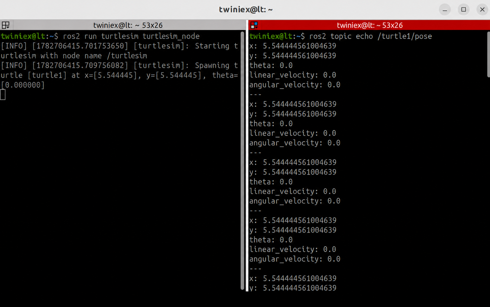

# 거북이의 위치정보를 구독하는 subscribe 노드 생성

앞 절까지는 `/turtle1/cmd_vel` Topic에 이동 명령을 발행하는 Publisher 노드를 만들었습니다.

이번 절에서는 `/turtle1/pose` Topic을 구독하여 거북이의 위치와 방향을 실시간으로 확인하는 Subscriber 노드를 작성합니다.

#### Pose Topic 확인

`turtlesim`은 거북이의 현재 상태를 `/turtle1/pose` Topic으로 계속 발행합니다.

먼저 `turtlesim`을 실행하고 Topic 데이터를 확인합니다.

```bash
# 1번 터미널
ros2 run turtlesim turtlesim_node
```

```bash
# 2번 터미널
ros2 topic echo /turtle1/pose
```



출력되는 Pose 메시지는 다음 정보를 포함합니다.

- `x`: X축 위치
- `y`: Y축 위치
- `theta`: 거북이가 바라보는 방향
- `linear_velocity`: 직선 속도
- `angular_velocity`: 회전 속도

메시지 구조는 다음 명령으로도 확인할 수 있습니다.

```bash
ros2 interface show turtlesim_msgs/msg/Pose
```

---

#### 의존성 추가

`/turtle1/pose` Topic의 메시지 타입은 `turtlesim_msgs/msg/Pose` 입니다.

`package.xml`에 `turtlesim_msgs` 의존성을 추가합니다.

```xml
<depend>rclpy</depend>
<depend>geometry_msgs</depend>
<depend>turtlesim_msgs</depend>
```

`geometry_msgs`는 앞에서 작성한 Publisher 노드에서 사용하므로 그대로 유지합니다.

---

#### Subscriber 노드 작성

`first_package/first_package` 폴더에 `pose_sub.py` 파일을 만들고 다음 코드를 작성합니다.

#### 전체 소스 코드

> GitHub Link: [https://github.com/applesnack23/ros2-lerobot-code/blob/main/chapter3/pose_sub.py](https://github.com/applesnack23/ros2-lerobot-code/blob/main/chapter3/pose_sub.py)
> 

```python
import rclpy
from rclpy.node import Node
from turtlesim_msgs.msg import Pose

class PoseSubscriber(Node):

    def __init__(self):
        super().__init__('pose_subscriber')

        self.subscription = self.create_subscription(
            Pose,
            '/turtle1/pose',
            self.pose_callback,
            10
        )

        self.get_logger().info('Pose Subscriber Node Started')

    def pose_callback(self, msg):
        self.get_logger().info(
            f'x: {msg.x:.2f}, '
            f'y: {msg.y:.2f}, '
            f'theta: {msg.theta:.2f}'
        )

def main(args=None):
    rclpy.init(args=args)

    node = PoseSubscriber()
    rclpy.spin(node)

    node.destroy_node()
    rclpy.shutdown()

if __name__ == '__main__':
    main()
```

---

#### Pose 메시지 불러오기

다음 코드는 `turtlesim_msgs` 패키지에서 `Pose` 메시지 타입을 불러옵니다.

```python
from turtlesim_msgs.msg import Pose
```

Publisher 노드에서는 `geometry_msgs/msg/Twist`를 사용했지만, 이번 Subscriber 노드는 `/turtle1/pose` Topic을 구독하므로 `turtlesim_msgs/msg/Pose`를 사용합니다.

---

#### Subscriber 생성

Subscriber는 `create_subscription()` 메서드로 생성합니다.

```python
self.subscription = self.create_subscription()
	Pose,
	`/turtle1/pose',
	self.pose_callback,
	10
)
```

각 인자의 의미는 다음과 같습니다.

| 인자 | 설명 |
| --- | --- |
| `Pose` | 구독할 메시지 타입 |
| `/turtle1/pose` | 구독할 Topic 이름 |
| `self.pose_callback` | 메시지를 받았을 때 실행할 함수 |
| `10` | 메시지 큐 크기 |

Publisher는 타이머를 이용해 일정한 주기로 메시지를 발행했습니다. 반면 Subscriber는 새로운 메시지가 도착할 때마다 ROS 2가 콜백 함수를 자동으로 호출하므로 별도의 타이머가 필요하지 않습니다.

---

#### 콜백 함수

```python
def pose_callback(self, msg):
    self.get_logger().info(
        f'x: {msg.x:.2f}, '
        f'y: {msg.y:.2f}, '
        f'theta: {msg.theta:.2f}'
    )
```

`/turtle1/pose` Topic에서 새로운 메시지가 들어올 때마다 `pose_callback()` 함수가 실행됩니다.

콜백 함수의 `msg`에는 Pose 메시지가 전달됩니다. 이 중 `x`, `y`, `theta` 값을 읽어 현재 위치와 방향을 출력합니다.

```python
msg.x
msg.y
msg.theta
```

`:.2f`는 실수 값을 소수점 둘째 자리까지 표시하는 형식입니다.

---

#### setup.py에 노드 등록

`setup.py`의 `console_scripts`에 `read_pose`를 추가합니다.

```python
entry_points={
    'console_scripts': [
        'move_straight = first_package.move_pub:main',
        'move_circle = first_package.circle_pub:main',
        'move_square = first_package.square_pub:main',
        'read_pose = first_package.pose_sub:main',
    ],
},
```

다음 명령으로 Subscriber 노드를 실행할 수 있습니다.

```python
ros2 run first_package read_pose
```

실행 명령어 이름은 `read_pose`이지만 ROS2 내부 노드 이름은 코드에서 지정한 `pose_subscriber`입니다.

```python
super().__init__('pose_subscriber')
```

따라서 `ros2 node list`에는 `/pose_subscriber`로 표시됩니다.

---

#### 빌드하기

워크스페이스로 이동하여 패키지를 빌드합니다.

```bash
cd ~/project/ros2_ws
colcon build --packages-select first_package
```

빌드가 완료되면 새 터미널에서 워크스페이스를 활성화합니다.

```bash
pkg_enable
```

---

#### 실행하기

먼저 `turtlesim`과 Subscriber 노드를 실행합니다.

```bash
# 1번 터미널
ros2 run turtlesim turtlesim_node
```

```bash
# 2번 터미널
pkg_enable
ros2 run first_package read_pose
```

거북이를 움직이려면 앞 절에서 만든 원 그리기 노드를 추가로 실행합니다.

```bash
# 3번 터미널
pkg_enable
ros2 run first_package move_circle
```


거북이가 움직이면 2번 터미널에 `x`, `y`, `theta` 값이 실시간으로 출력됩니다.

```bash
x: 5.54, y: 5.54, theta: 0.00
x: 5.74, y: 5.55, theta: 0.10
x: 5.94, y: 5.58, theta: 0.20
```

---

#### rqt_graph로 연결 확인

다음 명령으로 `rqt_graph`를 실행합니다.

```bash
ros2 run rqt_graph rqt_graph
```


화면 왼쪽 위의 새로고침 버튼을 누르면 다음 연결을 확인할 수 있습니다.

```bash
/circle_publisher
→ /turtle1/cmd_vel
→ /turtlesim
→ /turtle1/pose
→ /pose_subscriber
```

`circle_publisher`는 이동 명령을 발행하고, `turtlesim`은 거북이의 위치 정보를 발행합니다. 이번에 만든 `pose_subscriber`는 `/turtle1/pose` Topic을 구독하여 위치 정보를 받아옵니다.

---

#### 마무리

이번 절에서는 `/turtle1/pose` Topic을 구독하여 거북이의 위치와 방향을 읽는 Subscriber 노드를 작성했습니다.

Publisher와 Subscriber의 주요 차이는 다음과 같습니다.

| 구분 | Publisher | Subscriber |
| --- | --- | --- |
| 역할 | 메시지 발행 | 메시지 구독 |
| 생성 메서드 | `create_publisher()` | `create_subscription()` |
| 콜백 실행 | 타이머 등이 호출 | 메시지가 도착하면 호출 |
| 이번 실습 Topic | `/turtle1/cmd_vel` | `/turtle1/pose` |

다음 절에서는 Publisher와 Subscriber를 하나의 노드에 결합합니다. 거북이의 실제 위치와 방향을 피드백으로 사용하여 사각형을 한 번만 정확하게 그리고 종료하는 노드를 작성해보겠습니다.