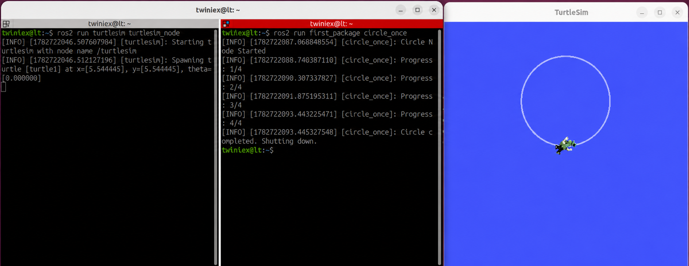

# Publisher + Subscriber 하나의 노드 생성

앞 절에서는 속도 명령을 발행하는 Publisher 노드와 거북이의 위치를 읽는 Subscriber 노드를 각각 작성했습니다.

이번 절에서는 Publisher와 Subscriber를 하나의 노드에 결합합니다. `/turtle1/cmd_vel` Topic으로 이동 명령을 보내면서 `/turtle1/pose` Topic에서 현재 방향을 받아 도형의 완성 여부를 판단합니다.

#### theta 피드백 제어

`/turtle1/pose`의 `theta`는 거북이가 바라보는 방향을 라디안 단위로 나타냅니다.

회전을 시작한 후 이전 `theta`와 현재 `theta`의 차이를 계속 누적하면 실제로 회전한 각도를 계산할 수 있습니다.

다만 `theta`는 `-π` 부터 `+π`까지만 표현됩니다. 예를 들어 `3.1`에서 조금 더 회전하면 `-3.1` 부근으로 값이 바뀝니다.

이러한 경계를 처리하기 위해 각도 차이를 다음과 같이 보정합니다.

```bash
diff = current_theta - previous_theta

if diff > math.pi:
    diff -= 2 * math.pi
elif diff < -math.pi:
    diff += 2 * math.pi
```

이 과정을 거치면 `theta`가 `+π` 와 `-π` 사이를 넘어가더라도 실제 회전량을 올바르게 누적할 수 있습니다.

---

#### 원을 한 번 그리는 노드

`first_package/first_package` 폴더에 `circle_sub.py` 파일을 만들고 다음 코드를 작성합니다.

#### 전체 소스 코드

> GitHub Link: [https://github.com/applesnack23/ros2-lerobot-code/blob/main/chapter3/circle_sub.py](https://github.com/applesnack23/ros2-lerobot-code/blob/main/chapter3/circle_sub.py)
> 

```python
import math

import rclpy
from rclpy.node import Node
from geometry_msgs.msg import Twist
from turtlesim_msgs.msg import Pose

class CircleNode(Node):

    def __init__(self):
        super().__init__('circle_node')

        self.publisher = self.create_publisher(
            Twist,
            '/turtle1/cmd_vel',
            10
        )

        self.subscription = self.create_subscription(
            Pose,
            '/turtle1/pose',
            self.pose_callback,
            10
        )

        self.timer = self.create_timer(
            0.1,
            self.timer_callback
        )

        self.linear_speed = 2.0
        self.angular_speed = 1.0

        self.total_angle = 0.0
        self.previous_theta = None
        self.quarter = 0
        self.done = False

        self.get_logger().info('Circle Node Started')

    def pose_callback(self, msg):
        if self.previous_theta is None:
            self.previous_theta = msg.theta
            return

        diff = msg.theta - self.previous_theta

        if diff > math.pi:
            diff -= 2 * math.pi
        elif diff < -math.pi:
            diff += 2 * math.pi

        self.total_angle += diff
        self.previous_theta = msg.theta

        current_quarter = int(
            self.total_angle / (math.pi / 2)
        )

        if current_quarter > self.quarter:
            self.quarter = current_quarter
            self.get_logger().info(
                f'Progress: {self.quarter}/4'
            )

        if self.total_angle >= 2 * math.pi:
            self.get_logger().info(
                'Circle completed. Shutting down.'
            )

            stop_msg = Twist()
            self.publisher.publish(stop_msg)
            self.done = True

    def timer_callback(self):
        if self.done:
            return

        msg = Twist()
        msg.linear.x = self.linear_speed
        msg.angular.z = self.angular_speed

        self.publisher.publish(msg)

def main(args=None):
    rclpy.init(args=args)

    node = CircleNode()

    while rclpy.ok() and not node.done:
        rclpy.spin_once(node, timeout_sec=0.1)

    node.destroy_node()
    rclpy.shutdown()

if __name__ == '__main__':
    main()
```

---

#### Publisher와 Subscriber 구성

하나의 노드 안에 Publisher, Subscriber, Timer를 함께 생성합니다.

```python
self.publisher = self.create_publisher(
    Twist,
    '/turtle1/cmd_vel',
    10
)

self.subscription = self.create_subscription(
    Pose,
    '/turtle1/pose',
    self.pose_callback,
    10
)

self.timer = self.create_timer(
    0.1,
    self.timer_callback
)
```

각 구성 요소의 역할은 다음과 같습니다.

| 구성 요소 | 역할 |
| --- | --- |
| Publisher | `/turtle1/cmd_vel`에 속도 명령 발행 |
| Subscriber | `/turtle1/pose`에서 위치와 방향 구독 |
| Timer | 0.1초마다 속도 명령 생성 |
| Pose Callback | 실제 회전 각도 계산 및 완료 여부 판단 |

Timer는 거북이를 움직이고, Pose Callback은 거북이가 실제로 얼마나 회전했는지 확인합니다.

#### 각도 누적

첫 번째 Pose 메시지가 들어왔을 때는 비교할 이전 각도가 없으므로 현재 값을 저장하고 종료합니다.

```python
if self.previous_theta is None:
    self.previous_theta = msg.theta
    return
```

두 번째 메시지부터는 현재 각도와 이전 각도의 차이를 계산합니다.

```python
diff = msg.theta - self.previous_theta
```

각도 경계를 보정한 후 전체 회전량에 더합니다.

```python
self.total_angle += diff
self.previous_theta = msg.theta
```

누적 각도가 `2π`에 도달하면 한 바퀴를 완성한 것으로 판단합니다.

```python
if self.total_angle >= 2 * math.pi:
    stop_msg = Twist()
    self.publisher.publish(stop_msg)
    self.done = True
```

빈 `Twist` 메시지는 모든 속도 값이 `0.0` 이므로 거북이를 정지시키는 명령이 됩니다.

---

#### 진행 상태 출력

누적 각도를 `π/2`로 나누면 현재 몇 번째 4분의 1 구간을 지났는지 확인할 수 있습니다.

```python
current_quarter = int(
    self.total_angle / (math.pi/2)
)
```

새로운 구간에 진입할 때만 진행 상태를 출력합니다.

```
Progress: 1/4
Progress: 2/4
Progress: 3/4
Progress: 4/4
```

매번 Pose 데이터를 출력하지 않으므로 터미널에서 전체 진행 상태를 쉽게 확인할 수 있습니다.

---

## 자동 종료

기존 노드에서 사용한 `rclpy.spin()`은 `Ctrl+C`를 입력할 때까지 노드를 계속 실행합니다.

이번 노드는 원을 한 바퀴 그린 후 자동으로 종료해야 하므로 `spin_once()`와 `done` 변수를 사용합니다.

```python
while rclpy.ok() and not node.done:
    rclpy.spin_once(node, timeout_sec=0.1)
```

`done`이 `True`가 되면 반복문이 종료되고 노드와 ROS 2 통신을 정리합니다.

```python
node.destroy_node()
rclpy.shutdown()
```

---

## 원 그리기 노드 등록

`setup.py`의 `console_scripts`에 `circle_once`를 추가합니다.

```python
entry_points={
    'console_scripts': [
        'move_straight = first_package.move_pub:main',
        'move_circle = first_package.circle_pub:main',
        'move_square = first_package.square_pub:main',
        'read_pose = first_package.pose_sub:main',
        'circle_once = first_package.circle_sub:main',
    ],
},
```

`circle_once`는 실행 명령어 이름이고 ROS 2 내부의 노드 이름은 `circle_node`입니다.

---

## 빌드 및 실행

패키지를 빌드합니다.

```bash
cd ~/project/ros2_ws
colcon build--packages-select first_package
```

각 터미널에서 다음 명령을 실행합니다.

```bash
# 1번 터미널
ros2 run turtlesim turtlesim_node
```

```bash
# 2번 터미널
pkg_enable
ros2 run first_package circle_once
```



거북이가 원을 한 바퀴 그리면 정지 명령이 발행되고 `circle_once` 실행도 자동으로 종료됩니다.

---

## rqt_graph로 연결 확인

다음 명령으로 `rqt_graph`를 실행합니다.

```bash
ros2 run rqt_graph rqt_graph
```

화면을 새로고침하면 다음 통신 구조를 확인할 수 있습니다.

```
/circle_node
    │
    ├── /turtle1/cmd_vel ──→ /turtlesim
    │
    └── /turtle1/pose ←──── /turtlesim
```

`circle_node`는 `/turtle1/cmd_vel` Topic으로 이동 명령을 발행합니다. `turtlesim`은 명령에 따라 거북이를 움직이고 `/turtle1/pose` Topic으로 위치 정보를 발행합니다.

`circle_node`는 이 정보를 다시 구독하여 누적 회전량을 계산하고 한 바퀴가 완료되면 정지 명령을 발행합니다.


---

## 사각형을 한 번 그리는 노드

원 그리기 노드와 같은 방식으로 사각형도 한 번만 그리도록 만들 수 있습니다.

직진 구간은 일정 시간 동안 실행하고, 회전 구간은 `theta` 피드백을 이용하여 90도 회전했는지 확인합니다.

`first_package/first_package` 폴더에 `square_sub.py` 파일을 만들고 다음 코드를 작성합니다.

```python
import math

import rclpy
from rclpy.node import Node
from geometry_msgs.msg import Twist
from turtlesim_msgs.msg import Pose

class SquareNode(Node):

    def __init__(self):
        super().__init__('square_node')

        self.publisher = self.create_publisher(
            Twist,
            '/turtle1/cmd_vel',
            10
        )

        self.subscription = self.create_subscription(
            Pose,
            '/turtle1/pose',
            self.pose_callback,
            10
        )

        self.timer = self.create_timer(
            0.1,
            self.timer_callback
        )

        self.state = 'MOVING'
        self.elapsed = 0.0
        self.turned_angle = 0.0
        self.previous_theta = None
        self.side_count = 0
        self.done = False

        self.linear_speed = 2.0
        self.move_duration = 2.0
        self.angular_speed = math.pi / 2
        self.dt = 0.1

        self.get_logger().info('Square Node Started')

    def pose_callback(self, msg):
        if self.previous_theta is None:
            self.previous_theta = msg.theta
            return

        if self.state == 'TURNING':
            diff = msg.theta - self.previous_theta

            if diff > math.pi:
                diff -= 2 * math.pi
            elif diff < -math.pi:
                diff += 2 * math.pi

            self.turned_angle += abs(diff)

        self.previous_theta = msg.theta

    def timer_callback(self):
        if self.done:
            return

        msg = Twist()

        if self.state == 'MOVING':
            msg.linear.x = self.linear_speed
            msg.angular.z = 0.0

            self.elapsed += self.dt

            if self.elapsed >= self.move_duration:
                self.state = 'TURNING'
                self.elapsed = 0.0
                self.turned_angle = 0.0

        elif self.state == 'TURNING':
            msg.linear.x = 0.0
            msg.angular.z = self.angular_speed

            if self.turned_angle >= math.pi / 2 - 0.01:
                self.side_count += 1

                if self.side_count >= 4:
                    self.get_logger().info(
                        'Square completed. Shutting down.'
                    )

                    stop_msg = Twist()
                    self.publisher.publish(stop_msg)
                    self.done = True
                    return

                self.state = 'MOVING'
                self.elapsed = 0.0
                self.turned_angle = 0.0

        self.publisher.publish(msg)

def main(args=None):
    rclpy.init(args=args)

    node = SquareNode()

    while rclpy.ok() and not node.done:
        rclpy.spin_once(node, timeout_sec=0.1)

    node.destroy_node()
    rclpy.shutdown()

if __name__ == '__main__':
    main()
```

> 이 노드는 회전 각도를 Pose 피드백으로 측정하지만, 각 변의 이동 거리는 여전히 이동 시간으로 결정합니다. 따라서 회전 오차는 줄어들지만 시스템 지연에 따라 변의 길이에는 작은 오차가 생길 수 있습니다.
> 

---

## 사각형 노드 등록

`setup.py`의 `console_scripts`에 다음 항목을 추가합니다.

```python
'square_once = first_package.square_sub:main',
```

전체 등록 예시는 다음과 같습니다.

```python
entry_points={
    'console_scripts': [
        'move_straight = first_package.move_pub:main',
        'move_circle = first_package.circle_pub:main',
        'move_square = first_package.square_pub:main',
        'read_pose = first_package.pose_sub:main',
        'circle_once = first_package.circle_sub:main',
        'square_once = first_package.square_sub:main',
    ],
},
```

---

## 사각형 노드 빌드 및 실행

패키지를 다시 빌드합니다.

```bash
cd ~/project/ros2_ws
colcon build--packages-select first_package
```

각 터미널에서 다음 명령을 실행합니다.

```bash
# 1번 터미널
ros2 run turtlesim turtlesim_node
```

```bash
# 2번 터미널
pkg_enable
ros2 run first_package square_once
```


거북이가 네 번의 직진과 회전을 수행하면 정지하고 노드가 자동으로 종료됩니다.

---

## 마무리

이번 절에서는 Publisher와 Subscriber를 하나의 노드에 결합했습니다.

Publisher는 속도 명령을 발행하고 Subscriber는 실제 방향 정보를 받아옵니다. 이를 통해 시간만으로 회전량을 추정하던 방식보다 정확하게 도형의 회전 각도를 제어할 수 있습니다.

지금까지는 여러 노드를 각각 다른 터미널에서 실행했습니다. 노드가 많아지면 실행해야 하는 명령과 터미널도 늘어납니다.

다음 절에서는 여러 노드를 한 번에 실행하고 관리할 수 있는 ROS 2 Launch 파일을 작성해보겠습니다.