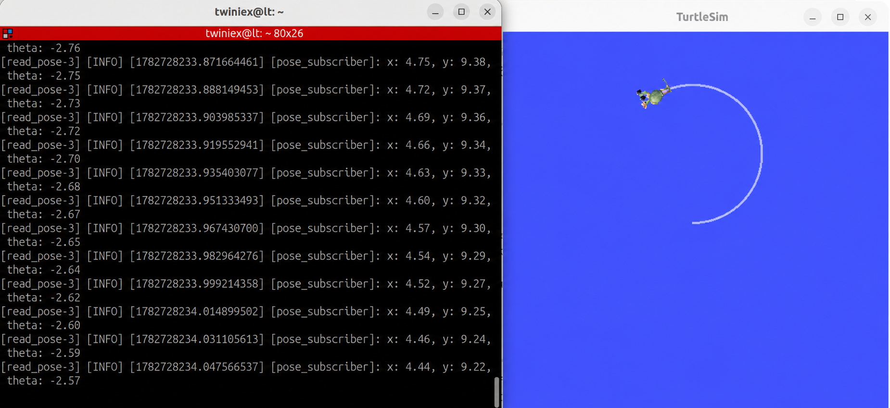

# ROS2 launch

지금까지는 `turtlesim`, Publisher, Subscriber 노드를 각각 다른 터미널에서 실행했습니다. 노드가 많아질수록 터미널을 열고 명령을 반복해서 입력하는 과정이 번거로워집니다.

ROS2 Launch를 사용하면 실행할 노드와 설정을 하나의 파일에 정의하고, 명령어 한 줄로 여러 노드를 함께 실행할 수 있습니다.

#### Launch 파일이란

Launch 파일은 실행할 노드와 각 노드의 설정을 정의하는 파일입니다.

일반적으로 패키지 내부의 `launch` 폴더에 저장하며 파일 이름은 다음 형식을 사용합니다.

```bash
파일이름.launch.py
```

Python 이외에도 XML이나 YAML 형식을 사용할 수 있지만, 이 책에서는 Python 형식의 Launch 파일을 사용합니다.

---

#### Launch 폴더 생성

다음 명령으로 `first_package` 안에 `launch` 폴더를 만듭니다.

```bash
mkdir-p ~/project/ros2_ws/src/first_package/launch
```

패키지 구조는 다음과 같습니다.

```
first_package/
├── first_package/
│   ├── move_pub.py
│   ├── circle_pub.py
│   └── pose_sub.py
├── launch/
│   └── turtlesim_circle.launch.py
├── package.xml
├── setup.py
└── setup.cfg
```

---

#### Launch 파일 작성

`launch` 폴더에 `turtlesim_circle.launch.py` 파일을 만들고 다음 코드를 작성합니다.

#### 전체 소스 코드

> GitHub Link: [https://github.com/applesnack23/ros2-lerobot-code/blob/main/chapter3/turtlesim_circle.launch.py](https://github.com/applesnack23/ros2-lerobot-code/blob/main/chapter3/turtlesim_circle.launch.py)
> 

```python
from launch import LaunchDescription
from launch_ros.actions import Node

def generate_launch_description():
    return LaunchDescription([
        Node(
            package='turtlesim',
            executable='turtlesim_node',
            name='turtlesim'
        ),

        Node(
            package='first_package',
            executable='move_circle',
            name='circle_publisher'
        ),

        Node(
            package='first_package',
            executable='read_pose',
            name='pose_subscriber'
        ),
    ])
```

이 Launch 파일은 다음 세 노드를 함께 실행합니다.

- `turtlesim_node`
- `move_circle`
- `read_pose`

---

#### LaunchDescription

```python
def generate_launch_description():
    return LaunchDescription([
        ...
    ])
```

`generate_launch_description()`은 ROS2 Launch 시스템이 호출하는 기본 함수입니다.

`LaunchDescription` 안에는 실행할 노드와 기타 Launch 동작을 작성합니다.

---

#### Node 설정

실행할 노드 하나는 `Node` 항목으로 정의합니다.

```python
Node(
    package='turtlesim',
    executable='turtlesim_node',
    name='turtlesim'
)
```

각 항목의 의미는 다음과 같습니다.

| 항목 | 설명 |
| --- | --- |
| `package` | 실행 파일이 들어 있는 패키지 이름 |
| `executable` | `ros2 run`에서 사용하는 실행 파일 이름 |
| `name` | 실행할 때 사용할 ROS2 노드 이름 |

예를 들어 다음 명령은

```bash
ros2 run first_package move_circle
```

Launch 파일에서 다음과 같이 표현할 수 있습니다.

```python
Node(
    package='first_package',
    executable='move_circle',
    name='circle_publisher'
)
```

`name`을 지정하면 코드에서 설정한 노드 이름을 Launch 파일의 이름으로 변경하여 실행할 수 있습니다.

---

#### package.xml 의존성 추가

Launch 파일에서 `launch`와 `launch_ros`를 사용하므로 `package.xml`에 다음 의존성을 추가합니다.

```xml
<depend>rclpy</depend>
<depend>geometry_msgs</depend>
<depend>turtlesim_msgs</depend>

<exec_depend>launch</exec_depend>
<exec_depend>launch_ros</exec_depend>
```

기존 의존성과 함께 작성하면 다음과 같습니다.

```xml
<depend>rclpy</depend>
<depend>geometry_msgs</depend>
<depend>turtlesim_msgs</depend>

<exec_depend>launch</exec_depend>
<exec_depend>launch_ros</exec_depend>
```

---

#### setup.py에 Launch 파일 등록

Launch 파일이 빌드 결과에 포함되도록 `setup.py`를 수정해야 합니다.

파일 위쪽에 `os`와 `glob`을 추가합니다.

```python
import os
from glob import glob

from setuptools import find_packages, setup
```

`data_files`에는 Launch 파일을 설치하는 설정을 추가합니다.

```python
data_files=[
    (
        'share/ament_index/resource_index/packages',
        ['resource/' + package_name]
    ),
    (
        'share/' + package_name,
        ['package.xml']
    ),
    (
        os.path.join('share', package_name, 'launch'),
        glob('launch/*.launch.py')
    ),
],
```

추가된 핵심 부분은 다음과 같습니다.

```python
(
    os.path.join('share', package_name, 'launch'),
    glob('launch/*.launch.py')
),
```

`glob('launch/*.launch.py')`는 `launch` 폴더에 있는 모든 `.launch.py` 파일을 가져옵니다.

빌드하면 해당 파일들이 다음 경로에 설치됩니다.

```bash
~/project/ros2_ws/install/first_package/share/first_package/launch
```

`ros2 launch` 명령은 이 경로에서 Launch 파일을 찾습니다.

---

#### 빌드하기

워크스페이스로 이동하여 패키지를 빌드합니다.

```bash
cd ~/project/ros2_ws
colcon build--packages-select first_package
```

새로운 Launch 파일을 추가하거나 `setup.py`를 변경한 경우에는 반드시 다시 빌드해야 합니다.

빌드가 완료되면 워크스페이스를 활성화합니다.

```bash
pkg_enable
```

또는 직접 다음 명령을 실행할 수 있습니다.

```bash
source ~/project/ros2_ws/install/setup.bash
```

---

#### Launch 파일 실행

다음 명령으로 Launch 파일을 실행합니다.

```bash
ros2 launch first_package turtlesim_circle.launch.py
```

실행하면 다음 노드가 함께 시작됩니다.

```bash
/turtlesim
/circle_publisher
/pose_subscriber
```

`turtlesim` 창이 열리고 거북이가 원을 그리기 시작합니다. 같은 터미널에는 각 노드의 로그가 함께 출력됩니다.

현재 실행 중인 노드는 다른 터미널에서 확인할 수 있습니다.

```bash
ros2 node list
```



Launch로 실행한 모든 노드를 종료하려면 Launch 명령을 실행한 터미널에서 `Ctrl+C`를 누릅니다.

---

#### 마무리

이번 절에서는 Launch 파일을 사용하여 여러 노드를 한 번에 실행하는 방법을 살펴봤습니다.

기존에는 다음 명령을 각각 실행해야 했습니다.

```bash
ros2 run turtlesim turtlesim_node
ros2 run first_package move_circle
ros2 run first_package read_pose
```

Launch 파일을 사용하면 하나의 명령으로 같은 작업을 수행할 수 있습니다.

```bash
ros2 launch first_package turtlesim_circle.launch.py
```

다음 절에서는 Service 요청을 처리하는 Service Server 노드와 요청을 보내는 Service Client 노드를 만들어보겠습니다.