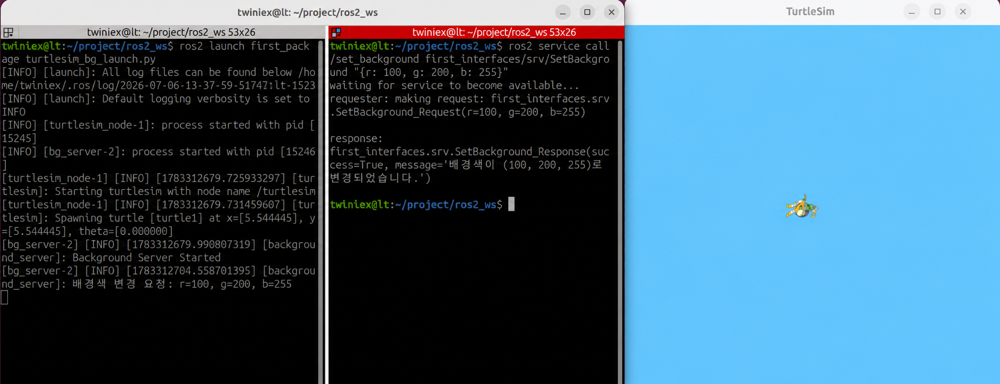

# Service Server 노드 생성

#### Service 서버 생성

```python
self.server = self.create_service(
    SetBackground,
    '/set_background',
    self.handle_request
)
```

`create_service()`는 Service 서버를 생성하는 메서드이며 다음 세 가지 인자를 받습니다.

- `SetBackground`: 사용할 Service 타입
- `/set_background`: Service 이름
- `self.handle_request`: 요청을 받았을 때 실행할 콜백 함수

Subscriber의 `create_subscription()`과 구조가 비슷합니다. 클라이언트로부터 요청이 도착하면 ROS2가 `handle_request()` 콜백 함수를 자동으로 호출합니다.

---

#### 파라미터 클라이언트 생성

```python
self.param_client = self.create_client(
    SetParameters,
    '/turtlesim/set_parameters'
)
```

`turtlesim_node`의 배경색을 변경하려면 다음 파라미터를 수정해야 합니다.

- `background_r`: 빨간색 값
- `background_g`: 초록색 값
- `background_b`: 파란색 값

이를 위해 `/turtlesim/set_parameters` Service에 요청을 보내는 파라미터 클라이언트를 생성합니다.

따라서 이번 노드는 다음 두 가지 역할을 동시에 수행합니다.

- `/set_background` 요청을 받는 Service 서버
- `/turtlesim/set_parameters`에 요청을 보내는 Service 클라이언트

> `SetParameters`는 일반적으로 다음과 같이 가져옵니다.
>
> ```python
> from rcl_interfaces.srv import SetParameters
> ```
>

---

#### Service 콜백 함수

```python
def handle_request(self, request, response):
```

Service 서버의 콜백 함수는 Publisher나 Subscriber의 콜백과 달리 두 개의 인자를 받습니다.

- `request`: 클라이언트가 보낸 요청 객체
- `response`: 클라이언트에게 반환할 응답 객체

클라이언트가 전달한 RGB 값은 다음과 같이 가져옵니다.

```python
request.r
request.g
request.b
```

이 값을 이용해 `background_r`, `background_g`, `background_b` 파라미터를 생성한 뒤 `turtlesim_node`의 파라미터 Service에 전달합니다.

---

**파라미터 메시지 변환**

파라미터는 `Parameter` 객체로 생성한 뒤 `to_parameter_msg()`를 사용해 ROS2 Service가 처리할 수 있는 메시지 형태로 변환합니다.

```python
parameter.to_parameter_msg()
```

변경할 파라미터가 여러 개이므로 RGB 파라미터를 리스트에 담아 한 번에 요청합니다.

**응답 처리**

배경색 변경 요청이 정상적으로 처리되면 다음과 같이 응답을 구성합니다.

```python
response.success = True
response.message = '배경색이 변경되었습니다.'
```

처리 과정에서 예외가 발생하면 실패 결과와 오류 내용을 반환합니다.

```python
response.success = False
response.message = str(e)
```

마지막으로 응답 객체를 반환하면 ROS2가 클라이언트에게 결과를 전달합니다.

```python
return response
```

---

#### `package.xml` 의존성 추가

`first_package`의 `package.xml`에 필요한 의존성을 추가합니다.

```xml
<depend>rclpy</depend>
<depend>geometry_msgs</depend>
<depend>turtlesim</depend>
<depend>rcl_interfaces</depend>
<depend>first_interfaces</depend>
```

각 의존성의 역할은 다음과 같습니다.

- `rclpy`: ROS2 Python 노드 작성
- `geometry_msgs`: 기존 Publisher 노드에서 사용하는 메시지
- `turtlesim`: Turtlesim 관련 기능 사용
- `rcl_interfaces`: 파라미터 Service 타입 사용
- `first_interfaces`: 직접 만든 `SetBackground` Service 타입 사용

---

#### setup.py에 노드 등록

`setup.py`의 `console_scripts`에 `bg_server`를 추가합니다.

```python
entry_points={
    'console_scripts': [
        'move_straight = first_package.move_pub:main',
        'move_circle = first_package.circle_pub:main',
        'move_square = first_package.square_pub:main',
        'read_pose = first_package.pose_sub:main',
        'circle_once = first_package.circle_sub:main',
        'bg_server = first_package.bg_server:main',
    ],
},
```

다음 명령으로 Service 서버 노드를 실행할 수 있습니다.

```bash
ros2 run first_package bg_server
```

---

#### 빌드하기

워크스페이스로 이동한 뒤 `first_package`를 빌드합니다.

```bash
cd ~/project/ros2_ws
colcon build --packages-select first_package
```

빌드가 끝나면 환경 설정을 다시 적용합니다.

```bash
source ~/project/ros2_ws/install/setup.bash
```

또는 앞에서 등록한 명령을 사용합니다.

---

```bash
pkg_enable
```

#### 실행하기

먼저 두 개의 터미널에서 Turtlesim과 Service 서버를 실행합니다.

**1번 터미널: Turtlesim 실행**

```bash
ros2 run turtlesim turtlesim_node
```

**2번 터미널: Service 서버 실행**

```bash
ros2 run first_package bg_server
```

서버가 실행된 상태에서 세 번째 터미널을 열고 Service 요청을 보냅니다.

**3번 터미널: 배경색 변경 요청**

```bash
ros2 service call /set_background first_interfaces/srv/SetBackground "{r: 100, g: 200, b: 255}"
```



요청이 정상적으로 처리되면 Turtlesim의 배경색이 RGB `(100, 200, 255)`로 변경되고, 터미널에는 성공 여부와 결과 메시지가 출력됩니다.

---

#### 실행 결과 확인

현재 활성화된 Service는 다음 명령으로 확인할 수 있습니다.

```bash
ros2 service list
```

`/set_background`의 타입은 다음 명령으로 확인합니다.

```bash
ros2 service type /set_background
```

Service의 자세한 연결 정보는 다음과 같이 확인할 수 있습니다.

```bash
ros2 service info /set_background
```

---

#### 마무리

이번 절에서는 Turtlesim의 배경색을 변경하는 Service 서버 노드를 만들었습니다.

핵심 동작 흐름은 다음과 같습니다.

1. 클라이언트가 `/set_background`에 RGB 값을 요청합니다.
2. `bg_server`가 요청을 받아 콜백 함수를 실행합니다.
3. `bg_server`가 `/turtlesim/set_parameters`에 파라미터 변경을 요청합니다.
4. Turtlesim의 배경색이 변경됩니다.
5. 처리 결과가 클라이언트에게 응답으로 전달됩니다.

이번 노드는 Service 서버로 요청을 받으면서 다른 Service에는 요청을 보내는 구조입니다. 하나의 노드가 상황에 따라 서버와 클라이언트 역할을 동시에 수행할 수 있다는 점이 중요합니다.

다음 절에서는 도형 그리기가 완료된 후 배경색 변경을 자동으로 요청하는 Service 클라이언트 노드를 만들어보겠습니다.
