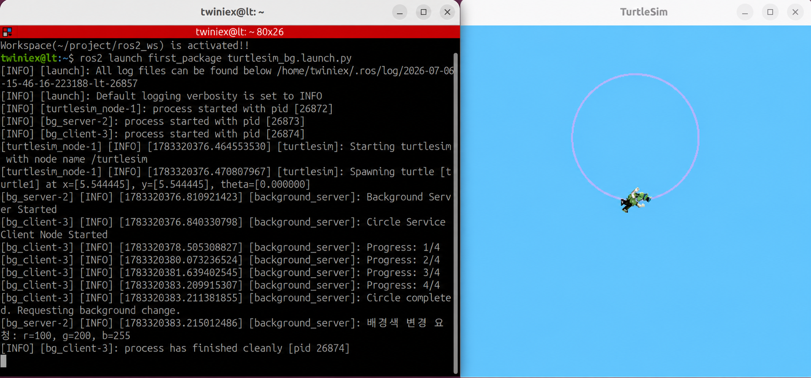

# Sevice Client 노드 생성

3.8절에서는 Turtlesim의 배경색을 변경하는 Service 서버 노드를 만들고, 터미널에서 직접 요청을 보내 동작을 확인했습니다.

이번 절에서는 특정 조건이 충족되면 Service 서버에 자동으로 요청을 보내는 클라이언트 노드를 만들어보겠습니다.

3.5절에서 만든 원 그리기 노드를 기반으로 다음 동작을 구현합니다.

1. Publisher가 거북이의 속도 명령을 발행합니다.
2. Subscriber가 거북이의 현재 각도를 구독합니다.
3. 거북이가 원을 한 바퀴 완주하면 정지합니다.
4. Service 클라이언트가 배경색 변경을 요청합니다.
5. 서버의 응답을 받아 결과를 출력합니다.

이번 노드는 Publisher, Subscriber, Service 클라이언트가 하나의 노드에 결합된 구조입니다.

---

#### 노드 파일 작성

`first_package/first_package` 폴더 안에 `bg_client.py` 파일을 만들고 다음 코드를 작성합니다.

#### 전체 소스 코드

> GitHub Link: [https://github.com/applesnack23/ros2-lerobot-code/blob/main/chapter3/bg_client.py](https://github.com/applesnack23/ros2-lerobot-code/blob/main/chapter3/bg_client.py)
> 

```python
import math

import rclpy
from rclpy.node import Node
from geometry_msgs.msg import Twist
from turtlesim_msgs.msg import Pose

from first_interfaces.srv import SetBackground

class CircleServiceClient(Node):

    def __init__(self):
        super().__init__('circle_service_client')

        self.publisher = self.create_publisher(
            Twist,
            '/turtle1/cmd_vel',
            10
        )

        self.subscription = self.create_subscription(
            Pose,
            '/turtle1/pose',
            self.pose_callback,
            10
        )

        self.client = self.create_client(
            SetBackground,
            '/set_background'
        )

        self.timer = self.create_timer(
            0.1,
            self.timer_callback
        )

        self.total_angle = 0.0
        self.previous_theta = None
        self.quarter = 0

        self.motion_done = False
        self.response_received = False

        self.get_logger().info(
            'Circle Service Client Node Started'
        )

    def pose_callback(self, msg):
        if self.motion_done:
            return

        if self.previous_theta is None:
            self.previous_theta = msg.theta
            return

        diff = msg.theta - self.previous_theta

        if diff > math.pi:
            diff -= 2 * math.pi
        elif diff < -math.pi:
            diff += 2 * math.pi

        self.total_angle += abs(diff)
        self.previous_theta = msg.theta

        current_quarter = int(
            self.total_angle / (math.pi / 2)
        )

        if current_quarter > self.quarter:
            self.quarter = min(current_quarter, 4)
            self.get_logger().info(
                f'Progress: {self.quarter}/4'
            )

        if self.total_angle >= 2 * math.pi:
            self.motion_done = True

            self.get_logger().info(
                'Circle completed. Requesting background change.'
            )

            stop_msg = Twist()
            self.publisher.publish(stop_msg)

            self.send_background_request(
                100,
                200,
                255
            )

    def send_background_request(self, r, g, b):
        if not self.client.wait_for_service(timeout_sec=1.0):
            self.get_logger().warning(
                'Background server is not available.'
            )
            self.response_received = True
            return

        request = SetBackground.Request()
        request.r = r
        request.g = g
        request.b = b

        future = self.client.call_async(request)
        future.add_done_callback(
            self.background_response_callback
        )

    def background_response_callback(self, future):
        try:
            response = future.result()

            if response.success:
                self.get_logger().info(
                    f'배경색 변경 성공: {response.message}'
                )
            else:
                self.get_logger().warning(
                    f'배경색 변경 실패: {response.message}'
                )

        except Exception as error:
            self.get_logger().error(
                f'Service 요청 처리 중 오류 발생: {error}'
            )

        self.response_received = True

    def timer_callback(self):
        if self.motion_done:
            return

        msg = Twist()
        msg.linear.x = 2.0
        msg.angular.z = 1.0

        self.publisher.publish(msg)

def main(args=None):
    rclpy.init(args=args)
    node = CircleServiceClient()

    while rclpy.ok() and not node.response_received:
        rclpy.spin_once(node, timeout_sec=0.1)

    node.destroy_node()
    rclpy.shutdown()

if __name__ == '__main__':
    main()
```

---

#### 노드의 전체 구조

이번 노드에서는 다음 세 가지 ROS2 통신 기능을 사용합니다.

| 기능 | Topic 또는 Service | 역할 |
| --- | --- | --- |
| Publisher | `/turtle1/cmd_vel` | 거북이의 속도 명령 발행 |
| Subscriber | `/turtle1/pose` | 거북이의 위치와 각도 구독 |
| Service Client | `/set_background` | 배경색 변경 요청 |

Publisher는 거북이를 움직이고, Subscriber는 회전한 각도를 확인합니다. 원을 한 바퀴 완주하면 Service 클라이언트가 배경색 변경을 요청합니다.

---

#### Service 클라이언트 생성

```python
self.client = self.create_client(
    SetBackground,
    '/set_background'
)
```

`create_client()`는 Service 클라이언트를 생성하는 메서드입니다.

- `SetBackground`: 사용할 Service 타입
- `/set_background`: 요청을 보낼 Service 이름

Service 서버와 클라이언트는 반드시 같은 Service 이름과 타입을 사용해야 합니다.

---

#### 원의 회전 각도 계산

```python
diff = msg.theta - self.previous_theta

if diff > math.pi:
    diff -= 2 * math.pi
elif diff < -math.pi:
    diff += 2 * math.pi

self.total_angle += abs(diff)
```

`turtlesim`의 `theta` 값은 `-π`와 `π` 사이에서 표현됩니다. 거북이가 이 경계를 통과하면 각도 값이 갑자기 크게 변한 것처럼 보일 수 있습니다.

이를 보정한 뒤 회전량의 절댓값을 `total_angle`에 누적합니다.

누적 회전량이 $2\pi$ 이상이면 원을 한 바퀴 완주한 것으로 판단합니다.

```python
if self.total_angle >= 2 * math.pi:
```

---

#### 원 완주 후 정지

```python
self.motion_done = True

stop_msg = Twist()
self.publisher.publish(stop_msg)
```

빈 `Twist` 메시지는 모든 속도 값이 `0.0`으로 설정되어 있으므로 거북이가 정지합니다.

`motion_done`을 `True`로 변경하면 Timer와 Subscriber가 더 이상 이동 명령이나 중복 요청을 처리하지 않습니다.

---

#### Service 요청 전송

```python
def send_background_request(self, r, g, b):
    if not self.client.wait_for_service(timeout_sec=1.0):
        self.get_logger().warning(
            'Background server is not available.'
        )
        self.response_received = True
        return
```

`wait_for_service()`는 요청을 보내기 전에 Service 서버가 실행 중인지 확인합니다.

1초 안에 서버를 발견하지 못하면 경고를 출력하고 요청을 중단합니다.

요청 객체는 다음과 같이 생성합니다.

```python
request = SetBackground.Request()
request.r = r
request.g = g
request.b = b
```

배경색으로 사용할 RGB 값을 요청 객체에 저장한 뒤 비동기 방식으로 전송합니다.

```python
future = self.client.call_async(request)
future.add_done_callback(
    self.background_response_callback
)
```

`call_async()`는 응답을 기다리는 동안 노드 전체를 멈추지 않고 요청을 보내는 메서드입니다.

`add_done_callback()`은 서버 응답이 도착했을 때 실행할 콜백 함수를 등록합니다.

---

#### 비동기 요청을 사용하는 이유

Service 요청을 동기 방식으로 처리하면 응답을 받을 때까지 현재 콜백 함수가 멈출 수 있습니다.

현재 노드는 Subscriber 콜백 안에서 Service 요청을 보내기 때문에 동기 방식으로 기다리면 ROS2의 이벤트 처리 과정이 막혀 응답을 정상적으로 처리하지 못할 수 있습니다.

따라서 다음 구조로 처리합니다.

1. `call_async()`로 요청을 전송합니다.
2. 노드는 계속 이벤트를 처리합니다.
3. 응답이 도착하면 등록된 콜백 함수가 실행됩니다.

---

#### Service 응답 처리

```python
def background_response_callback(self, future):
    try:
        response = future.result()

        if response.success:
            self.get_logger().info(
                f'배경색 변경 성공: {response.message}'
            )
        else:
            self.get_logger().warning(
                f'배경색 변경 실패: {response.message}'
            )

    except Exception as error:
        self.get_logger().error(
            f'Service 요청 처리 중 오류 발생: {error}'
        )

    self.response_received = True
```

`future.result()`로 서버가 반환한 응답 객체를 가져옵니다.

응답의 `success` 값에 따라 성공 또는 실패 메시지를 출력합니다. 응답 처리가 끝나면 `response_received`를 `True`로 변경하여 메인 반복문을 종료합니다.

---

#### 메인 함수

```python
def main(args=None):
    rclpy.init(args=args)
    node = CircleServiceClient()

    while rclpy.ok() and not node.response_received:
        rclpy.spin_once(node, timeout_sec=0.1)

    node.destroy_node()
    rclpy.shutdown()
```

Service 요청은 비동기로 처리되므로 요청을 보낸 직후 노드를 종료하면 응답 콜백이 실행되지 않을 수 있습니다.

따라서 `response_received`가 `True`가 될 때까지 `spin_once()`를 반복합니다. 서버의 응답을 처리한 뒤 노드를 안전하게 종료합니다.

---

#### package.xml 의존성 확인

`first_package`의 `package.xml`에 다음 의존성이 포함되어 있어야 합니다.

```xml
<depend>rclpy</depend>
<depend>geometry_msgs</depend>
<depend>turtlesim_msgs</depend>
<depend>first_interfaces</depend>
```

---

#### setup.py에 노드 등록

`setup.py`의 `console_scripts`에 `bg_client`를 추가합니다.

```python
entry_points={
    'console_scripts': [
        'move_straight = first_package.move_pub:main',
        'move_circle = first_package.circle_pub:main',
        'move_square = first_package.square_pub:main',
        'read_pose = first_package.pose_sub:main',
        'circle_once = first_package.circle2_pub:main',
        'bg_server = first_package.bg_server:main',
        'bg_client = first_package.bg_client:main',
    ],
},
```

다음 명령으로 클라이언트 노드를 실행할 수 있습니다.

```bash
ros2 run first_package bg_client
```

---

#### 빌드하기

```bash
cd ~/project/ros2_ws
colcon build--packages-select first_package
```

빌드가 완료되면 환경 설정을 다시 적용합니다.

```bash
source ~/project/ros2_ws/install/setup.bash
```

또는 앞에서 등록한 명령을 사용합니다.

```bash
pkg_enable
```

---

#### 개별 노드 실행하기

세 개의 터미널에서 다음 노드를 순서대로 실행합니다.

**1번 터미널: Turtlesim 실행**

```
ros2 run turtlesim turtlesim_node
```

**2번 터미널: 배경색 Service 서버 실행**

```
ros2 run first_package bg_server
```

**3번 터미널: 원 그리기 및 Service 클라이언트 실행**

```
ros2 run first_package bg_client
```

거북이가 원을 한 바퀴 완주하면 정지하고, Turtlesim의 배경색이 RGB `(100, 200, 255)`로 변경됩니다.

클라이언트 터미널에는 서버가 반환한 결과 메시지가 출력됩니다.

---

#### Launch 파일 작성

여러 노드를 한 번에 실행하려면 Launch 파일을 사용할 수 있습니다.

`first_package/launch` 폴더 안에 `turtlesim_background.launch.py` 파일을 만들고 다음 내용을 작성합니다.

```python
from launch import LaunchDescription
from launch_ros.actions import Node

def generate_launch_description():
    return LaunchDescription([
        Node(
            package='turtlesim',
            executable='turtlesim_node',
            name='turtlesim'
        ),
        Node(
            package='first_package',
            executable='bg_server',
            name='background_server'
        ),
        Node(
            package='first_package',
            executable='bg_client',
            name='circle_service_client'
        ),
    ])
```

클라이언트 노드의 이름은 `background_server`가 아니라 `circle_service_client`로 설정해야 합니다. 같은 Launch 파일 안에서 서버와 클라이언트에 동일한 노드 이름을 사용하면 이름 충돌이 발생할 수 있습니다.

---

#### Launch 파일 실행

Launch 파일을 추가한 뒤 패키지를 다시 빌드합니다.

```bash
cd ~/project/ros2_ws
colcon build--packages-select first_package
pkg_enable
```

다음 명령으로 세 개의 노드를 한 번에 실행합니다.

```bash
ros2 launch first_package turtlesim_background.launch.py
```



거북이가 원을 완주하면 다음 순서로 동작합니다.

1. 거북이가 정지합니다.
2. `/set_background` Service에 RGB 값을 요청합니다.
3. Service 서버가 Turtlesim의 파라미터를 변경합니다.
4. Turtlesim의 배경색이 변경됩니다.
5. 클라이언트가 서버의 응답을 출력한 뒤 종료됩니다.

---

#### 마무리

이번 절에서는 Publisher, Subscriber, Service 클라이언트를 하나의 노드에 결합했습니다.

핵심은 거북이의 현재 각도를 Subscriber로 확인하고, 원을 한 바퀴 완주한 시점에 Service 요청을 자동으로 보내는 것입니다.

특히 콜백 함수 안에서 Service를 호출할 때는 `call_async()`와 `add_done_callback()`을 사용해야 다른 ROS2 이벤트 처리를 방해하지 않고 응답을 받을 수 있습니다.

다음 절에서는 시간이 오래 걸리는 작업을 Goal, Feedback, Result로 관리할 수 있는 Action 서버와 Action 클라이언트 노드를 만들어보겠습니다.