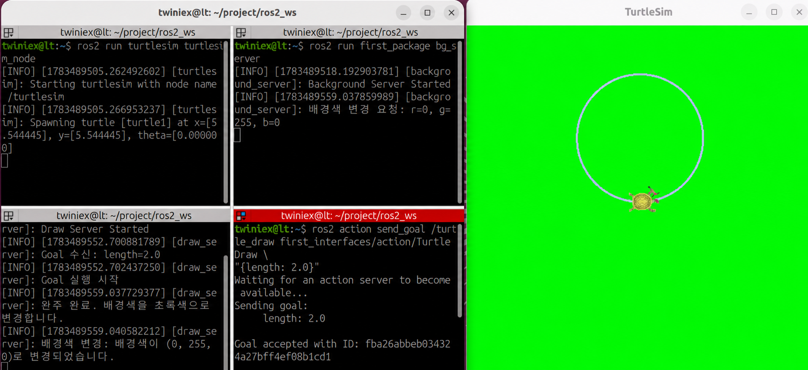

# Action Server 노드 생성

2장에서는 Action이 다음과 같은 구조로 동작한다고 배웠습니다.

1. Action 클라이언트가 목표인 Goal을 전달합니다.
2. Action 서버가 작업을 수행합니다.
3. 작업 중 진행 상황을 Feedback으로 전달합니다.
4. 작업이 끝나면 최종 Result를 반환합니다.
5. 클라이언트는 작업 도중 취소를 요청할 수 있습니다.

이번 절에서는 거북이가 원을 그리는 Action 서버를 구현합니다.

- Goal: 원의 반지름
- Feedback: 완주까지 남은 거리
- Result: 성공 여부, 결과 메시지, 소요 시간
- 완주: 배경색을 초록색으로 변경
- 취소: 배경색을 빨간색으로 변경

배경색 변경에는 앞 절에서 만든 `/set_background` Service를 사용합니다.

---

#### 커스텀 Action 파일 작성

`first_interfaces/action` 폴더의 `TurtleDraw.action` 파일에 다음 내용을 작성합니다.

```
float32 length
---
bool success
string message
float32 elapsed_time
---
float32 distance
```

Action 인터페이스는 `---` 구분선을 기준으로 세 부분으로 구성됩니다.

| 구분 | 필드 | 설명 |
| --- | --- | --- |
| Goal | `length` | 원의 반지름 |
| Result | `success` | 완주 성공 여부 |
| Result | `message` | 결과 메시지 |
| Result | `elapsed_time` | 작업 소요 시간 |
| Feedback | `distance` | 완주까지 남은 거리 |

현재 필드 이름은 `length`지만 실제 코드에서는 원의 반지름으로 사용합니다. 의미를 명확하게 만들고 싶다면 `radius`라는 이름을 사용하는 것이 더 자연스럽습니다.

---

#### CMakeLists.txt에 Action 등록

`first_interfaces`의 `CMakeLists.txt`에서 `TurtleDraw.action`이 등록되어 있는지 확인합니다.

```makefile
rosidl_generate_interfaces(${PROJECT_NAME}
  "msg/TopicTest.msg"
  "srv/SetBackground.srv"
  "action/TurtleDraw.action"
)
```

Action 파일을 새로 추가했다면 인터페이스 패키지를 다시 빌드해야 합니다.

```bash
cd ~/project/ros2_ws
colcon build--packages-select first_interfacessource ~/project/ros2_ws/install/setup.bash
```

또는 앞에서 만든 명령을 사용합니다.

```bash
pkg_enable
```

정상적으로 등록됐는지 다음 명령으로 확인할 수 있습니다.

```bash
ros2 interface show first_interfaces/action/TurtleDraw
```

---

#### Action 서버 노드 작성

`first_package/first_package` 폴더 안에 `draw_server.py` 파일을 만들고 다음 코드를 작성합니다.

### 전체 소스 코드

> GitHub Link:  [https://github.com/applesnack23/ros2-lerobot-code/blob/main/chapter3/draw_server.py](https://github.com/applesnack23/ros2-lerobot-code/blob/main/chapter3/draw_server.py)
> 

```python
import asyncio
import math
import time

import rclpy
from rclpy.action import ActionServer
from rclpy.action import CancelResponse
from rclpy.action import GoalResponse
from rclpy.callback_groups import ReentrantCallbackGroup
from rclpy.executors import MultiThreadedExecutor
from rclpy.node import Node

from geometry_msgs.msg import Twist
from turtlesim_msgs.msg import Pose

from first_interfaces.action import TurtleDraw
from first_interfaces.srv import SetBackground

class DrawServer(Node):

    def __init__(self):
        super().__init__('draw_server')

        self.callback_group = ReentrantCallbackGroup()

        self.action_server = ActionServer(
            self,
            TurtleDraw,
            '/turtle_draw',
            execute_callback=self.execute_callback,
            goal_callback=self.goal_callback,
            cancel_callback=self.cancel_callback,
            callback_group=self.callback_group
        )

        self.publisher = self.create_publisher(
            Twist,
            '/turtle1/cmd_vel',
            10
        )

        self.subscription = self.create_subscription(
            Pose,
            '/turtle1/pose',
            self.pose_callback,
            10,
            callback_group=self.callback_group
        )

        self.bg_client = self.create_client(
            SetBackground,
            '/set_background',
            callback_group=self.callback_group
        )

        self.current_pose = None
        self.dt = 0.1

        self.get_logger().info('Draw Server Started')

    def goal_callback(self, goal_request):
        radius = goal_request.length

        self.get_logger().info(
            f'Goal 수신: radius={radius:.2f}'
        )

        if radius <= 0.0:
            self.get_logger().warning(
                '반지름은 0보다 커야 합니다. Goal을 거절합니다.'
            )
            return GoalResponse.REJECT

        return GoalResponse.ACCEPT

    def cancel_callback(self, goal_handle):
        self.get_logger().info('취소 요청을 수신했습니다.')
        return CancelResponse.ACCEPT

    def pose_callback(self, msg):
        self.current_pose = msg

    def send_background(self, r, g, b):
        if not self.bg_client.wait_for_service(timeout_sec=1.0):
            self.get_logger().warning(
                'Background Service 서버를 찾을 수 없습니다.'
            )
            return

        request = SetBackground.Request()
        request.r = r
        request.g = g
        request.b = b

        future = self.bg_client.call_async(request)
        future.add_done_callback(
            self.background_response_callback
        )

    def background_response_callback(self, future):
        try:
            response = future.result()

            if response.success:
                self.get_logger().info(
                    f'배경색 변경 성공: {response.message}'
                )
            else:
                self.get_logger().warning(
                    f'배경색 변경 실패: {response.message}'
                )

        except Exception as error:
            self.get_logger().error(
                f'배경색 변경 요청 중 오류 발생: {error}'
            )

    async def execute_callback(self, goal_handle):
        self.get_logger().info('Goal 실행을 시작합니다.')

        radius = goal_handle.request.length
        circumference = 2.0 * math.pi * radius

        angular_speed = 1.0
        linear_speed = radius * angular_speed

        feedback_msg = TurtleDraw.Feedback()
        result = TurtleDraw.Result()

        while self.current_pose is None:
            if goal_handle.is_cancel_requested:
                goal_handle.canceled()

                result.success = False
                result.message = 'Pose 수신 대기 중 취소됨'
                result.elapsed_time = 0.0

                return result

            await asyncio.sleep(self.dt)

        previous_theta = self.current_pose.theta
        total_angle = 0.0
        start_time = time.time()

        while rclpy.ok():

            if goal_handle.is_cancel_requested:
                self.publish_stop()
                goal_handle.canceled()

                self.send_background(255, 0, 0)

                elapsed_time = time.time() - start_time

                result.success = False
                result.message = '원 그리기가 취소되었습니다.'
                result.elapsed_time = float(elapsed_time)

                self.get_logger().info(
                    'Goal이 취소되어 배경색을 빨간색으로 변경합니다.'
                )

                return result

            current_theta = self.current_pose.theta
            diff = current_theta - previous_theta

            if diff > math.pi:
                diff -= 2.0 * math.pi
            elif diff < -math.pi:
                diff += 2.0 * math.pi

            total_angle += abs(diff)
            previous_theta = current_theta

            traveled_distance = radius * total_angle

            remaining_distance = max(
                circumference - traveled_distance,
                0.0
            )

            feedback_msg.distance = float(remaining_distance)
            goal_handle.publish_feedback(feedback_msg)

            if total_angle >= 2.0 * math.pi:
                break

            move_msg = Twist()
            move_msg.linear.x = linear_speed
            move_msg.angular.z = angular_speed

            self.publisher.publish(move_msg)

            await asyncio.sleep(self.dt)

        self.publish_stop()

        elapsed_time = time.time() - start_time

        self.send_background(0, 255, 0)

        goal_handle.succeed()

        result.success = True
        result.message = '원 그리기를 완료했습니다.'
        result.elapsed_time = float(elapsed_time)

        self.get_logger().info(
            '완주하여 배경색을 초록색으로 변경합니다.'
        )

        return result

    def publish_stop(self):
        stop_msg = Twist()
        self.publisher.publish(stop_msg)

def main(args=None):
    rclpy.init(args=args)

    node = DrawServer()
    executor = MultiThreadedExecutor()
    executor.add_node(node)

    try:
        executor.spin()
    except KeyboardInterrupt:
        pass
    finally:
        executor.shutdown()
        node.destroy_node()
        rclpy.shutdown()

if __name__ == '__main__':
    main()
```

---

#### ActionServer 생성

```python
self.action_server = ActionServer(
    self,
    TurtleDraw,
    '/turtle_draw',
    execute_callback=self.execute_callback,
    goal_callback=self.goal_callback,
    cancel_callback=self.cancel_callback,
    callback_group=self.callback_group
)
```

`ActionServer`는 다음 정보를 사용해 Action 서버를 생성합니다.

- `self`: Action 서버를 실행할 노드
- `TurtleDraw`: 사용할 Action 타입
- `/turtle_draw`: Action 이름
- `execute_callback`: Goal을 실행하는 함수
- `goal_callback`: Goal의 수락 여부를 결정하는 함수
- `cancel_callback`: 취소 요청의 수락 여부를 결정하는 함수

---

#### Goal 수락과 거절

```python
def goal_callback(self, goal_request):
    radius = goal_request.length

    if radius <= 0.0:
        return GoalResponse.REJECT

    return GoalResponse.ACCEPT
```

`goal_callback()`은 클라이언트가 보낸 Goal을 실행하기 전에 호출됩니다.

- `GoalResponse.ACCEPT`: Goal 수락
- `GoalResponse.REJECT`: Goal 거절

이번 코드에서는 반지름이 `0` 이하이면 정상적인 원을 만들 수 없으므로 Goal을 거절합니다.

---

#### 취소 요청 수락

```python
def cancel_callback(self, goal_handle):
    self.get_logger().info('취소 요청을 수신했습니다.')
    return CancelResponse.ACCEPT
```

`cancel_callback()`은 Action 클라이언트가 실행 중인 Goal의 취소를 요청했을 때 호출됩니다.

`CancelResponse.ACCEPT`를 반환하면 취소 요청을 허용합니다.

---

#### 원의 이동 속도 계산

원의 반지름은 다음 관계로 결정됩니다.

$$
r= \frac{v}{\omega}
$$

- $r$: 원의 반지름
- $v$: 직선 속도
- $\omega$: 각속도

각속도를 `1.0 rad/s`로 설정하면 직선 속도를 반지름과 같은 값으로 설정할 수 있습니다.

```python
angular_speed = 1.0
linear_speed = radius * angular_speed
```

예를 들어 반지름이 `2.0`이면 다음과 같이 설정됩니다.

```
linear_speed = 2.0
angular_speed = 1.0
```

---

#### 이동 거리와 남은 거리 계산

원 둘레는 다음 식으로 계산합니다.

$$
C=2πr
$$

현재까지 이동한 원호의 길이는 다음과 같습니다.

$$
s=rθ
$$

- $s$: 이동한 거리
- $r$: 원의 반지름
- $\theta$: 누적 회전각

코드에서는 다음과 같이 계산합니다.

```python
circumference = 2.0 * math.pi * radius
traveled_distance = radius * total_angle

remaining_distance = max(
    circumference - traveled_distance,
    0.0
)
```

시간을 기준으로 거리를 추정하는 것보다 실제 `Pose`에서 측정한 회전각을 사용하는 것이 시스템 지연에 따른 오차를 줄일 수 있습니다.

---

#### Feedback 발행

```python
feedback_msg.distance = float(remaining_distance)
goal_handle.publish_feedback(feedback_msg)
```

Action이 실행되는 동안 완주까지 남은 거리를 Feedback으로 계속 발행합니다.

클라이언트는 이 Feedback을 받아 작업 진행 상황을 실시간으로 확인할 수 있습니다.

---

#### 취소 처리

```python
if goal_handle.is_cancel_requested:
    self.publish_stop()
    goal_handle.canceled()
    self.send_background(255, 0, 0)

    result.success = False
    result.message = '원 그리기가 취소되었습니다.'
    result.elapsed_time = float(elapsed_time)

    return result
```

실행 반복문에서 `is_cancel_requested`를 계속 확인합니다.

취소 요청을 발견하면 다음 순서로 처리합니다.

1. 거북이에게 정지 명령을 보냅니다.
2. Goal 상태를 취소로 변경합니다.
3. 배경색을 빨간색으로 변경합니다.
4. 실패 결과와 소요 시간을 반환합니다.

---

#### 완주 처리

```python
self.publish_stop()
self.send_background(0, 255, 0)
goal_handle.succeed()
```

거북이가 한 바퀴를 완주하면 다음 순서로 처리합니다.

1. 거북이를 정지시킵니다.
2. 배경색을 초록색으로 변경합니다.
3. Goal을 성공 상태로 변경합니다.
4. 성공 여부와 메시지, 소요 시간을 Result로 반환합니다.

---

#### ReentrantCallbackGroup

```python
self.callback_group = ReentrantCallbackGroup()
```

이번 Action 서버는 Action 실행 중에도 다음 콜백을 함께 처리해야 합니다.

- `/turtle1/pose` Subscriber 콜백
- Action 취소 요청
- 배경색 Service 응답

`ReentrantCallbackGroup`을 사용하면 하나의 콜백이 실행되는 동안에도 다른 콜백을 함께 처리할 수 있습니다.

---

#### MultiThreadedExecutor

```python
executor = MultiThreadedExecutor()
executor.add_node(node)
executor.spin()
```

`MultiThreadedExecutor`는 여러 콜백을 여러 실행 흐름에서 처리할 수 있도록 합니다.

Action을 실행하면서 Pose를 구독하고 Service 응답과 취소 요청을 처리해야 하므로 이번 노드에서는 `ReentrantCallbackGroup`과 함께 사용합니다.

---

#### package.xml 의존성 확인

`first_package`의 `package.xml`에 다음 의존성이 포함되어 있어야 합니다.

```xml
<depend>rclpy</depend>
<depend>geometry_msgs</depend>
<depend>turtlesim_msgs</depend>
<depend>first_interfaces</depend>
```

---

#### setup.py에 노드 등록

`setup.py`의 `console_scripts`에 `draw_server`를 추가합니다.

```python
entry_points={
    'console_scripts': [
        'move_straight = first_package.move_pub:main',
        'move_circle = first_package.circle_pub:main',
        'move_square = first_package.square_pub:main',
        'read_pose = first_package.pose_sub:main',
        'circle_once = first_package.circle2_pub:main',
        'square_once = first_package.square_pub:main',
        'bg_server = first_package.bg_server:main',
        'bg_client = first_package.bg_client:main',
        'draw_server = first_package.draw_server:main',
    ],
},
```

---

#### 빌드하기

먼저 인터페이스 패키지를 빌드합니다.

```bash
cd ~/project/ros2_ws
colcon build --packages-select first_interfaces
source ~/project/ros2_ws/install/setup.bash
```

그다음 노드가 들어 있는 `first_package`를 빌드합니다.

```bash
colcon build --packages-select first_package
source ~/project/ros2_ws/install/setup.bash
```

전체 패키지를 한 번에 빌드해도 됩니다.

```bash
cd ~/project/ros2_ws
colcon build
pkg_enable
```

---

#### 실행하기

세 개의 터미널에서 다음 노드를 실행합니다.

**1번 터미널: Turtlesim 실행**

```bash
ros2 run turtlesim turtlesim_node
```

**2번 터미널: 배경색 Service 서버 실행**

```bash
ros2 run first_package bg_server
```

**3번 터미널: Action 서버 실행**

```bash
ros2 run first_package draw_server
```

---

#### Goal 전송하기

새 터미널에서 다음 명령을 실행합니다.

```
ros2 action send_goal \
  /turtle_draw \
  first_interfaces/action/TurtleDraw \"{length: 2.0}"
```

`length` 값으로 전달한 `2.0`은 원의 반지름으로 사용됩니다.



Goal이 수락되면 거북이가 반지름 `2.0`인 원을 그리기 시작합니다. 완주하면 거북이가 정지하고 배경색이 초록색으로 변경됩니다.

---

#### Feedback 확인하기

Action의 Feedback은 기본 명령에서는 표시되지 않습니다.

진행 상황을 함께 확인하려면 `--feedback` 옵션을 사용합니다.

```python
ros2 action send_goal \
  /turtle_draw \
  first_interfaces/action/TurtleDraw \
  "{length: 2.0}"
```

실행 중 터미널에 완주까지 남은 거리인 `distance`가 반복해서 출력됩니다.

---

#### 취소 요청 보내기

Action은 실행 중인 Goal을 취소할 수 있습니다.

`ros2 action send_goal` 명령을 실행 중인 터미널에서 `Ctrl+C`를 누르면 취소 요청이 전달됩니다.

서버가 취소 요청을 수락하면 다음 동작이 수행됩니다.

1. 거북이가 정지합니다.
2. Goal 상태가 취소로 변경됩니다.
3. 배경색이 빨간색으로 변경됩니다.
4. 취소 결과와 실행 시간이 반환됩니다.

---

#### 배경색 Service 서버가 없을 때

Action 서버는 `/set_background` Service를 사용해 배경색을 변경합니다.

Service 서버가 실행되지 않은 경우에도 원 그리기와 Action Result 반환은 처리할 수 있지만 배경색은 변경되지 않습니다. 이때 Action 서버 터미널에 다음 경고가 출력됩니다.

```
Background Service 서버를 찾을 수 없습니다.
```

따라서 완주와 취소에 따른 배경색 변경까지 확인하려면 `bg_server`를 함께 실행해야 합니다.


---

#### 마무리

이번 절에서는 거북이가 원을 그리는 Action 서버를 만들었습니다.

다음과 같은 Action의 전체 흐름을 구현했습니다.

- Goal 수락과 거절
- 작업 실행
- Feedback 발행
- Result 반환
- 실행 중 취소
- 성공 및 취소에 따른 배경색 변경

Action은 시간이 걸리는 작업을 수행하면서 중간 진행 상황을 전달하고, 필요하면 작업을 취소해야 하는 경우에 적합합니다.

다음 절에서는 `/turtle_draw` Action 서버에 Goal을 보내고 Feedback과 Result를 처리하는 Action 클라이언트 노드를 만들어보겠습니다.