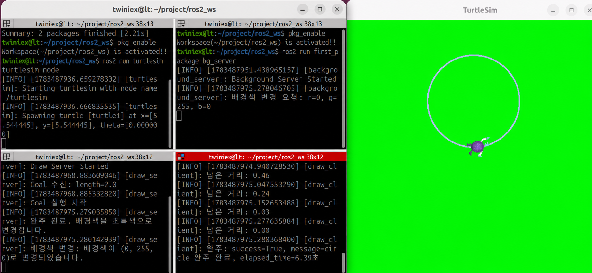

# Action Client 노드 생성

앞 절에서는 터미널에서 `ros2 action send_goal` 명령을 사용해 Action 서버에 직접 Goal을 전달했습니다.

이번 절에서는 Goal을 Python 코드로 전송하는 Action 클라이언트 노드를 만들어보겠습니다.

Action 클라이언트는 다음 순서로 동작합니다.

1. Action 서버가 실행 중인지 확인합니다.
2. 원의 반지름을 Goal로 전송합니다.
3. 서버의 Goal 수락 여부를 확인합니다.
4. 원을 그리는 동안 Feedback을 받습니다.
5. 작업이 끝나면 Result를 받아 출력합니다.
6. Result 처리가 끝나면 클라이언트 노드를 종료합니다.

---

#### 노드 파일 작성

`first_package/first_package` 폴더 안에 `draw_client.py` 파일을 만들고 다음 코드를 작성합니다.

#### 전체 소스 코드

> GitHub Link: [https://github.com/applesnack23/ros2-lerobot-code/blob/main/chapter3/draw_client.py](https://github.com/applesnack23/ros2-lerobot-code/blob/main/chapter3/draw_client.py)
> 

```python
import rclpy
from rclpy.action import ActionClient
from rclpy.node import Node

from first_interfaces.action import TurtleDraw

class DrawClient(Node):

    def __init__(self):
        super().__init__('draw_client')

        self.action_client = ActionClient(
            self,
            TurtleDraw,
            '/turtle_draw'
        )

        self.done = False

        self.get_logger().info(
            'Draw Client Node Started'
        )

    def send_goal(self, length):
        self.get_logger().info(
            'Action 서버 연결을 기다립니다.'
        )

        if not self.action_client.wait_for_server(timeout_sec=5.0):
            self.get_logger().error(
                'Action 서버를 찾을 수 없습니다.'
            )
            self.done = True
            return

        goal_msg = TurtleDraw.Goal()
        goal_msg.length = float(length)

        self.get_logger().info(
            f'Goal 전송: length={length:.2f}'
        )

        send_goal_future = self.action_client.send_goal_async(
            goal_msg,
            feedback_callback=self.feedback_callback
        )

        send_goal_future.add_done_callback(
            self.goal_response_callback
        )

    def goal_response_callback(self, future):
        try:
            goal_handle = future.result()

            if not goal_handle.accepted:
                self.get_logger().warning(
                    'Goal이 거절되었습니다.'
                )
                self.done = True
                return

            self.get_logger().info(
                'Goal이 수락되었습니다.'
            )

            result_future = goal_handle.get_result_async()

            result_future.add_done_callback(
                self.result_callback
            )

        except Exception as error:
            self.get_logger().error(
                f'Goal 응답 처리 중 오류 발생: {error}'
            )
            self.done = True

    def feedback_callback(self, feedback_msg):
        distance = feedback_msg.feedback.distance

        self.get_logger().info(
            f'남은 거리: {distance:.2f}'
        )

    def result_callback(self, future):
        try:
            wrapped_result = future.result()
            result = wrapped_result.result
            status = wrapped_result.status

            self.get_logger().info(
                f'완료 상태 코드: {status}'
            )

            self.get_logger().info(
                f'완료: success={result.success}, '
                f'message={result.message}, '
                f'elapsed_time={result.elapsed_time:.2f}초'
            )

        except Exception as error:
            self.get_logger().error(
                f'Result 처리 중 오류 발생: {error}'
            )

        self.done = True

def main(args=None):
    rclpy.init(args=args)

    node = DrawClient()
    node.send_goal(2.0)

    try:
        while rclpy.ok() and not node.done:
            rclpy.spin_once(node, timeout_sec=0.1)

    except KeyboardInterrupt:
        node.get_logger().info(
            '사용자가 클라이언트를 종료했습니다.'
        )

    finally:
        node.destroy_node()
        rclpy.shutdown()

if __name__ == '__main__':
    main()
```

---

#### Action 클라이언트 생성

```python
self.action_client = ActionClient(
    self,
    TurtleDraw,
    '/turtle_draw'
)
```

`ActionClient`는 다음 세 가지 정보를 사용해 Action 클라이언트를 생성합니다.

- `self`: Action 클라이언트를 실행할 노드
- `TurtleDraw`: 사용할 Action 타입
- `/turtle_draw`: 연결할 Action 이름

Action 서버와 클라이언트는 반드시 같은 Action 타입과 이름을 사용해야 합니다.

앞 절에서 만든 서버도 `TurtleDraw` 타입과 `/turtle_draw` 이름을 사용하므로 동일하게 설정합니다.

---

#### Action 서버 연결 확인

```python
if not self.action_client.wait_for_server(timeout_sec=5.0):
    self.get_logger().error(
        'Action 서버를 찾을 수 없습니다.'
    )
    self.done = True
    return
```

`wait_for_server()`는 Goal을 전송하기 전에 Action 서버가 실행 중인지 확인합니다.

이번 코드에서는 최대 5초 동안 서버를 기다립니다. 5초 안에 서버를 찾지 못하면 오류를 출력하고 클라이언트를 종료합니다.

시간 제한을 설정하지 않으면 서버가 실행될 때까지 계속 기다리기 때문에 프로그램이 멈춘 것처럼 보일 수 있습니다.

---

#### Goal 메시지 생성

```python
goal_msg = TurtleDraw.Goal()
goal_msg.length = float(length)
```

`TurtleDraw.Goal()`을 사용해 Goal 객체를 생성한 뒤 `length` 필드에 값을 저장합니다.

현재 Action 인터페이스에서 `length`는 원의 반지름으로 사용합니다.

```
node.send_goal(2.0)
```

따라서 위 코드는 반지름이 `2.0`인 원을 그리도록 요청하는 것입니다.

---

#### Goal 비동기 전송

```python
send_goal_future = self.action_client.send_goal_async(
    goal_msg,
    feedback_callback=self.feedback_callback
)
```

`send_goal_async()`는 Goal을 비동기 방식으로 서버에 전송합니다.

두 번째 인자로 `feedback_callback`을 등록하면 서버가 Feedback을 보낼 때마다 지정된 함수가 자동으로 호출됩니다.

Goal을 전송한 뒤 서버의 수락 여부도 비동기 방식으로 전달되므로 다음과 같이 콜백을 등록합니다.

```python
send_goal_future.add_done_callback(
    self.goal_response_callback
)
```

---

#### Goal 수락 여부 확인

```python
def goal_response_callback(self, future):
    goal_handle = future.result()

    if not goal_handle.accepted:
        self.get_logger().warning(
            'Goal이 거절되었습니다.'
        )
        self.done = True
        return
```

`future.result()`를 통해 서버가 반환한 Goal Handle을 가져옵니다.

`goal_handle.accepted` 값에 따라 서버의 Goal 수락 여부를 확인할 수 있습니다.

- `True`: Goal 수락
- `False`: Goal 거절

Goal이 거절되면 더 이상 Feedback이나 Result를 받을 수 없으므로 클라이언트를 종료합니다.

---

#### Result 요청 등록

```python
result_future = goal_handle.get_result_async()

result_future.add_done_callback(
    self.result_callback
)
```

Goal이 수락되면 `get_result_async()`를 호출해 작업의 최종 Result를 기다립니다.

Result도 비동기 방식으로 전달되므로 `add_done_callback()`을 사용해 Result 처리 함수를 등록합니다.

---

#### Feedback 처리

```python
def feedback_callback(self, feedback_msg):
    distance = feedback_msg.feedback.distance

    self.get_logger().info(
        f'남은 거리: {distance:.2f}'
    )
```

Action 서버가 `publish_feedback()`을 호출할 때마다 `feedback_callback()`이 실행됩니다.

실제 Feedback 객체는 다음 경로로 접근합니다.

```python
feedback_msg.feedback
```

`TurtleDraw.Feedback`의 `distance` 필드에는 완주까지 남은 거리가 들어 있습니다.

```python
feedback_msg.feedback.distance
```

거북이가 원을 그리는 동안 이 값이 점차 감소하는 것을 확인할 수 있습니다.

---

#### Result 처리

```coffeescript
wrapped_result = future.result()
result = wrapped_result.result
status = wrapped_result.status
```

`future.result()`에는 Result 데이터뿐만 아니라 Action의 최종 상태 코드도 함께 들어 있습니다.

- `wrapped_result.status`: Action의 최종 상태 코드
- `wrapped_result.result`: 직접 정의한 `TurtleDraw.Result`

Result에서는 다음 값을 확인합니다.

```python
result.success
result.message
result.elapsed_time
```

| 필드 | 설명 |
| --- | --- |
| `success` | 작업 성공 여부 |
| `message` | 완료 또는 취소 결과 메시지 |
| `elapsed_time` | Action 실행 소요 시간 |

Result 처리가 끝나면 다음 값을 변경합니다.

```python
self.done = True
```

메인 반복문이 종료되고 클라이언트 노드가 안전하게 정리됩니다.

---

#### 메인 함수

```python
while rclpy.ok() and not node.done:
    rclpy.spin_once(node, timeout_sec=0.1)
```

`spin_once()`는 Action의 응답과 Feedback, Result 콜백을 하나씩 처리합니다.

Result가 도착하거나 Goal이 거절되면 `node.done`이 `True`가 되어 반복문이 종료됩니다.

기존 코드처럼 `rclpy.spin(node)`만 사용하면 Result를 받은 뒤에도 노드가 계속 실행됩니다. 이번 코드에서는 Result 출력 후 자동으로 종료되도록 반복 조건을 추가했습니다.

---

#### package.xml 의존성 확인

`first_package`의 `package.xml`에 다음 의존성이 포함되어 있어야 합니다.

```xml
<depend>rclpy</depend>
<depend>geometry_msgs</depend>
<depend>turtlesim_msgs</depend>
<depend>first_interfaces</depend>
```

---

#### setup.py에 노드 등록

`setup.py`의 `console_scripts`에 `draw_client`를 추가합니다.

```python
entry_points={
    'console_scripts': [
        'move_straight = first_package.move_pub:main',
        'move_circle = first_package.circle_pub:main',
        'move_square = first_package.square_pub:main',
        'read_pose = first_package.pose_sub:main',
        'circle_once = first_package.circle_sub:main',
        'bg_server = first_package.bg_server:main',
        'circle_client = first_package.circle_service_client:main',
        'draw_server = first_package.draw_server:main',
        'draw_client = first_package.draw_client:main',
    ],
},
```

다음 명령으로 Action 클라이언트를 실행할 수 있습니다.

```bash
ros2 run first_package draw_client
```

---

#### 빌드하기

워크스페이스로 이동한 뒤 `first_package`를 빌드합니다.

```bash
cd ~/project/ros2_ws
colcon build --packages-select first_package
```

빌드가 완료되면 환경 설정을 다시 적용합니다.

```bash
source ~/project/ros2_ws/install/setup.bash
```

또는 앞에서 등록한 명령을 사용합니다.

```bash
pkg_enable
```

---

#### 실행하기

네 개의 터미널에서 다음 노드를 순서대로 실행합니다.

**1번 터미널: Turtlesim 실행**

```
ros2 run turtlesim turtlesim_node
```

**2번 터미널: 배경색 Service 서버 실행**

```
ros2 run first_package bg_server
```

**3번 터미널: Action 서버 실행**

```
ros2 run first_package draw_server
```

**4번 터미널: Action 클라이언트 실행**

```
ros2 run first_package draw_client
```



`draw_client`를 실행하면 별도의 터미널 명령 없이 다음 과정이 자동으로 진행됩니다.

1. `/turtle_draw` Action 서버 연결을 확인합니다.
2. 반지름 `2.0`을 Goal로 전송합니다.
3. 서버의 Goal 수락 여부를 확인합니다.
4. 거북이가 원을 그리기 시작합니다.
5. 남은 거리를 Feedback으로 출력합니다.
6. 완주하면 배경색이 초록색으로 변경됩니다.
7. Result를 출력하고 클라이언트가 종료됩니다.

---

#### 실행 결과

Action 클라이언트 터미널에는 다음과 같은 내용이 출력됩니다.

```
Draw Client Node Started
Action 서버 연결을 기다립니다.
Goal 전송: length=2.00
Goal이 수락되었습니다.
남은 거리: 12.56
남은 거리: 12.36
남은 거리: 12.16
...
완료 상태 코드: 4
완료: success=True, message=원 그리기를 완료했습니다., elapsed_time=6.39초
```

상태 코드 `4`는 Action 작업이 성공적으로 완료됐음을 의미합니다.

---

#### rqt_graph로 통신 구조 확인

모든 노드가 실행된 상태에서 다음 명령으로 `rqt_graph`를 실행합니다.

```
ros2 run rqt_graph rqt_graph
```


`rqt_graph`에서는 다음 Topic 연결을 확인할 수 있습니다.

- `draw_server`가 `/turtle1/cmd_vel`을 발행합니다.
- `turtlesim`이 `/turtle1/cmd_vel`을 구독합니다.
- `turtlesim`이 `/turtle1/pose`를 발행합니다.
- `draw_server`가 `/turtle1/pose`를 구독합니다.

Action은 내부적으로 Topic과 Service를 조합해 동작합니다.

`rqt_graph`는 Topic 기반 연결을 중심으로 표시하므로 Action의 Goal과 Result Service는 직접 표시되지 않을 수 있습니다. 대신 Action 내부에서 사용하는 Feedback과 Status Topic이 일부 표시될 수 있습니다.

배경색 변경에 사용하는 Service 연결도 지속적인 Topic 연결이 아니므로 `rqt_graph`에 표시되지 않습니다.

---

#### 전체 통신 구조

이번 실습에서 사용하는 통신 구조는 다음과 같습니다.

| 송신 노드 | 통신 방식 | 이름 | 수신 노드 |
| --- | --- | --- | --- |
| `draw_client` | Action Goal | `/turtle_draw` | `draw_server` |
| `draw_server` | Action Feedback | `/turtle_draw` | `draw_client` |
| `draw_server` | Topic | `/turtle1/cmd_vel` | `turtlesim` |
| `turtlesim` | Topic | `/turtle1/pose` | `draw_server` |
| `draw_server` | Service 요청 | `/set_background` | `bg_server` |
| `bg_server` | 파라미터 Service | `/turtlesim/set_parameters` | `turtlesim` |

---

#### 마무리

이번 절에서는 Action 클라이언트 노드를 만들어 코드에서 Goal을 전송하고 Feedback과 Result를 처리했습니다.

Action 클라이언트의 핵심 흐름은 다음과 같습니다.

1. `ActionClient`를 생성합니다.
2. `wait_for_server()`로 서버 연결을 확인합니다.
3. `send_goal_async()`로 Goal을 전송합니다.
4. Feedback 콜백으로 진행 상황을 처리합니다.
5. Goal Handle을 통해 Result를 요청합니다.
6. Result 콜백에서 최종 결과를 처리합니다.

이번 절을 마지막으로 Topic, Service, Action을 Python 코드로 직접 구현했습니다.

Publisher와 Subscriber는 거북이의 이동 명령과 위치 정보를 전달하고, Service는 배경색을 변경하며, Action은 원 그리기처럼 시간이 걸리는 작업의 Goal, Feedback, Result를 관리합니다.

이러한 노드들이 서로 연결되면서 각각의 기능이 하나의 ROS2 시스템으로 동작하는 구조를 확인할 수 있습니다.