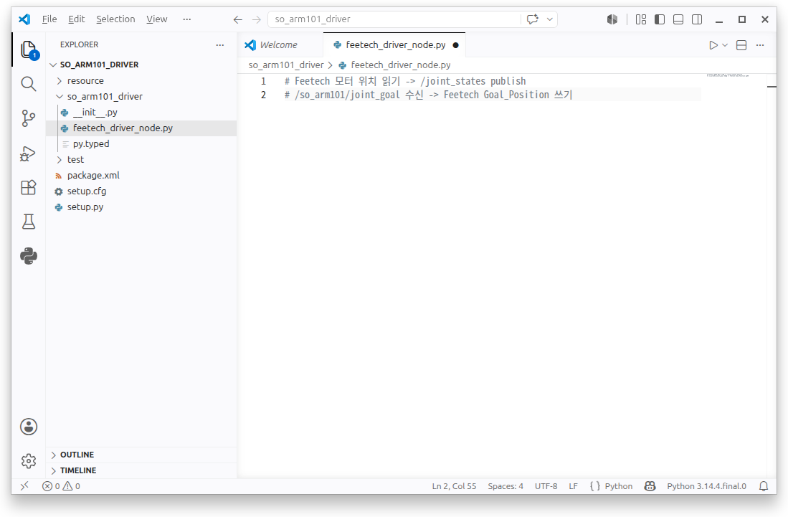

# so_arm101_driver 패키지: feetech_driver_node

이번 절에서는 SO-ARM101의 Feetech 모터와 ROS2를 연결하는 `so_arm101_driver` 패키지를 제작합니다.

`feetech_driver_node`는 실제 모터의 위치를 읽어 `/joint_states` 토픽으로 발행하고, `/so_arm101/joint_goal` 토픽으로 전달된 목표 위치를 모터에 전송합니다.

---

#### 패키지 생성

ROS2 환경을 적용한 뒤 워크스페이스의 `src` 폴더에서 패키지를 생성합니다.

```bash
source /opt/ros/lyrical/setup.bash
cd ~/project/ros2_ws/src

ros2 pkg create so_arm101_driver \
  --build-type ament_python \
  --dependencies rclpy sensor_msgs
```

패키지가 생성되면 VS Code로 워크스페이스를 엽니다.

```
code ~/project/ros2_ws
```



---

#### 드라이버 노드의 역할

`feetech_driver_node.py`는 다음 기능을 담당합니다.

1. `/dev/ttyACM0` 포트를 통해 Feetech 모터 버스에 연결
2. SO-ARM101의 모터 6개 등록
3. 각 모터의 현재 위치 확인
4. 현재 위치를 `/joint_states` 토픽으로 발행
5. `/so_arm101/joint_goal` 토픽 구독
6. 수신한 목표 위치를 `Goal_Position`으로 전송
7. 동작 완료 후 자동으로 Torque 해제

노드 파일은 다음 경로에 생성합니다.

```
~/project/ros2_ws/src/so_arm101_driver/so_arm101_driver/feetech_driver_node.py
```

---

#### 소스 코드 작성 프롬프트

AI를 이용해 기본 코드를 작성할 때는 다음과 같은 프롬프트를 사용할 수 있습니다.

```
이전에 작성한 motor_teach.py, motor_run.py,
motor_auto_run.py의 Feetech 모터 제어 방식을 참고해 주세요.

SO-ARM101을 ROS2에서 제어하기 위한
feetech_driver_node.py를 작성해 주세요.

요구사항은 다음과 같습니다.

1. /dev/ttyACM0 포트로 Feetech 모터 버스에 연결합니다.
2. SO-ARM101의 모터 6개를 등록합니다.
3. 각 모터의 현재 위치를 읽어 /joint_states 토픽으로 발행합니다.
4. /so_arm101/joint_goal 토픽으로 JointState 메시지를 구독합니다.
5. 수신한 관절 이름과 위치를 Goal_Position으로 전송합니다.
6. 목표 위치를 수신하면 Torque를 활성화합니다.
7. 일정 시간이 지나면 Torque를 자동으로 해제합니다.
8. 노드 종료 시 Torque를 해제하고 모터 버스 연결을 종료합니다.
```

---

#### feetech_driver_node 작성

#### 전체 소스 코드

> GitHub Link: [https://github.com/applesnack23/ros2-lerobot-code/blob/main/chapter3/feetech_driver_node.py](https://github.com/applesnack23/ros2-lerobot-code/blob/main/chapter3/feetech_driver_node.py)
> 

```python
import time

import rclpy
from rclpy.node import Node
from sensor_msgs.msg import JointState

from lerobot.motors.feetech.feetech import FeetechMotorsBus
from lerobot.motors.motors_bus import Motor

class FeetechDriverNode(Node):

    def __init__(self):
        super().__init__('feetech_driver_node')

        self.port = '/dev/ttyACM0'
        self.read_period = 0.05  # 20 Hz

        # 마지막 명령 이후 Torque를 유지할 시간
        self.torque_hold_time = 1.0
        self.last_goal_time = None
        self.torque_enabled = False

        self.motors = {
            'shoulder_pan': Motor(
                id=1,
                model='sts3215',
                norm_mode='position'
            ),
            'shoulder_lift': Motor(
                id=2,
                model='sts3215',
                norm_mode='position'
            ),
            'elbow_flex': Motor(
                id=3,
                model='sts3215',
                norm_mode='position'
            ),
            'wrist_flex': Motor(
                id=4,
                model='sts3215',
                norm_mode='position'
            ),
            'wrist_roll': Motor(
                id=5,
                model='sts3215',
                norm_mode='position'
            ),
            'gripper': Motor(
                id=6,
                model='sts3215',
                norm_mode='position'
            ),
        }

        self.joint_names = list(self.motors.keys())

        self.bus = FeetechMotorsBus(
            port=self.port,
            motors=self.motors
        )

        self.connect_motor_bus()

        self.joint_state_pub = self.create_publisher(
            JointState,
            '/joint_states',
            10
        )

        self.joint_goal_sub = self.create_subscription(
            JointState,
            '/so_arm101/joint_goal',
            self.joint_goal_callback,
            10
        )

        self.timer = self.create_timer(
            self.read_period,
            self.publish_joint_states
        )

        self.get_logger().info(
            'SO-ARM101 Feetech Driver Node started.'
        )
        self.get_logger().info(
            'Default torque state: DISABLED'
        )
        self.get_logger().info(
            'Publish  : /joint_states'
        )
        self.get_logger().info(
            'Subscribe: /so_arm101/joint_goal'
        )

    def connect_motor_bus(self):
        try:
            self.bus.connect()

            # Teaching을 위해 기본 Torque 상태는 OFF로 설정
            self.disable_torque()

            self.get_logger().info(
                f'Connected to Feetech bus: {self.port}'
            )

        except Exception as error:
            self.get_logger().error(
                f'Failed to connect motor bus: {error}'
            )
            raise

    def enable_torque(self):
        if self.torque_enabled:
            return

        try:
            self.bus.enable_torque()
            self.torque_enabled = True
            self.get_logger().info('Torque enabled.')

        except Exception as error:
            self.get_logger().error(
                f'Failed to enable torque: {error}'
            )

    def disable_torque(self):
        try:
            self.bus.disable_torque()
            self.torque_enabled = False
            self.get_logger().info('Torque disabled.')

        except Exception as error:
            self.get_logger().error(
                f'Failed to disable torque: {error}'
            )

    def to_int(self, value):
        if isinstance(value, list):
            return int(value[0])

        try:
            return int(value)
        except TypeError:
            return int(value.item())

    def read_motor_position(self, motor_name):
        position = self.bus.read(
            'Present_Position',
            motor_name,
            normalize=False
        )

        return self.to_int(position)

    def publish_joint_states(self):
        msg = JointState()

        msg.header.stamp = self.get_clock().now().to_msg()
        msg.name = []
        msg.position = []
        msg.velocity = []
        msg.effort = []

        for motor_name in self.joint_names:
            try:
                position = self.read_motor_position(motor_name)

                msg.name.append(motor_name)
                msg.position.append(float(position))
                msg.velocity.append(0.0)
                msg.effort.append(0.0)

            except Exception as error:
                self.get_logger().warning(
                    f'Failed to read {motor_name}: {error}'
                )

        if msg.name:
            self.joint_state_pub.publish(msg)

        self.auto_disable_torque()

    def auto_disable_torque(self):
        if not self.torque_enabled:
            return

        if self.last_goal_time is None:
            return

        elapsed_time = time.time() - self.last_goal_time

        if elapsed_time >= self.torque_hold_time:
            self.disable_torque()

    def joint_goal_callback(self, msg):
        # 목표 위치를 수신하면 Torque 활성화
        self.enable_torque()
        self.last_goal_time = time.time()

        for name, position in zip(msg.name, msg.position):
            if name not in self.joint_names:
                self.get_logger().warning(
                    f'Unknown joint name: {name}'
                )
                continue

            try:
                goal_position = int(position)

                self.bus.write(
                    'Goal_Position',
                    name,
                    goal_position,
                    normalize=False
                )

                self.get_logger().info(
                    f'Move {name} -> {goal_position}'
                )

            except Exception as error:
                self.get_logger().error(
                    f'Failed to move {name}: {error}'
                )

    def shutdown(self):
        self.get_logger().info(
            'Shutting down Feetech driver node.'
        )

        try:
            self.bus.disable_torque()
        except Exception:
            pass

        try:
            self.bus.disconnect()
        except Exception:
            pass

def main(args=None):
    rclpy.init(args=args)
    node = FeetechDriverNode()

    try:
        rclpy.spin(node)

    except KeyboardInterrupt:
        pass

    finally:
        node.shutdown()
        node.destroy_node()
        rclpy.shutdown()

if __name__ == '__main__':
    main()
```

---

#### 코드의 주요 구조

**모터 구성**

```python
self.motors = {
    'shoulder_pan': Motor(id=1, model='sts3215', norm_mode='position'),
    'shoulder_lift': Motor(id=2, model='sts3215', norm_mode='position'),
    'elbow_flex': Motor(id=3, model='sts3215', norm_mode='position'),
    'wrist_flex': Motor(id=4, model='sts3215', norm_mode='position'),
    'wrist_roll': Motor(id=5, model='sts3215', norm_mode='position'),
    'gripper': Motor(id=6, model='sts3215', norm_mode='position'),
}
```

SO-ARM101의 관절 이름과 Feetech 모터 ID를 연결합니다. 이후 토픽 메시지에서는 모터 ID 대신 `wrist_flex`와 같은 관절 이름을 사용합니다.

---

**현재 위치 발행**

```python
self.joint_state_pub = self.create_publisher(
    JointState,
    '/joint_states',
    10
)
```

각 모터에서 읽은 `Present_Position`을 `JointState` 메시지에 저장하여 `/joint_states` 토픽으로 발행합니다.

20 Hz 주기로 위치를 읽기 때문에 약 0.05초마다 새로운 메시지가 발행됩니다.

**목표 위치 구독**

```python
self.joint_goal_sub = self.create_subscription(
    JointState,
    '/so_arm101/joint_goal',
    self.joint_goal_callback,
    10
)
```

`/so_arm101/joint_goal` 토픽으로 전달된 관절 이름과 위치를 받아 `Goal_Position` 명령으로 변환합니다.

---

**Torque 자동 해제**

목표 위치를 수신하면 Torque를 활성화하고 마지막 명령 시간을 저장합니다.

```python
self.enable_torque()
self.last_goal_time = time.time()
```

마지막 명령 이후 `torque_hold_time`이 지나면 Torque를 자동으로 해제합니다.

```python
self.enable_torque()
self.last_goal_time = time.time()
```

이를 통해 동작이 끝난 뒤 로봇 관절을 다시 손으로 움직일 수 있습니다.

> 실습 중 로봇이 물체나 사람과 충돌할 가능성이 있으면 즉시 전원을 차단할 수 있도록 준비해야 합니다. 처음에는 반드시 작은 이동량으로 테스트합니다.
> 
> 
> ---
> 

#### setup.py 실행 파일 등록


`setup.py`의 `entry_points`에 다음 내용을 추가합니다.

```python
entry_points={
    'console_scripts': [
        'feetech_driver_node = '
        'so_arm101_driver.feetech_driver_node:main',
    ],
},
```

이제 다음 명령으로 노드를 실행할 수 있습니다.

```
ros2 run so_arm101_driver feetech_driver_node
```

---

#### LeRobot 가상 환경 설정

이 노드는 LeRobot의 Feetech 모터 라이브러리를 사용하므로 VS Code의 Python 인터프리터도 LeRobot 가상 환경으로 설정해야 합니다.

1. `Ctrl + Shift + P` 입력
2. `Python: Select Interpreter` 선택
3. `Enter Interpreter Path` 선택
4. `Find` 선택
5. 다음 Python 인터프리터 선택


```bash
~/project/rosws/lerobot/venv/bin/python
```

터미널에서도 다음 명령으로 가상 환경을 활성화합니다.

```bash
source ~/project/rosws/lerobot/venv/bin/activate
```

ROS2 환경도 함께 적용합니다.

```bash
source /opt/ros/lyrical/setup.bash
```

ROS2 관련 Python 의존성이 가상 환경에 없다면 오류 메시지를 확인한 뒤 필요한 패키지만 추가합니다.

```python
pip install empy lark
```

빌드 도구가 가상 환경에 없다면 다음 패키지를 설치합니다.

```python
pip install colcon-common-extensions osrf-pycommon
```

오류가 발생하지 않는다면 불필요하게 다시 설치할 필요는 없습니다.

---

#### 패키지 빌드

ROS2 환경과 LeRobot 가상 환경이 모두 적용된 상태에서 빌드합니다.

```bash
source /opt/ros/lyrical/setup.bash
source ~/project/rosws/lerobot/venv/bin/activate

cd ~/project/ros2_ws
python -m colcon build --packages-select so_arm101_driver
```

빌드가 완료되면 워크스페이스 환경을 적용합니다.

```bash
source ~/project/ros2_ws/install/setup.bash
```

그다음 드라이버 노드를 실행합니다.

```bash
ros2 run so_arm101_driver feetech_driver_node
```

정상적으로 실행되면 다음과 비슷한 로그가 출력됩니다.

```
(venv) twiniex@lt:~/project/ros2_ws$ \
ros2 run so_arm101_driver feetech_driver_node

[INFO] [feetech_driver_node]:
Connected to Feetech bus: /dev/ttyACM0

[INFO] [feetech_driver_node]:
SO-ARM101 Feetech Driver Node started.

[INFO] [feetech_driver_node]:
Publish  : /joint_states

[INFO] [feetech_driver_node]:
Subscribe: /so_arm101/joint_goal
```

---

#### 토픽 확인

새 터미널에서 ROS2 환경과 워크스페이스 환경을 적용한 후 토픽 목록을 확인합니다.

```bash
ros2 topic list
```

다음 토픽이 표시되는지 확인합니다.

```
/joint_states
/parameter_events
/rosout
/so_arm101/joint_goal
```

---

#### 현재 위치 확인

다음 명령으로 모터의 현재 위치를 확인합니다.

```bash
ros2 topic echo /joint_states
```

출력 예시는 다음과 같습니다.

```yaml
header:
  stamp:
    sec: 1782356627
    nanosec: 550181502
  frame_id: ''
name:
- shoulder_pan
- shoulder_lift
- elbow_flex
- wrist_flex
- wrist_roll
- gripper
position:
- 2071.0
- 885.0
- 3081.0
- 2953.0
- 2076.0
- 2048.0
velocity:
- 0.0
- 0.0
- 0.0
- 0.0
- 0.0
- 0.0
effort:
- 0.0
- 0.0
- 0.0
- 0.0
- 0.0
- 0.0
---
```

Torque가 해제된 상태에서 관절을 손으로 천천히 움직여 봅니다. 출력되는 위치 값이 변하면 실제 모터의 위치를 정상적으로 읽고 있는 것입니다.

> `sensor_msgs/msg/JointState`의 `position` 필드는 일반적으로 회전 관절의 라디안 값을 사용합니다. 이번 절에서는 직접 제어 원리를 확인하기 위해 Feetech의 원시 위치값을 임시로 저장합니다. 이후 URDF 및 `ros2_control`과 연동할 때는 원시 위치값을 라디안으로 변환해야 합니다.
> 

---

#### 목표 위치 전송

현재 `wrist_flex`의 위치가 `2953`이라고 가정하고, 작은 이동을 확인하기 위해 목표 위치를 `2900`으로 설정해 보겠습니다.

이 값은 예시이며 로봇마다 현재 자세와 캘리브레이션 결과가 다릅니다. 반드시 자신의 로봇에서 확인한 현재 위치를 기준으로 작은 범위만 변경해야 합니다.

```bash
ros2 topic pub --once \
  /so_arm101/joint_goal \
  sensor_msgs/msg/JointState \
  "{name: ['wrist_flex'], position: [2900.0]}"
```

명령을 실행하면 다음 순서로 동작합니다.

1. `/so_arm101/joint_goal` 토픽에 `JointState` 메시지 발행
2. `feetech_driver_node`가 메시지 수신
3. `joint_goal_callback()` 실행
4. 관절 이름 `wrist_flex`와 목표 위치 `2900` 추출
5. Torque 활성화
6. `Goal_Position` 명령을 Feetech 모터에 전송
7. ID 4 모터가 목표 위치로 이동
8. 설정된 시간이 지나면 Torque 자동 해제

핵심적으로 실행되는 코드는 다음과 같습니다.

```python
def joint_goal_callback(self, msg):
    self.enable_torque()
    self.last_goal_time = time.time()

    for name, position in zip(msg.name, msg.position):
        if name not in self.joint_names:
            self.get_logger().warning(
                f'Unknown joint name: {name}'
            )
            continue

        try:
            goal_position = int(position)

            self.bus.write(
                'Goal_Position',
                name,
                goal_position,
                normalize=False
            )

            self.get_logger().info(
                f'Move {name} -> {goal_position}'
            )

        except Exception as error:
            self.get_logger().error(
                f'Failed to move {name}: {error}'
            )
```

토픽으로 전달한 값은 다음과 같이 변환됩니다.

```
msg.name     → wrist_flex
msg.position → 2900.0
```

결과적으로 드라이버는 다음과 같은 모터 명령을 실행합니다.

```python
self.bus.write(
    'Goal_Position',
    'wrist_flex',
    2900,
    normalize=False
)
```

---

#### 전체 동작 구조

```
/so_arm101/joint_goal
        ↓
feetech_driver_node
        ↓
Feetech Goal_Position
        ↓
SO-ARM101 모터 이동
```

반대로 현재 위치 정보는 다음 방향으로 전달됩니다.

```
SO-ARM101 모터 위치
        ↓
Feetech Present_Position
        ↓
feetech_driver_node
        ↓
/joint_states
```

---

#### 마무리

이번 절에서는 Feetech 모터 제어 코드를 ROS2 노드로 구성했습니다.

기존에는 `bus.write()`를 직접 호출하여 하나의 모터를 움직였지만, 이제는 `/so_arm101/joint_goal` 토픽을 통해 관절 이름과 목표 위치를 전달할 수 있습니다.

또한 드라이버 노드는 모터의 현재 위치를 지속적으로 읽어 `/joint_states` 토픽으로 발행합니다. 따라서 이후에 작성할 Teaching, Playback, 자동 Pick & Place 노드는 Feetech 모터 버스를 직접 제어할 필요 없이 ROS2 토픽을 통해 드라이버 노드와 통신할 수 있습니다.