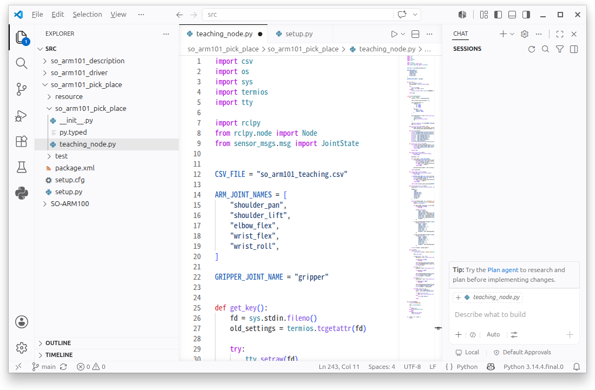

# so_arm101_pick_place 패키지: teaching_node

이번 절에서는 SO-ARM101의 현재 관절 위치를 저장하는 Teaching 노드를 작성합니다.

`teaching_node`는 `feetech_driver_node`가 발행하는 `/joint_states` 토픽을 구독합니다. 사용자가 숫자 키를 누르면 현재 로봇의 자세를 Teaching Point로 저장하고, `+`와 `-` 키를 누르면 Gripper의 Grip·Ungrip 위치를 저장합니다.

---

#### 패키지 생성

ROS2 환경을 적용한 뒤 워크스페이스의 `src` 폴더에서 패키지를 생성합니다.

```bash
source /opt/ros/lyrical/setup.bash
cd ~/project/ros2_ws/src

ros2 pkg create so_arm101_pick_place \
  --build-type ament_python \
  --dependencies rclpy sensor_msgs
```

패키지가 생성되면 VS Code로 워크스페이스를 엽니다.

```bash
code ~/project/ros2_ws
```

---

#### Teaching 노드의 역할

`teaching_node.py`는 다음 기능을 담당합니다.

1. `/joint_states` 토픽 구독
2. SO-ARM101의 현재 관절 위치 저장
3. 키보드 입력 처리
4. 숫자 키 `1`, `2`, `3`으로 Teaching Point 저장
5. `+` 키로 Grip 위치 저장
6.  키로 Ungrip 위치 저장
7. `q` 키 입력 시 Teaching 데이터를 CSV 파일로 저장

노드 파일은 다음 경로에 생성합니다.

```
~/project/ros2_ws/src/so_arm101_pick_place/
└── so_arm101_pick_place/
    └── teaching_node.py
```



---

#### 소스 코드 작성 프롬프트

AI를 이용해 기본 코드를 작성할 때는 다음 프롬프트를 사용할 수 있습니다.

```
이전에 작성한 motor_teach.py, motor_run.py,
motor_auto_run.py를 참고해 주세요.

SO-ARM101의 Pick & Place 동작을 ROS2로 구현하려고 합니다.

현재 관절 위치는 /joint_states 토픽으로 전달됩니다.
다음 기능을 수행하는 teaching_node.py를 작성해 주세요.

1. /joint_states 토픽을 구독합니다.
2. 숫자 키 1, 2, 3을 누르면 현재 로봇 관절 위치를 저장합니다.
3. + 키를 누르면 현재 Gripper 위치를 Grip 위치로 저장합니다.
4. - 키를 누르면 현재 Gripper 위치를 Ungrip 위치로 저장합니다.
5. q 키를 누르면 저장 여부를 확인합니다.
6. 저장을 선택하면 모든 데이터를 CSV 파일로 저장합니다.
7. ARM 관절과 Gripper 위치는 구분해서 관리합니다.
```

---

#### teaching_node.py 작성

#### 전체 소스 코드

> GitHub Link: [https://github.com/applesnack23/ros2-lerobot-code/blob/main/chapter3/teaching_node.py](https://github.com/applesnack23/ros2-lerobot-code/blob/main/chapter3/teaching_node.py)
> 

```python
import csv
import os
import sys
import termios
import tty

import rclpy
from rclpy.node import Node
from sensor_msgs.msg import JointState

CSV_FILE = os.path.expanduser(
    '~/project/ros2_ws/so_arm101_teaching.csv'
)

ARM_JOINT_NAMES = [
    'shoulder_pan',
    'shoulder_lift',
    'elbow_flex',
    'wrist_flex',
    'wrist_roll',
]

GRIPPER_JOINT_NAME = 'gripper'

def get_key():
    fd = sys.stdin.fileno()
    old_settings = termios.tcgetattr(fd)

    try:
        tty.setraw(fd)
        key = sys.stdin.read(1)
    finally:
        termios.tcsetattr(
            fd,
            termios.TCSADRAIN,
            old_settings
        )

    return key

class TeachingNode(Node):

    def __init__(self):
        super().__init__('teaching_node')

        self.current_joint_positions = {}

        self.teaching_data = {
            'points': {
                '1': None,
                '2': None,
                '3': None,
            },
            'gripper': {
                'grip': None,
                'ungrip': None,
            },
        }

        self.subscription = self.create_subscription(
            JointState,
            '/joint_states',
            self.joint_state_callback,
            10,
        )

        self.get_logger().info(
            'SO-ARM101 Teaching Node started.'
        )

        self.print_menu()

    def joint_state_callback(self, msg):
        for name, position in zip(
            msg.name,
            msg.position
        ):
            self.current_joint_positions[name] = position

    def print_menu(self):
        print('====================================')
        print(' SO-ARM101 ROS2 Teaching Program')
        print('====================================')
        print('1 : Save Teaching Point 1')
        print('2 : Save Teaching Point 2')
        print('3 : Save Teaching Point 3')
        print('+ : Save Grip Position')
        print('- : Save Ungrip Position')
        print('q : Quit and Save')
        print('====================================')

    def check_joint_data_ready(self):
        if not self.current_joint_positions:
            print('\nNo /joint_states data received yet.')
            print('Run feetech_driver_node first.')
            return False

        return True

    def read_arm_positions(self):
        if not self.check_joint_data_ready():
            return None

        positions = {}

        for joint_name in ARM_JOINT_NAMES:
            if joint_name not in self.current_joint_positions:
                print(f'\nJoint not found: {joint_name}')
                print('Available joints:')

                for name in self.current_joint_positions:
                    print(f' - {name}')

                return None

            positions[joint_name] = (
                self.current_joint_positions[joint_name]
            )

        return positions

    def read_gripper_position(self):
        if not self.check_joint_data_ready():
            return None

        if GRIPPER_JOINT_NAME not in self.current_joint_positions:
            print(
                f'\nGripper joint not found: '
                f'{GRIPPER_JOINT_NAME}'
            )
            print('Available joints:')

            for name in self.current_joint_positions:
                print(f' - {name}')

            return None

        return self.current_joint_positions[
            GRIPPER_JOINT_NAME
        ]

    def save_teaching_data_csv(self):
        headers = [
            'type',
            'name',
            'shoulder_pan',
            'shoulder_lift',
            'elbow_flex',
            'wrist_flex',
            'wrist_roll',
            'gripper',
        ]

        with open(
            CSV_FILE,
            'w',
            newline='',
            encoding='utf-8-sig'
        ) as file:
            writer = csv.DictWriter(
                file,
                fieldnames=headers
            )
            writer.writeheader()

            for point_name, positions in (
                self.teaching_data['points'].items()
            ):
                if positions is None:
                    continue

                writer.writerow({
                    'type': 'point',
                    'name': point_name,
                    'shoulder_pan':
                        positions['shoulder_pan'],
                    'shoulder_lift':
                        positions['shoulder_lift'],
                    'elbow_flex':
                        positions['elbow_flex'],
                    'wrist_flex':
                        positions['wrist_flex'],
                    'wrist_roll':
                        positions['wrist_roll'],
                    'gripper': '',
                })

            grip_position = (
                self.teaching_data['gripper']['grip']
            )

            if grip_position is not None:
                writer.writerow({
                    'type': 'gripper',
                    'name': 'grip',
                    'shoulder_pan': '',
                    'shoulder_lift': '',
                    'elbow_flex': '',
                    'wrist_flex': '',
                    'wrist_roll': '',
                    'gripper': grip_position,
                })

            ungrip_position = (
                self.teaching_data['gripper']['ungrip']
            )

            if ungrip_position is not None:
                writer.writerow({
                    'type': 'gripper',
                    'name': 'ungrip',
                    'shoulder_pan': '',
                    'shoulder_lift': '',
                    'elbow_flex': '',
                    'wrist_flex': '',
                    'wrist_roll': '',
                    'gripper': ungrip_position,
                })

        print(f'\nSaved: {CSV_FILE}')

    def run(self):
        while rclpy.ok():
            rclpy.spin_once(
                self,
                timeout_sec=0.05
            )

            key = get_key()

            if key in ['1', '2', '3']:
                positions = self.read_arm_positions()

                if positions is None:
                    continue

                self.teaching_data['points'][key] = (
                    positions.copy()
                )

                print(
                    f'\nTeaching Point {key} saved'
                )
                print(positions)

            elif key == '+':
                grip_position = (
                    self.read_gripper_position()
                )

                if grip_position is None:
                    continue

                self.teaching_data[
                    'gripper'
                ]['grip'] = grip_position

                print('\nGrip position saved')
                print('gripper:', grip_position)

            elif key == '-':
                ungrip_position = (
                    self.read_gripper_position()
                )

                if ungrip_position is None:
                    continue

                self.teaching_data[
                    'gripper'
                ]['ungrip'] = ungrip_position

                print('\nUngrip position saved')
                print('gripper:', ungrip_position)

            elif key.lower() == 'q':
                print('\nExit requested.')

                save = input(
                    'Save teaching data? (y/n): '
                )

                if save.lower() == 'y':
                    self.save_teaching_data_csv()
                else:
                    print('Not saved.')

                break

def main(args=None):
    rclpy.init(args=args)
    node = TeachingNode()

    try:
        node.run()

    except KeyboardInterrupt:
        pass

    finally:
        node.destroy_node()
        rclpy.shutdown()

if __name__ == '__main__':
    main()
```

---

#### 코드의 주요 구조

**관절 이름 정의**

```python
ARM_JOINT_NAMES = [
    'shoulder_pan',
    'shoulder_lift',
    'elbow_flex',
    'wrist_flex',
    'wrist_roll',
]

GRIPPER_JOINT_NAME = 'gripper'
```

SO-ARM101의 다섯 개 Arm 관절과 Gripper를 구분합니다.

Teaching Point에는 Arm 관절 다섯 개의 위치만 저장하고, Grip과 Ungrip에는 Gripper 위치만 저장합니다.

**현재 관절 위치 수신**

```python
self.subscription = self.create_subscription(
    JointState,
    '/joint_states',
    self.joint_state_callback,
    10,
)
```

`feetech_driver_node`가 발행하는 `/joint_states` 토픽을 구독합니다.

새로운 메시지를 받을 때마다 다음 콜백이 실행됩니다.

```python
def joint_state_callback(self, msg):
    for name, position in zip(msg.name, msg.position):
        self.current_joint_positions[name] = position
```

수신한 관절 이름과 위치는 다음과 같은 딕셔너리 형태로 관리됩니다.

```python
{
    'shoulder_pan': 2071.0,
    'shoulder_lift': 885.0,
    'elbow_flex': 3081.0,
    'wrist_flex': 2953.0,
    'wrist_roll': 2076.0,
    'gripper': 2048.0,
}
```

**키보드 입력 처리**

`get_key()` 함수는 Enter를 누르지 않아도 키 하나를 즉시 읽을 수 있도록 터미널을 Raw 모드로 변경합니다.

```python
key = get_key()
```

입력된 키에 따라 다음 동작을 수행합니다.

| 입력 키 | 동작 |
| --- | --- |
| `1` | Teaching Point 1 저장 |
| `2` | Teaching Point 2 저장 |
| `3` | Teaching Point 3 저장 |
| `+` | Grip 위치 저장 |
| `-` | Ungrip 위치 저장 |
| `q` | 종료 및 CSV 저장 여부 확인 |

**Teaching Point 저장**

```python
if key in ['1', '2', '3']:
    positions = self.read_arm_positions()
    self.teaching_data['points'][key] = positions.copy()
```

숫자 키를 누르면 현재 Arm 관절 다섯 개의 위치를 복사하여 저장합니다.

`copy()`를 사용하는 이유는 이후 `/joint_states` 메시지가 갱신되더라도 이미 저장한 Teaching Point가 변경되지 않도록 하기 위해서입니다.

**Gripper 위치 저장**

```python
elif key == '+':
    self.teaching_data['gripper']['grip'] = (
        self.read_gripper_position()
    )

elif key == '-':
    self.teaching_data['gripper']['ungrip'] = (
        self.read_gripper_position()
    )
```

`+` 키는 현재 Gripper 위치를 Grip 값으로 저장하고, `-` 키는 Ungrip 값으로 저장합니다.

**CSV 파일 저장**

저장 경로는 다음과 같이 고정했습니다.

```bash
~/project/ros2_ws/so_arm101_teaching.csv
```

저장되는 CSV 파일은 다음과 같은 구조를 가집니다.

```
type,name,shoulder_pan,shoulder_lift,elbow_flex,wrist_flex,wrist_roll,gripper
point,1,2071.0,885.0,3081.0,2953.0,2076.0,
point,2,2100.0,920.0,3000.0,2800.0,2050.0,
point,3,2200.0,1000.0,2900.0,2700.0,2000.0,
gripper,grip,,,,,,1800.0
gripper,ungrip,,,,,,2300.0
```

---

#### setup.py 실행 파일 등록


`so_arm101_pick_place/setup.py`의 `entry_points`를 다음과 같이 수정합니다.

```python
entry_points={
    'console_scripts': [
        'teaching_node = '
        'so_arm101_pick_place.teaching_node:main',
    ],
},
```

기존 내용에 있던 다음 등록은 `so_arm101_driver` 패키지에서 사용하는 항목이므로 `so_arm101_pick_place`에 등록하면 안 됩니다.

```python
# so_arm101_driver 패키지에서만 사용
'feetech_driver_node = '
'so_arm101_driver.feetech_driver_node:main'
```

---

#### 패키지 빌드

LeRobot 가상 환경과 ROS2 환경을 적용합니다.

```bash
source /opt/ros/lyrical/setup.bash
source ~/project/rosws/lerobot/venv/bin/activate
```

워크스페이스로 이동해 두 패키지를 빌드합니다.

```bash
cd ~/project/ros2_ws

python -m colcon build \
  --packages-select \
  so_arm101_driver \
  so_arm101_pick_place
```

빌드가 완료되면 워크스페이스 환경을 적용합니다.

```bash
source ~/project/ros2_ws/install/setup.bash
```

---

#### 노드 실행

두 개의 터미널을 준비합니다.

**1번 터미널: Feetech 드라이버 실행**

```bash
source /opt/ros/lyrical/setup.bash
source ~/project/rosws/lerobot/venv/bin/activate
source ~/project/ros2_ws/install/setup.bash

ros2 run so_arm101_driver feetech_driver_node
```

**2번 터미널: Teaching 노드 실행**

```bash
source /opt/ros/lyrical/setup.bash
source ~/project/rosws/lerobot/venv/bin/activate
source ~/project/ros2_ws/install/setup.bash

ros2 run so_arm101_pick_place teaching_node
```

---

#### Teaching 실행 순서

1. `feetech_driver_node`를 먼저 실행합니다.
2. `teaching_node`를 실행합니다.
3. 로봇을 손으로 Teaching Point 1 위치로 이동합니다.
4. `1` 키를 눌러 현재 위치를 저장합니다.
5. Point 2와 Point 3도 같은 방법으로 저장합니다.
6. Gripper를 물체를 잡는 위치로 움직이고 `+` 키를 누릅니다.
7. Gripper를 물체를 놓는 위치로 움직이고  키를 누릅니다.
8. `q` 키를 누릅니다.
9. 저장 여부를 묻는 메시지에서 `y`를 입력합니다.

---

#### 실행 결과

Teaching 노드가 정상적으로 실행되면 다음과 같은 메뉴가 표시됩니다.

```
(venv) twiniex@lt:~/project/ros2_ws$ \
ros2 run so_arm101_pick_place teaching_node

[INFO] [teaching_node]:
SO-ARM101 Teaching Node started.

====================================
 SO-ARM101 ROS2 Teaching Program
====================================
1 : Save Teaching Point 1
2 : Save Teaching Point 2
3 : Save Teaching Point 3
+ : Save Grip Position
- : Save Ungrip Position
q : Quit and Save
====================================
```

각 키를 눌렀을 때는 다음과 같이 현재 위치가 출력됩니다.

```
Teaching Point 1 saved
{
    'shoulder_pan': 2071.0,
    'shoulder_lift': 885.0,
    'elbow_flex': 3081.0,
    'wrist_flex': 2953.0,
    'wrist_roll': 2076.0
}

Grip position saved
gripper: 1800.0

Ungrip position saved
gripper: 2300.0
```

`q`와 `y`를 차례대로 입력하면 CSV 저장 경로가 표시됩니다.

```
Exit requested.
Save teaching data? (y/n): y

Saved: /home/twiniex/project/ros2_ws/so_arm101_teaching.csv
```

---

#### 저장 결과 확인

다음 명령으로 CSV 파일이 생성되었는지 확인합니다.

```bash
ls -l ~/project/ros2_ws/so_arm101_teaching.csv
```

내용은 다음 명령으로 확인할 수 있습니다.

```bash
cat ~/project/ros2_ws/so_arm101_teaching.csv
```

---

#### 주의 사항

- 반드시 `feetech_driver_node`를 먼저 실행해야 합니다.
- `/joint_states`가 수신되지 않으면 Teaching Point를 저장할 수 없습니다.
- Teaching 중에는 모터 Torque가 해제되어 있어야 합니다.
- 로봇 관절을 빠르게 움직이거나 강제로 꺾지 않습니다.
- 케이블이 로봇 관절에 걸리지 않았는지 확인합니다.
- 숫자 키는 키보드 상단 또는 숫자 패드에서 입력할 수 있지만, Num Lock 상태에 따라 숫자 패드 입력이 다르게 처리될 수 있습니다.
- Teaching 데이터를 다시 저장하면 기존 CSV 파일은 덮어쓰기 됩니다.

---

#### 전체 동작 구조

```
SO-ARM101 모터
      ↓ 현재 위치
feetech_driver_node
      ↓ /joint_states
teaching_node
      ↓ 키보드 입력
Teaching Point 및 Gripper 위치 저장
      ↓ q + y
so_arm101_teaching.csv
```

---

#### 마무리

이번 절에서는 `/joint_states` 토픽을 구독해 SO-ARM101의 현재 관절 위치를 저장하는 Teaching 노드를 작성했습니다.

`teaching_node`는 모터를 직접 제어하지 않고 `feetech_driver_node`가 발행하는 관절 위치만 사용합니다. 따라서 하드웨어 제어와 Teaching 기능이 서로 다른 노드로 분리됩니다.

다음 절에서는 이번에 생성한 `so_arm101_teaching.csv` 파일을 읽고, 저장된 Teaching Point로 로봇을 이동시키는 `playback_node`를 작성합니다.