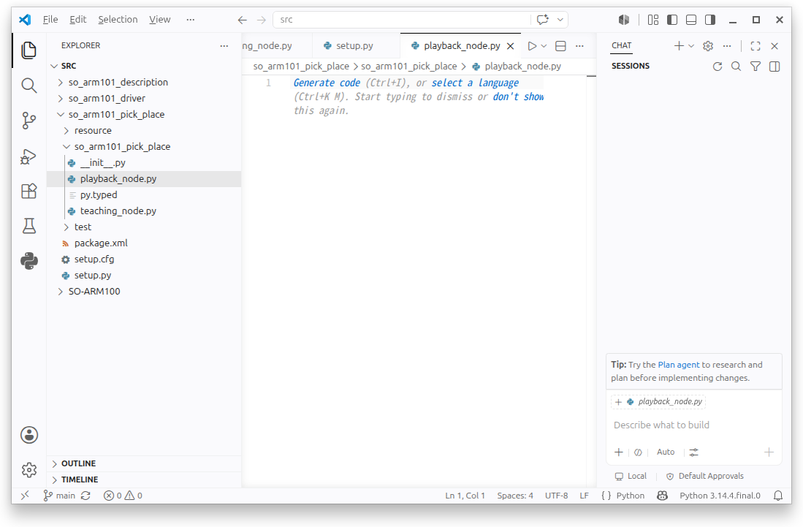

# so_arm101_pick_place 패키지: auto_pick_place_node

이번 절에서는 Teaching 과정에서 저장한 위치를 순서대로 실행하는 자동 Pick & Place 노드를 작성합니다.

`auto_pick_place_node`는 CSV 파일에서 Teaching Point와 Gripper 위치를 불러온 뒤 `/so_arm101/joint_goal` 토픽으로 목표 위치를 차례대로 발행합니다.

---

#### 자동 동작 순서

자동 Pick & Place는 다음 순서로 실행합니다.

1. Point 1: 대기 위치로 이동
2. Ungrip: Gripper 열기
3. Point 2: Pick 위치로 이동
4. Grip: 물체 잡기
5. Point 1: 대기 위치로 복귀
6. Point 3: Place 위치로 이동
7. Ungrip: 물체 놓기
8. Point 1: 대기 위치로 복귀

```
Point 1
   ↓
Ungrip
   ↓
Point 2
   ↓
Grip
   ↓
Point 1
   ↓
Point 3
   ↓
Ungrip
   ↓
Point 1
```

---

#### 노드 파일 생성

VS Code에서 다음 경로에 `auto_pick_place_node.py` 파일을 생성합니다.

```
~/project/ros2_ws/src/so_arm101_pick_place/
└── so_arm101_pick_place/
    └── auto_pick_place_node.py
```



---

#### 소스 코드 작성 프롬프트

AI를 이용해 기본 코드를 작성할 때는 다음 프롬프트를 사용할 수 있습니다.

```
이전에 작성한 motor_teach.py, motor_run.py,
motor_auto_run.py를 참고해 주세요.

SO-ARM101의 Pick & Place 동작을 ROS2로 구현하려고 합니다.

teaching_node.py에서 저장한
so_arm101_teaching.csv 파일을 읽어 자동으로 동작하는
auto_pick_place_node.py를 작성해 주세요.

목표 위치는 sensor_msgs/msg/JointState 메시지로 구성하고
/so_arm101/joint_goal 토픽으로 발행합니다.

동작 순서는 다음과 같습니다.

1. Point 1 대기 위치
2. Ungrip
3. Point 2 Pick 위치
4. Grip
5. Point 1 대기 위치
6. Point 3 Place 위치
7. Ungrip
8. Point 1 대기 위치

각 Arm 이동과 Gripper 동작 사이에는
설정된 대기 시간을 적용해 주세요.

CSV 파일 또는 필요한 Teaching 데이터가 없으면
오류 메시지를 출력하고 동작을 시작하지 않도록 작성해 주세요.
```

---

#### auto_pick_place_node.py 작성

기존 소스에서는 `run_sequence()`가 클래스 외부에 작성되어 있어 `node.run_sequence()`를 호출할 때 오류가 발생합니다. 아래 코드에서는 해당 함수를 `AutoPickPlaceNode` 클래스 안으로 이동하고 CSV 검사 기능을 추가했습니다.

#### 전체 소스 코드

> GitHub Link: [https://github.com/applesnack23/ros2-lerobot-code/blob/main/chapter3/auto_pick_place_node.py](https://github.com/applesnack23/ros2-lerobot-code/blob/main/chapter3/auto_pick_place_node.py)
> 

```python
import csv
import os
import time

import rclpy
from rclpy.node import Node
from sensor_msgs.msg import JointState

CSV_FILE = os.path.expanduser(
    '~/project/ros2_ws/so_arm101_teaching.csv'
)

# 각 동작 이후 대기 시간
MOVE_DELAY = 2.0
GRIP_DELAY = 1.0

# 드라이버 연결을 기다리는 최대 시간
DRIVER_WAIT_TIMEOUT = 5.0

ARM_JOINT_NAMES = [
    'shoulder_pan',
    'shoulder_lift',
    'elbow_flex',
    'wrist_flex',
    'wrist_roll',
]

GRIPPER_JOINT_NAME = 'gripper'

def load_teaching_data_csv(filename):
    teaching_data = {
        'points': {},
        'gripper': {
            'grip': None,
            'ungrip': None,
        },
    }

    with open(
        filename,
        'r',
        newline='',
        encoding='utf-8-sig'
    ) as file:
        reader = csv.DictReader(file)

        for row in reader:
            row_type = row.get('type', '').strip()
            name = row.get('name', '').strip()

            if row_type == 'point':
                positions = {}

                for joint_name in ARM_JOINT_NAMES:
                    value = row.get(joint_name, '').strip()

                    if value == '':
                        raise ValueError(
                            f'Missing {joint_name} value '
                            f'in Teaching Point {name}'
                        )

                    positions[joint_name] = float(value)

                teaching_data['points'][name] = positions

            elif row_type == 'gripper':
                value = row.get(
                    GRIPPER_JOINT_NAME,
                    ''
                ).strip()

                if name not in ['grip', 'ungrip']:
                    continue

                if value == '':
                    raise ValueError(
                        f'Missing gripper value: {name}'
                    )

                teaching_data['gripper'][name] = float(value)

    return teaching_data

class AutoPickPlaceNode(Node):

    def __init__(self):
        super().__init__('auto_pick_place_node')

        self.joint_goal_pub = self.create_publisher(
            JointState,
            '/so_arm101/joint_goal',
            10,
        )

        if not os.path.exists(CSV_FILE):
            raise FileNotFoundError(
                f'CSV file not found: {CSV_FILE}'
            )

        self.teaching_data = load_teaching_data_csv(
            CSV_FILE
        )

        self.validate_teaching_data()

        self.get_logger().info(
            'SO-ARM101 Auto Pick & Place Node started.'
        )
        self.get_logger().info(
            f'Loaded CSV: {CSV_FILE}'
        )

    def validate_teaching_data(self):
        required_points = ['1', '2', '3']

        for point_name in required_points:
            if point_name not in self.teaching_data['points']:
                raise ValueError(
                    f'Teaching Point {point_name} is not saved.'
                )

        for mode in ['grip', 'ungrip']:
            if self.teaching_data['gripper'][mode] is None:
                raise ValueError(
                    f'Gripper position is not saved: {mode}'
                )

    def wait_for_driver(self):
        self.get_logger().info(
            'Waiting for feetech_driver_node...'
        )

        start_time = time.time()

        while rclpy.ok():
            subscriber_count = (
                self.joint_goal_pub.get_subscription_count()
            )

            if subscriber_count > 0:
                self.get_logger().info(
                    'feetech_driver_node connected.'
                )
                return True

            elapsed_time = time.time() - start_time

            if elapsed_time >= DRIVER_WAIT_TIMEOUT:
                self.get_logger().error(
                    'feetech_driver_node was not found.'
                )
                return False

            time.sleep(0.1)

        return False

    def move_arm(self, point_name):
        point_data = self.teaching_data[
            'points'
        ][point_name]

        msg = JointState()
        msg.header.stamp = self.get_clock().now().to_msg()
        msg.name = ARM_JOINT_NAMES.copy()
        msg.position = [
            point_data[joint_name]
            for joint_name in ARM_JOINT_NAMES
        ]

        self.joint_goal_pub.publish(msg)

        self.get_logger().info(
            f'Move -> Point {point_name}'
        )

        for name, position in zip(
            msg.name,
            msg.position
        ):
            self.get_logger().info(
                f'  {name}: {position}'
            )

    def move_gripper(self, mode):
        position = self.teaching_data[
            'gripper'
        ][mode]

        msg = JointState()
        msg.header.stamp = self.get_clock().now().to_msg()
        msg.name = [GRIPPER_JOINT_NAME]
        msg.position = [position]

        self.joint_goal_pub.publish(msg)

        self.get_logger().info(
            f'Gripper -> {mode}: {position}'
        )

    def run_sequence(self):
        if not self.wait_for_driver():
            return

        self.get_logger().info(
            'Start Auto Pick & Place'
        )

        # 1. Point 1: 대기 위치
        self.move_arm('1')
        time.sleep(MOVE_DELAY)

        # 2. Ungrip: Gripper 열기
        self.move_gripper('ungrip')
        time.sleep(GRIP_DELAY)

        # 3. Point 2: Pick 위치
        self.move_arm('2')
        time.sleep(MOVE_DELAY)

        # 4. Grip: 물체 잡기
        self.move_gripper('grip')
        time.sleep(GRIP_DELAY)

        # 5. Point 1: 대기 위치로 복귀
        self.move_arm('1')
        time.sleep(MOVE_DELAY)

        # 6. Point 3: Place 위치
        self.move_arm('3')
        time.sleep(MOVE_DELAY)

        # 7. Ungrip: 물체 놓기
        self.move_gripper('ungrip')
        time.sleep(GRIP_DELAY)

        # 8. Point 1: 대기 위치로 복귀
        self.move_arm('1')
        time.sleep(MOVE_DELAY)

        self.get_logger().info(
            'Auto Pick & Place Finished'
        )

def main(args=None):
    rclpy.init(args=args)

    try:
        node = AutoPickPlaceNode()

    except (FileNotFoundError, ValueError) as error:
        print(
            f'Auto Pick & Place initialization failed: '
            f'{error}'
        )
        rclpy.shutdown()
        return

    try:
        node.run_sequence()

    except KeyboardInterrupt:
        node.get_logger().warning(
            'Auto Pick & Place interrupted.'
        )

    finally:
        node.destroy_node()
        rclpy.shutdown()

if __name__ == '__main__':
    main()
```

---

#### 코드의 주요 구조

**CSV 파일 불러오기**

```python
self.teaching_data = load_teaching_data_csv(
    CSV_FILE
)
```

Teaching 노드에서 생성한 다음 파일을 읽습니다.

```python
~/project/ros2_ws/so_arm101_teaching.csv
```

CSV 데이터는 Teaching Point와 Gripper 위치로 구분해 저장합니다.

```python
{
    'points': {
        '1': {
            'shoulder_pan': 2071.0,
            'shoulder_lift': 885.0,
            'elbow_flex': 3081.0,
            'wrist_flex': 2953.0,
            'wrist_roll': 2076.0,
        },
        '2': {
            # Pick 위치
        },
        '3': {
            # Place 위치
        },
    },
    'gripper': {
        'grip': 1800.0,
        'ungrip': 2300.0,
    },
}
```

**Teaching 데이터 검사**

```python
self.validate_teaching_data()
```

자동 동작을 시작하기 전에 다음 데이터가 모두 저장되어 있는지 확인합니다.

- Teaching Point 1
- Teaching Point 2
- Teaching Point 3
- Grip 위치
- Ungrip 위치

필요한 데이터가 하나라도 없으면 로봇을 움직이지 않고 오류를 출력합니다.

**드라이버 연결 확인**

```python
self.joint_goal_pub.get_subscription_count()
```

`/so_arm101/joint_goal` 토픽을 구독하는 노드가 있는지 확인합니다.

`feetech_driver_node`가 연결되지 않은 상태에서 곧바로 메시지를 발행하면 첫 번째 목표 위치가 전달되지 않을 수 있습니다. 따라서 최대 5초 동안 드라이버 연결을 기다린 뒤 자동 동작을 시작합니다.

**Arm 이동 명령**

```python
def move_arm(self, point_name):
```

선택한 Teaching Point의 관절 위치를 `JointState` 메시지로 구성해 발행합니다.

```python
msg.name = [
    'shoulder_pan',
    'shoulder_lift',
    'elbow_flex',
    'wrist_flex',
    'wrist_roll',
]

msg.position = [
    point_data['shoulder_pan'],
    point_data['shoulder_lift'],
    point_data['elbow_flex'],
    point_data['wrist_flex'],
    point_data['wrist_roll'],
]
```

**Gripper 이동 명령**

```python
def move_gripper(self, mode):
```

Gripper 동작에서는 `gripper` 관절 하나만 포함한 메시지를 발행합니다.

```python
msg.name = ['gripper']
msg.position = [position]
```

**동작 사이의 대기 시간**

```python
MOVE_DELAY = 2.0
GRIP_DELAY = 1.0
```

`MOVE_DELAY`는 Arm 이동 이후 기다리는 시간이고 `GRIP_DELAY`는 Grip 또는 Ungrip 이후 기다리는 시간입니다.

현재 구현은 로봇이 실제 목표 위치에 도착했는지 확인하지 않고 설정된 시간만큼 기다립니다. 따라서 실제 로봇의 속도와 이동 거리에 맞게 값을 조정해야 합니다.

---

#### setup.py 실행 파일 등록


`so_arm101_pick_place/setup.py`의 `entry_points`를 다음과 같이 수정합니다.

```python
entry_points={
    'console_scripts': [
        'teaching_node = '
        'so_arm101_pick_place.teaching_node:main',

        'playback_node = '
        'so_arm101_pick_place.playback_node:main',

        'auto_pick_place_node = '
        'so_arm101_pick_place.'
        'auto_pick_place_node:main',
    ],
},
```

---

#### 패키지 빌드

ROS2 환경과 LeRobot 가상 환경을 적용합니다.

```bash
source /opt/ros/lyrical/setup.bash
source ~/project/rosws/lerobot/venv/bin/activate
```

워크스페이스로 이동해 패키지를 빌드합니다.

```bash
cd ~/project/ros2_ws

python-m colcon build \--packages-select \
  so_arm101_driver \
  so_arm101_pick_place
```

빌드가 완료되면 워크스페이스 환경을 적용합니다.

```bash
cd ~/project/ros2_ws

python -m colcon build \
  --packages-select \
  so_arm101_driver \
  so_arm101_pick_place
```

일반적인 Python 소스 변경에서는 `build`, `install`, `log` 폴더를 매번 삭제할 필요가 없습니다.

---

#### 노드 실행

두 개의 터미널을 준비합니다.

**1번 터미널: Feetech 드라이버 실행**

```bash
source /opt/ros/lyrical/setup.bash
source ~/project/rosws/lerobot/venv/bin/activate
source ~/project/ros2_ws/install/setup.bash

ros2 run so_arm101_driver feetech_driver_node
```

**2번 터미널: 자동 Pick & Place 실행**

```bash
source /opt/ros/lyrical/setup.bash
source ~/project/rosws/lerobot/venv/bin/activate
source ~/project/ros2_ws/install/setup.bash

ros2 run so_arm101_pick_place auto_pick_place_node
```

---

#### 실행 결과

노드가 정상적으로 실행되면 다음과 비슷한 로그가 출력됩니다.

```bash
(venv) twiniex@lt:~/project/ros2_ws$ \
ros2 run so_arm101_pick_place auto_pick_place_node

[INFO] [auto_pick_place_node]:
SO-ARM101 Auto Pick & Place Node started.

[INFO] [auto_pick_place_node]:
Loaded CSV:
/home/twiniex/project/ros2_ws/so_arm101_teaching.csv

[INFO] [auto_pick_place_node]:
Waiting for feetech_driver_node...

[INFO] [auto_pick_place_node]:
feetech_driver_node connected.

[INFO] [auto_pick_place_node]:
Start Auto Pick & Place

[INFO] [auto_pick_place_node]:
Move -> Point 1

[INFO] [auto_pick_place_node]:
Gripper -> ungrip: 2300.0

[INFO] [auto_pick_place_node]:
Move -> Point 2

[INFO] [auto_pick_place_node]:
Gripper -> grip: 1800.0

[INFO] [auto_pick_place_node]:
Move -> Point 1

[INFO] [auto_pick_place_node]:
Move -> Point 3

[INFO] [auto_pick_place_node]:
Gripper -> ungrip: 2300.0

[INFO] [auto_pick_place_node]:
Move -> Point 1

[INFO] [auto_pick_place_node]:
Auto Pick & Place Finished
```

---

#### 토픽 확인

자동 동작 중 다른 터미널에서 다음 명령을 실행하면 발행되는 목표 위치를 확인할 수 있습니다.

```bash
ros2 topic echo /so_arm101/joint_goal
```

Arm 이동 시에는 다섯 개의 관절 위치가 출력됩니다.

```yaml
name:
- shoulder_pan
- shoulder_lift
- elbow_flex
- wrist_flex
- wrist_roll
position:
- 2071.0
- 885.0
- 3081.0
- 2953.0
- 2076.0
---
```

Gripper 동작 시에는 Gripper 위치만 출력됩니다.

```yaml
name:
- gripper
position:
- 1800.0
---
```

---

#### 동작 확인 순서

1. CSV 파일에 Point 1, Point 2, Point 3이 저장되어 있는지 확인합니다.
2. Grip과 Ungrip 위치가 저장되어 있는지 확인합니다.
3. 로봇 주변의 사람과 장애물을 제거합니다.
4. `feetech_driver_node`를 실행합니다.
5. 가능하면 Playback 노드로 각 위치를 개별 테스트합니다.
6. `auto_pick_place_node`를 실행합니다.
7. 전체 Pick & Place 순서를 확인합니다.

---

#### 주의 사항

- 자동 실행 전에 Playback 노드로 각 Teaching Point를 개별적으로 확인합니다.
- 첫 테스트에서는 로봇의 이동 범위를 작게 설정합니다.
- 비상 정지가 가능한 상태에서 실행합니다.
- 로봇의 작업 영역 안에 손을 넣지 않습니다.
- `MOVE_DELAY`가 너무 짧으면 목표 위치에 도착하기 전에 다음 명령이 전송될 수 있습니다.
- `GRIP_DELAY`가 너무 짧으면 물체를 완전히 잡거나 놓기 전에 Arm이 움직일 수 있습니다.
- `feetech_driver_node`의 Torque 유지 시간이 이동 시간보다 짧으면 목표 위치에 도착하기 전에 Torque가 해제될 수 있습니다.
- 현재 방식은 목표 도달 여부를 확인하지 않는 시간 기반 제어 방식입니다.

---

#### 현재 방식의 한계

현재 노드는 다음과 같이 일정한 대기 시간으로 동작을 구분합니다.

```
목표 위치 발행
      ↓
time.sleep(MOVE_DELAY)
      ↓
다음 목표 위치 발행
```

따라서 모터 부하나 이동 거리에 따라 실제 도착 시간이 달라져도 이를 확인할 수 없습니다.

더 안정적인 제어를 위해서는 `/joint_states`를 구독하여 현재 위치와 목표 위치의 오차를 확인해야 합니다.

```
목표 위치 발행
      ↓
현재 /joint_states 확인
      ↓
모든 관절의 오차가 허용 범위 이하인지 검사
      ↓
다음 동작 실행
```

---

#### 전체 동작 구조

```
so_arm101_teaching.csv
          ↓
auto_pick_place_node
          ↓
/so_arm101/joint_goal
          ↓
feetech_driver_node
          ↓
Feetech Goal_Position
          ↓
SO-ARM101 자동 Pick & Place
```

---

#### 마무리

이번 절에서는 CSV에 저장된 Teaching Point와 Gripper 위치를 이용해 자동 Pick & Place 동작을 구현했습니다.

`auto_pick_place_node`는 순서에 맞춰 목표 위치를 `/so_arm101/joint_goal` 토픽으로 발행하고, `feetech_driver_node`가 이를 실제 모터 명령으로 변환합니다.

이를 통해 하드웨어 제어, Teaching, 수동 Playback, 자동 Pick & Place 기능이 각각 독립된 ROS2 노드로 분리되어 하나의 로봇 제어 시스템으로 동작하게 됩니다.