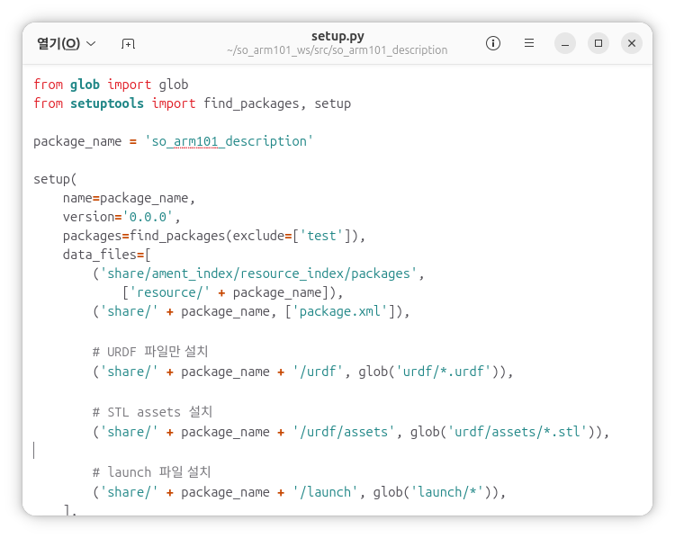

# RViz 검증

#### RViz2를 이용한 SO-ARM101 URDF 검증

이번 절에서는 SO-ARM101의 URDF와 Mesh 파일을 ROS2 패키지로 구성하고, RViz2에서 로봇 모델이 정상적으로 표시되는지 확인합니다.

URDF는 로봇의 다음 정보를 정의합니다.

- Link와 Joint의 연결 구조
- Joint의 위치와 회전축
- Joint의 동작 범위
- 로봇의 시각적 외형
- 충돌 계산용 형상
- 질량과 관성 정보

Gazebo에서 물리 시뮬레이션을 실행하거나 MoveIt으로 경로 계획을 수행하기 전에 RViz2에서 다음 항목을 먼저 검증하는 것이 좋습니다.

- URDF 파일을 정상적으로 읽을 수 있는가?
- Mesh 파일 경로가 올바른가?
- 모든 Link가 정상적으로 표시되는가?
- Joint 연결 관계가 올바른가?
- Joint의 회전축과 움직임 방향이 올바른가?
- TF Tree가 끊어지지 않고 연결되는가?

전체 작업 과정은 다음과 같습니다.

```
SO-ARM101 원본 파일 다운로드
            ↓
Description 패키지 생성
            ↓
URDF와 Mesh 파일 복사
            ↓
Mesh 경로 수정
            ↓
설치 파일과 의존성 등록
            ↓
Launch 파일 작성
            ↓
패키지 빌드
            ↓
RViz2에서 모델 검증
```

---

#### 작업공간 생성

먼저 SO-ARM101용 ROS2 작업공간을 생성합니다.

```bash
mkdir -p ~/project/so_arm101_ws/src
cd ~/project/so_arm101_ws/src
```

ROS2 작업공간은 일반적으로 다음과 같은 구조를 가집니다.

```
project/so_arm101_ws/
├── src/
├── build/
├── install/
└── log/
```

처음에는 `src` 폴더만 만들고, 나머지 폴더는 `colcon build`를 실행하면 자동으로 생성됩니다.

---

#### SO-ARM101 원본 파일 다운로드

SO-ARM101의 URDF와 Mesh 파일이 포함된 저장소를 내려받습니다.

```bash
cd ~/project/so_arm101_ws/src
git clone https://github.com/TheRobotStudio/SO-ARM100.git
```

다운로드가 완료되면 다음 명령으로 파일을 확인합니다.

```bash
ls ~/project/so_arm101_ws/src/SO-ARM100
```

SO-ARM101의 URDF 파일은 다음 경로에 있습니다.

```bash
ls ~/project/so_arm101_ws/src/SO-ARM100/Simulation/SO101
```

해당 경로의 내용을 확인합니다.

```bash
ls ~/project/so_arm101_ws/src/SO-ARM100/Simulation/SO101
```

원본 저장소의 폴더 구조는 버전에 따라 변경될 수 있습니다. 파일이 보이지 않는다면 다음 명령으로 URDF 파일을 검색할 수 있습니다.

```bash
find ~/project/so_arm101_ws/src/SO-ARM100 -name "*.urdf"
```

Mesh 파일도 다음과 같이 검색할 수 있습니다.

```bash
find ~/project/so_arm101_ws/src/SO-ARM100 -name "*.stl"
```

---

#### ROS2 Description 패키지 생성

ROS2 시스템 환경을 현재 터미널에 적용합니다.

```bash
source /opt/ros/lyrical/setup.bash
```

`src` 폴더에서 SO-ARM101의 URDF와 Mesh를 관리할 Description 패키지를 생성합니다.

```bash
cd ~/project/so_arm101_ws/src

ros2 pkg create so_arm101_description \
    --build-type ament_python
```

생성된 패키지로 이동합니다.

```bash
cd ~/project/so_arm101_ws/src/so_arm101_description
```

Description 패키지는 일반적으로 다음 파일을 관리합니다.

- URDF 또는 Xacro
- Mesh
- RViz2 설정
- Launch 파일
- 로봇 모델 관련 설정 파일URDF와 Mesh 폴더 생성

URDF와 Mesh 파일을 저장할 폴더를 생성합니다.

```bash
mkdir -p urdf/assets
mkdir -p launch
mkdir -p rviz
```

패키지 구조는 다음과 같습니다.

```
so_arm101_description/
├── launch/
├── resource/
├── rviz/
├── so_arm101_description/
├── test/
├── urdf/
│   └── assets/
├── package.xml
├── setup.cfg
└── setup.py
```

이번 절에서는 다음 폴더를 사용합니다.

| 폴더 | 역할 |
| --- | --- |
| `urdf/` | URDF 또는 Xacro 파일 |
| `urdf/assets/` | STL 등의 Mesh 파일 |
| `launch/` | ROS2 Launch 파일 |
| `rviz/` | RViz2 설정 파일 |

---

#### URDF 파일 복사

원본 SO-ARM101 URDF를 Description 패키지로 복사합니다.

```bash
cp ~/project/so_arm101_ws/src/SO-ARM100/Simulation/SO101/so101_new_calib.urdf \
    ~/project/so_arm101_ws/src/so_arm101_description/urdf/so_arm101.urdf
```

복사된 파일을 확인합니다.

```bash
ls ~/project/so_arm101_ws/src/so_arm101_description/urdf
```

다음과 같이 표시되면 정상입니다.

```
assets
so_arm101.urdf
```

---

#### Mesh 경로 확인

URDF에서 어떤 Mesh 파일을 사용하는지 확인합니다.

```bash
grep -n "mesh" \
    ~/project/so_arm101_ws/src/so_arm101_description/urdf/so_arm101.urdf
```

출력 예시는 다음과 같습니다.

```bash
<mesh filename="assets/base_so101_v2.stl"/>
```

여기서 `-n` 옵션은 해당 내용이 있는 줄 번호도 함께 출력합니다.

URDF에 작성된 모든 STL 파일이 실제 원본 폴더에 존재하는지 확인해야 합니다.

---

#### STL 파일 복사

SO-ARM101의 STL 파일을 Description 패키지의 `urdf/assets` 폴더로 복사합니다.

```bash
cp ~/project/so_arm101_ws/src/SO-ARM100/Simulation/SO101/assets/*.stl \
    ~/project/so_arm101_ws/src/so_arm101_description/urdf/assets/
```

복사된 파일을 확인합니다.

```bash
ls ~/project/so_arm101_ws/src/so_arm101_description/urdf/assets
```

URDF에서 참조하는 STL 파일들이 모두 표시되어야 합니다.

만약 Mesh가 다른 폴더에도 나누어져 있다면 `find` 명령으로 위치를 확인한 후 필요한 파일을 추가로 복사합니다.

---

#### URDF의 Mesh 경로 수정

원본 URDF는 Mesh를 상대 경로로 참조할 수 있습니다.

```bash
<mesh filename="assets/base_so101_v2.stl"/>
```

이러한 상대 경로는 URDF를 실행하는 위치에 따라 Mesh를 찾지 못할 수 있습니다.

ROS2 패키지에서는 다음과 같은 `package://` 경로를 사용하는 것이 안정적입니다.

```
package://패키지_이름/패키지_내부_경로
```

SO-ARM101 Description 패키지의 경로는 다음과 같습니다.

```xml
<mesh filename="package://so_arm101_description/urdf/assets/base_so101_v2.stl"/>
```

다음 명령으로 모든 Mesh 경로를 일괄 변경합니다.

```bash
cd ~/project/so_arm101_ws/src/so_arm101_description

sed -i \
    's|filename="assets/|filename="package://so_arm101_description/urdf/assets/|g' \
    urdf/so_arm101.urdf
```

수정 결과를 확인합니다.

```bash
grep -n "mesh" urdf/so_arm101.urdf
```

다음과 같이 표시되면 정상입니다.

```xml
<mesh filename="package://so_arm101_description/urdf/assets/base_so101_v2.stl"/>
```

`package://` 뒤의 패키지 이름과 실제 패키지 이름이 정확히 일치해야 합니다.

---

#### URDF 문법 확인

RViz2를 실행하기 전에 URDF의 XML 문법을 확인하는 것이 좋습니다.

시스템에 `check_urdf` 명령이 있다면 다음과 같이 검사할 수 있습니다.

```bash
check_urdf \
    ~/project/so_arm101_ws/src/so_arm101_description/urdf/so_arm101.urdf
```

정상적인 경우 Link와 Joint 구조가 출력됩니다.

명령을 찾을 수 없다면 다음 명령으로 관련 패키지를 설치할 수 있습니다.

```bash
sudo apt install liburdfdom-tools
```

URDF 문법에 문제가 있으면 다음과 같은 항목을 확인합니다.

- 시작 태그와 종료 태그가 일치하는가?
- Link 이름이 중복되지 않았는가?
- Joint의 Parent와 Child가 실제 Link로 존재하는가?
- Mesh 파일 경로가 올바른가?
- Root Link가 하나만 존재하는가?
- Joint 연결 관계가 순환 구조를 만들지 않는가?

---

#### package.xml 의존성 등록

Description 패키지가 사용하는 런타임 패키지를 `package.xml`에 등록합니다.

파일 경로는 다음과 같습니다.

```
~/project/so_arm101_ws/src/so_arm101_description/package.xml
```

기존 `<test_depend>` 항목 위에 다음 내용을 추가합니다.

```xml
<exec_depend>ament_index_python</exec_depend>
<exec_depend>launch</exec_depend>
<exec_depend>launch_ros</exec_depend>
<exec_depend>joint_state_publisher_gui</exec_depend>
<exec_depend>robot_state_publisher</exec_depend>
<exec_depend>rviz2</exec_depend>
<exec_depend>tf2_ros</exec_depend>
```

각 의존성의 역할은 다음과 같습니다.

| 패키지 | 역할 |
| --- | --- |
| `ament_index_python` | 설치된 ROS2 패키지 경로 검색 |
| `launch` | ROS2 Launch 시스템 |
| `launch_ros` | Launch에서 ROS2 Node 실행 |
| `joint_state_publisher_gui` | GUI를 이용한 Joint 값 발행 |
| `robot_state_publisher` | URDF와 JointState를 TF로 변환 |
| `rviz2` | 로봇 모델 시각화 |
| `tf2_ros` | TF 발행과 좌표 변환 |

---

#### setup.py 수정

ROS2 패키지는 빌드 후 `install` 폴더에 설치된 파일을 기준으로 실행합니다.

따라서 URDF, STL, Launch 파일이 `install` 폴더로 함께 복사되도록 `setup.py`를 수정해야 합니다.

파일 경로는 다음과 같습니다.

```
~/project/so_arm101_ws/src/so_arm101_description/setup.py
```



파일 상단에 `glob`를 추가합니다.

```python
from glob import glob
from setuptools import find_packages, setup
```

`data_files` 항목에 URDF, STL, Launch 파일을 추가합니다.

```python
data_files=[
    (
        'share/ament_index/resource_index/packages',
        ['resource/' + package_name],
    ),
    (
        'share/' + package_name,
        ['package.xml'],
    ),
    (
        'share/' + package_name + '/urdf',
        glob('urdf/*.urdf'),
    ),
    (
        'share/' + package_name + '/urdf/assets',
        glob('urdf/assets/*.stl'),
    ),
    (
        'share/' + package_name + '/launch',
        glob('launch/*.launch.py'),
    ),
    (
        'share/' + package_name + '/rviz',
        glob('rviz/*.rviz'),
    ),
],
```

각 항목은 다음 경로에 설치됩니다.

```
install/so_arm101_description/share/so_arm101_description/
├── launch/
├── rviz/
├── urdf/
│   └── assets/
└── package.xml
```

RViz2 설정 파일을 아직 만들지 않았다면 `glob('rviz/*.rviz')` 결과가 비어 있어도 빌드에 문제가 생기지는 않습니다.

---

#### 필요한 ROS2 패키지 설치

RViz2에서 URDF를 확인하기 위해 필요한 패키지를 설치합니다.

```bash
sudo apt update

sudo apt install \
    ros-lyrical-rviz2 \
    ros-lyrical-joint-state-publisher-gui \
    ros-lyrical-robot-state-publisher \
    ros-lyrical-tf2-ros
```

패키지 설치는 처음 한 번만 수행하면 됩니다.

이미 설치되어 있다면 다시 설치하지 않아도 됩니다.

---

#### 패키지 빌드

ROS2 시스템 환경을 적용한 후 패키지를 빌드합니다.

```bash
cd ~/project/so_arm101_ws
source /opt/ros/lyrical/setup.bash

colcon build --packages-select so_arm101_description
```

개발 과정에서는 다음과 같이 `--symlink-install` 옵션을 사용할 수도 있습니다.

```bash
colcon build \
    --symlink-install \
    --packages-select so_arm101_description
```

- `-symlink-install`을 사용하면 Python 파일이나 일부 데이터 파일을 수정할 때 개발 과정이 편리해집니다. 다만 `setup.py`와 설치 대상이 변경되었다면 다시 빌드해야 합니다.

빌드가 완료되면 Workspace Overlay 환경을 적용합니다.

```
source ~/project/so_arm101_ws/install/setup.bash
```

매번 전체 빌드 결과를 삭제할 필요는 없습니다. 빌드 캐시 문제 등으로 깨끗한 재빌드가 필요한 경우에만 다음 폴더를 삭제합니다.

```bash
cd ~/project/so_arm101_ws
rm -rf build install log
```

삭제 후에는 다시 빌드해야 합니다.

```bash
source /opt/ros/lyrical/setup.bash
colcon build
source install/setup.bash
```

---

#### 패키지 등록 확인

패키지가 ROS2 환경에 정상적으로 등록되었는지 확인합니다.

```bash
ros2 pkg list | grep so_arm101_description
```

다음과 같이 출력되면 정상입니다.

```
so_arm101_description
```

패키지의 설치 경로도 확인할 수 있습니다.

```bash
ros2 pkg prefix so_arm101_description
```

URDF가 실제 설치 폴더에 복사되었는지 확인합니다.

```bash
ls \
    ~/project/so_arm101_ws/install/so_arm101_description/share/so_arm101_description/urdf
```

Mesh 파일도 확인합니다.

```bash
ls \
    ~/project/so_arm101_ws/install/so_arm101_description/share/so_arm101_description/urdf/assets
```

---

#### RViz2 실행용 Launch 파일 생성

RViz2에서 SO-ARM101 모델을 확인하기 위한 Launch 파일을 작성합니다.

파일 경로는 다음과 같습니다.

```bash
~/project/so_arm101_ws/src/so_arm101_description/launch/display.launch.py
```

VS Code에서 패키지 폴더를 열 수 있습니다.

```bash
cd ~/project/so_arm101_ws/src/so_arm101_description
code .
```


`launch` 폴더 안에 `display.launch.py` 파일을 생성하고 다음 코드를 작성합니다.

```python
import os

from ament_index_python.packages import get_package_share_directory
from launch import LaunchDescription
from launch_ros.actions import Node

def generate_launch_description():
    package_path = get_package_share_directory(
        'so_arm101_description'
    )

    urdf_path = os.path.join(
        package_path,
        'urdf',
        'so_arm101.urdf',
    )

    with open(urdf_path, 'r', encoding='utf-8') as urdf_file:
        robot_description = urdf_file.read()

    return LaunchDescription([
        Node(
            package='tf2_ros',
            executable='static_transform_publisher',
            arguments=[
                '--x', '0',
                '--y', '0',
                '--z', '0',
                '--roll', '0',
                '--pitch', '0',
                '--yaw', '0',
                '--frame-id', 'world',
                '--child-frame-id', 'base_link',
            ],
            output='screen',
        ),

        Node(
            package='robot_state_publisher',
            executable='robot_state_publisher',
            parameters=[
                {
                    'robot_description': robot_description,
                },
            ],
            output='screen',
        ),

        Node(
            package='joint_state_publisher_gui',
            executable='joint_state_publisher_gui',
            output='screen',
        ),

        Node(
            package='rviz2',
            executable='rviz2',
            output='screen',
        ),
    ])
```

---

#### Launch 파일 구성

Launch 파일은 네 개의 노드를 실행합니다.

**static_transform_publisher**

```python
Node(
    package='tf2_ros',
    executable='static_transform_publisher',
    arguments=[
        '--x', '0',
        '--y', '0',
        '--z', '0',
        '--roll', '0',
        '--pitch', '0',
        '--yaw', '0',
        '--frame-id', 'world',
        '--child-frame-id', 'base_link',
    ],
)
```

`world` Frame과 `base_link` Frame을 고정 Transform으로 연결합니다.

```
world
└── base_link
```

위치와 회전값을 모두 0으로 지정했으므로 두 Frame의 원점과 방향이 일치합니다.

이 Transform을 추가하면 RViz2의 Fixed Frame을 `world`로 설정할 수 있습니다.

**robot_state_publisher**

```python
Node(
    package='robot_state_publisher',
    executable='robot_state_publisher',
    parameters=[
        {
            'robot_description': robot_description,
        },
    ],
)
```

URDF의 Link와 Joint 구조를 읽고 `/joint_states`의 Joint 값을 이용하여 TF를 발행합니다.

- 움직이는 Joint: `/tf`
- 고정 Joint: `/tf_static`

**joint_state_publisher_gui**

```python
Node(
    package='joint_state_publisher_gui',
    executable='joint_state_publisher_gui',
)
```

GUI의 슬라이더를 이용하여 각 Joint 값을 변경하고 `/joint_states` Topic으로 발행합니다.

이를 이용하면 실제 로봇이나 Controller가 없어도 RViz2에서 Joint 움직임을 확인할 수 있습니다.

**rviz2**

```python
Node(
    package='rviz2',
    executable='rviz2',
)
```

RViz2를 실행하여 RobotModel과 TF를 화면에 표시합니다.

---

#### Launch 파일 추가 후 다시 빌드

Launch 파일을 새로 추가했으므로 패키지를 다시 빌드합니다.

```bash
cd ~/project/so_arm101_ws
source /opt/ros/lyrical/setup.bash

colcon build --packages-select so_arm101_description
source install/setup.bash
```

`setup.py`에 Launch 파일 설치가 등록되어 있지 않거나 다시 빌드하지 않으면 다음과 같은 오류가 발생할 수 있습니다.

```
file 'display.launch.py' was not found
```

이 경우 다음 내용을 확인합니다.

- `launch/display.launch.py`가 존재하는가?
- `setup.py`에 `glob('launch/*.launch.py')`가 등록되어 있는가?
- 패키지를 다시 빌드했는가?
- `install/setup.bash`를 다시 적용했는가?

---

#### RViz2 실행

다음 명령으로 Launch 파일을 실행합니다.

```bash
ros2 launch so_arm101_description display.launch.py
```


정상적으로 실행되면 다음 프로그램이 함께 시작됩니다.

- `static_transform_publisher`
- `robot_state_publisher`
- `joint_state_publisher_gui`
- `RViz2`

---

#### RViz2 설정

RViz2가 실행되면 `Global Options`에서 Fixed Frame을 설정합니다.

```
Fixed Frame: world
```

다음으로 왼쪽 Displays 패널에서 `Add` 버튼을 누르고 `RobotModel`을 추가합니다.

ROS2 배포판과 RViz2 버전에 따라 RobotModel의 설정 방식이 다를 수 있습니다.

Topic을 사용하는 경우 다음과 같이 설정합니다.

```
Description Source: Topic
Description Topic: /robot_description
```

Parameter를 사용하는 환경이라면 `robot_description` Parameter를 사용하도록 설정합니다.

다음으로 `TF` Display를 추가합니다.

```
Add
→ By display type
→ TF
```

TF Display에서는 다음 내용을 확인할 수 있습니다.

- 각 Link Frame의 위치
- X, Y, Z축 방향
- Parent와 Child 관계
- TF Tree 연결 상태

축 색상은 다음과 같습니다.

```
X축 = 빨간색
Y축 = 초록색
Z축 = 파란색
```

---

#### Joint 움직임 확인

`joint_state_publisher_gui` 창에는 움직일 수 있는 Joint의 슬라이더가 표시됩니다.

Joint를 한 번에 하나씩 움직이며 다음 내용을 확인합니다.

- 해당 Joint만 의도한 방향으로 움직이는가?
- Child Link들이 함께 움직이는가?
- Joint 축이 실제 로봇과 일치하는가?
- 회전 방향이 올바른가?
- Joint Limit 범위 안에서 움직이는가?
- Link 사이에 비정상적인 간격이 생기지 않는가?

Joint가 반대 방향으로 움직인다면 다음 항목을 확인합니다.

- Joint의 `<axis xyz="..."/>`
- Joint Origin의 `rpy`
- 실제 모터 방향
- Driver의 Joint 값 변환 방식

Joint가 잘못된 위치를 중심으로 회전한다면 Joint Origin의 `xyz`를 확인해야 합니다.

---

#### ROS2 Topic 확인

Launch가 실행 중인 상태에서 새 터미널을 열고 ROS2 환경을 적용합니다.

```bash
source /opt/ros/lyrical/setup.bash
source ~/project/so_arm101_ws/install/setup.bash
```

현재 활성화된 Topic을 확인합니다.

```bash
ros2 topic list
```

다음 Topic이 표시되는지 확인합니다.

```
/joint_states
/robot_description
/tf
/tf_static
```

각 Topic의 역할은 다음과 같습니다.

| Topic | 역할 |
| --- | --- |
| `/joint_states` | 현재 Joint 위치 발행 |
| `/robot_description` | URDF 로봇 모델 정보 |
| `/tf` | 움직이는 Frame의 Transform |
| `/tf_static` | 고정 Frame의 Transform |

---

#### JointState 확인

`joint_state_publisher_gui`가 발행하는 JointState를 확인합니다.

```bash
ros2 topic echo /joint_states
```

GUI에서 슬라이더를 움직이면 `position` 값이 변경되는 것을 확인할 수 있습니다.

출력 예시는 다음과 같습니다.

```yaml
name:
- shoulder_pan
- shoulder_lift
- elbow_flex
position:
- 0.0
- 0.5
- -0.3
```

Joint 이름은 URDF에 작성된 움직이는 Joint 이름과 일치해야 합니다.

---

#### robot_description 확인

`robot_description` 정보를 다음 명령으로 확인할 수 있습니다.

```bash
ros2 topic echo /robot_description --once
```

URDF 내용이 출력되면 로봇 모델 정보가 정상적으로 제공되고 있는 것입니다.

환경에 따라 `robot_description`이 Topic이 아니라 Parameter 중심으로 사용될 수도 있습니다. 이 경우 다음 명령으로 확인합니다.

```bash
ros2 param get /robot_state_publisher robot_description
```

---

#### TF Tree 확인

TF Tree 전체 구조는 다음 명령으로 확인할 수 있습니다.

```bash
ros2 run tf2_tools view_frames
```

명령을 실행하면 일반적으로 현재 폴더에 `frames.pdf` 파일이 생성됩니다.

```bash
ls
```

SO-ARM101의 TF Tree는 다음과 같은 형태로 연결되어야 합니다.

```
world
└── base_link
    └── shoulder_link
        └── upper_arm_link
            └── forearm_link
                └── wrist_link
                    └── tool_link
                        └── gripper_link
```

실제 Frame 이름은 사용한 URDF에 따라 다를 수 있습니다.

---

#### 두 Frame 사이 좌표 확인

`base_link`를 기준으로 End-Effector의 위치와 방향을 확인할 수 있습니다.

예를 들어 End-Effector Frame이 `tool_link`라면 다음 명령을 사용합니다.

```bash
ros2 run tf2_ros tf2_echo base_link tool_link
```

출력 예시는 다음과 같습니다.

```
Translation: [0.265, 0.000, 0.221]
Rotation: [0.249, -0.379, -0.489, 0.745]
```

`joint_state_publisher_gui`의 슬라이더를 움직이면 Translation과 Rotation 값이 실시간으로 변경됩니다.

이를 통해 Forward Kinematics 결과가 TF에 반영되는 것을 확인할 수 있습니다.

---

#### VS Code에서 ROS2 환경 적용

VS Code에서 ROS2 Python 모듈을 정상적으로 인식하려면 ROS2 환경이 적용된 터미널에서 VS Code를 실행하는 것이 좋습니다.

```bash
cd ~/project/so_arm101_ws/src/so_arm101_description

source /opt/ros/lyrical/setup.bash
source ~/project/so_arm101_ws/install/setup.bash

code .
```

VS Code에서 다음 모듈에 밑줄이 표시된다면 Python Interpreter가 ROS2 환경과 맞지 않을 수 있습니다.

- `launch`
- `launch_ros`
- `ament_index_python`
- `rclpy`

Interpreter는 다음 순서로 변경합니다.

```
Ctrl + Shift + P
→ Python: Select Interpreter
→ /usr/bin/python3 선택
```

ROS2는 시스템 Python을 기준으로 설치되므로 `/usr/bin/python3`을 사용하는 것이 일반적입니다.

---

#### ROS2 환경 설정 간소화

매번 `source` 명령을 입력하는 것이 번거롭다면 ROS2 시스템 환경을 `.bashrc`에 등록할 수 있습니다.

```bash
source /opt/ros/lyrical/setup.bash
```

사용자 Workspace는 아직 빌드되지 않았거나 다른 Workspace로 변경될 수 있으므로 자동 적용보다 별도의 명령으로 구성하는 것이 안전합니다.

예를 들어 `.bashrc`에 다음 함수를 추가할 수 있습니다.

```bash
function so_arm101_enable()
{
    source /opt/ros/lyrical/setup.bash

    if [ -f ~/project/so_arm101_ws/install/setup.bash ]; then
        source ~/project/so_arm101_ws/install/setup.bash
        echo "Workspace(~/so_arm101_ws) is activated."
    else
        echo "Workspace has not been built yet."
    fi
}
```

새 터미널을 열거나 다음 명령으로 설정을 다시 적용합니다.

```bash
source ~/.bashrc
```

이후 다음 명령으로 SO-ARM101 Workspace를 활성화할 수 있습니다.

```
so_arm101_enable
```

---

#### 정상 동작 확인 기준

다음 항목을 모두 확인하면 SO-ARM101 URDF 패키지와 RViz2 실행 환경이 정상적으로 구성된 것입니다.

- `so_arm101_description` 패키지가 검색됨
- RViz2에 SO-ARM101 모델이 표시됨
- 모든 Mesh 파일이 정상적으로 표시됨
- `joint_state_publisher_gui`에 Joint 슬라이더가 표시됨
- 슬라이더를 움직이면 로봇 모델이 함께 움직임
- `/joint_states` Topic이 발행됨
- `/robot_description` 정보가 제공됨
- `/tf`와 `/tf_static` Topic이 발행됨
- TF Tree가 하나의 연결된 구조로 표시됨
- `base_link`에서 `tool_link`까지 Transform을 확인할 수 있음

---

#### 문제 해결

| 문제 | 확인할 내용 |
| --- | --- |
| RViz2에 로봇이 보이지 않음 | Fixed Frame, RobotModel, `robot_description` 확인 |
| Mesh가 보이지 않음 | `package://` 경로와 설치 폴더 확인 |
| 일부 Link만 보임 | Mesh 파일 누락과 Joint 연결 확인 |
| 로봇이 흰색으로 표시됨 | URDF Material 또는 Mesh 재질 확인 |
| Link 위치가 어긋남 | Joint Origin과 Visual Origin 확인 |
| Joint가 움직이지 않음 | `/joint_states`와 Joint 이름 확인 |
| Joint가 반대로 움직임 | Axis와 Driver 방향 확인 |
| TF가 끊어져 있음 | Parent·Child 및 Root Link 확인 |
| `world` Frame 오류 | `static_transform_publisher` 실행 여부 확인 |
| Launch 파일을 찾지 못함 | `setup.py`, 재빌드, Overlay 적용 확인 |
| Python import에 밑줄 표시 | VS Code Interpreter와 실행 환경 확인 |

---

#### 정리

이번 절에서는 SO-ARM101의 원본 URDF와 Mesh 파일을 ROS2 Description 패키지로 구성하고 RViz2에서 검증했습니다.

전체 과정은 다음과 같습니다.

1. ROS2 작업공간을 생성했습니다.
2. SO-ARM101 원본 저장소를 다운로드했습니다.
3. `so_arm101_description` 패키지를 생성했습니다.
4. URDF와 STL 파일을 패키지에 복사했습니다.
5. Mesh 경로를 `package://` 형식으로 변경했습니다.
6. `package.xml`에 실행 의존성을 등록했습니다.
7. `setup.py`에 URDF, Mesh, Launch 파일을 등록했습니다.
8. RViz2 실행용 Launch 파일을 작성했습니다.
9. `robot_state_publisher`로 TF를 발행했습니다.
10. `joint_state_publisher_gui`로 Joint 움직임을 확인했습니다.
11. RViz2에서 RobotModel과 TF를 검증했습니다.

> **RViz2 검증의 목적은 URDF의 외형, Joint 연결, Axis, Limit, TF 구조가 올바른지 물리 시뮬레이션 전에 확인하는 것입니다.**
>
